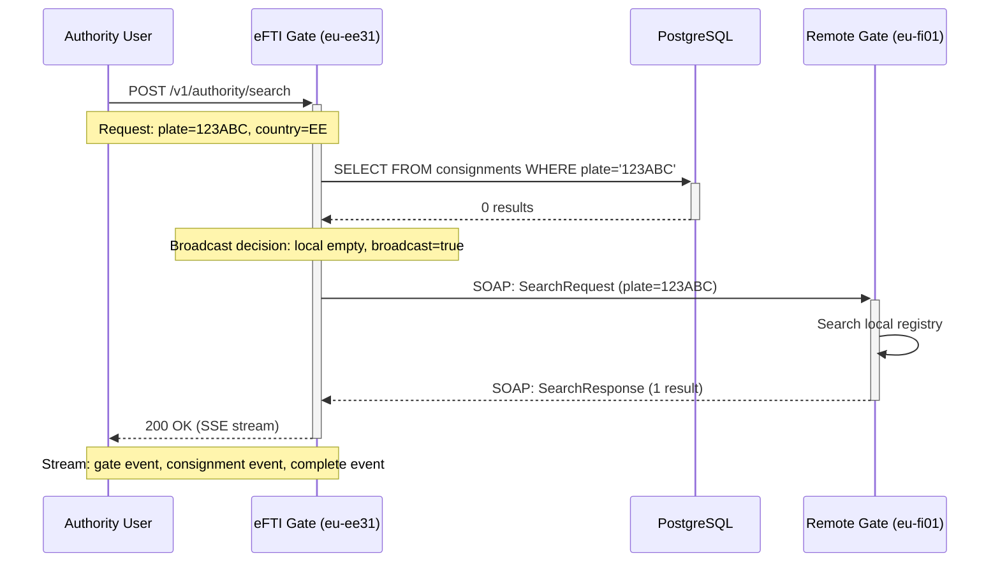
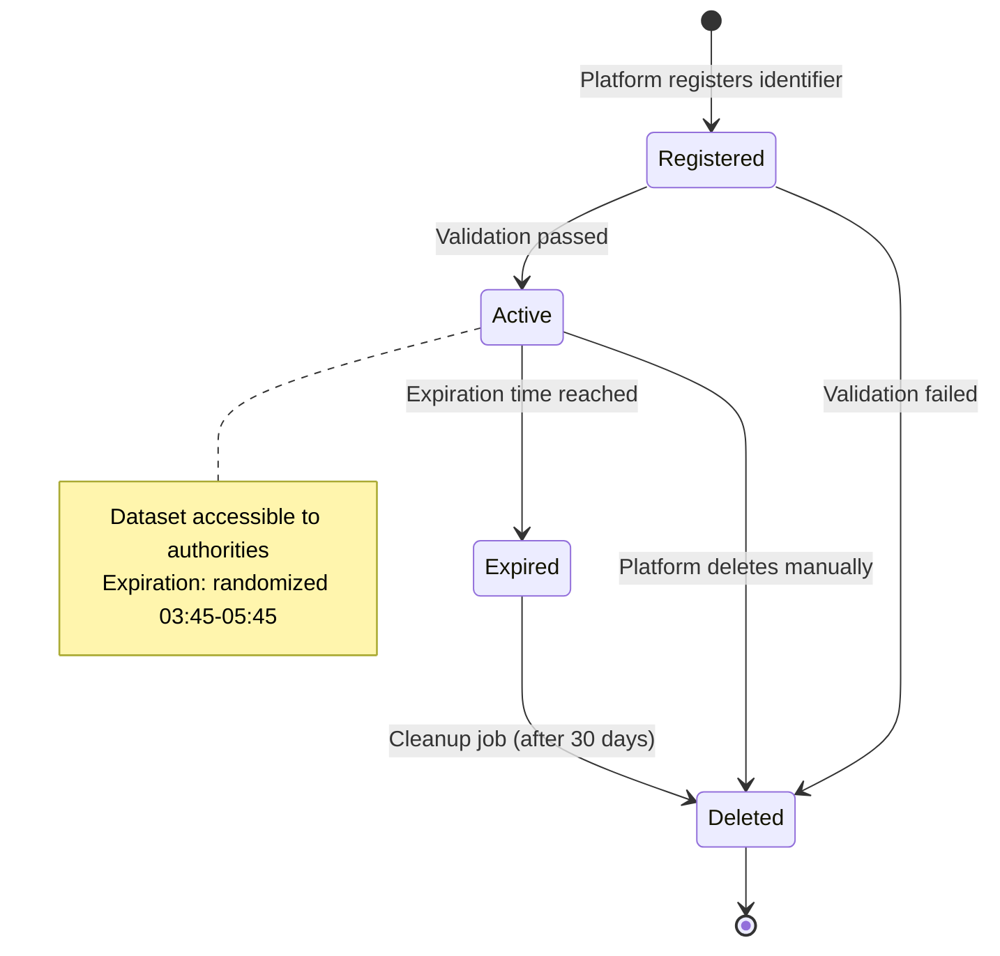
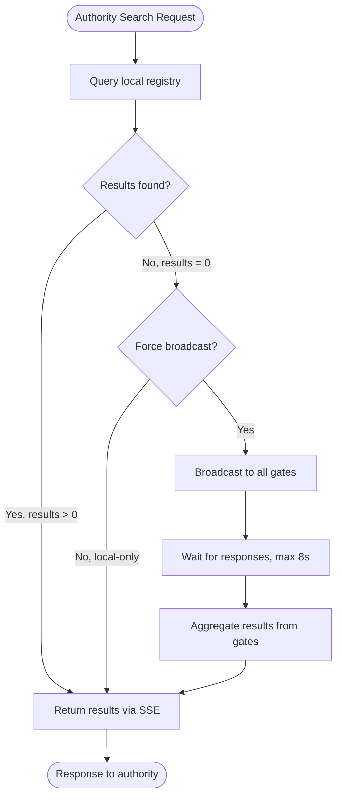
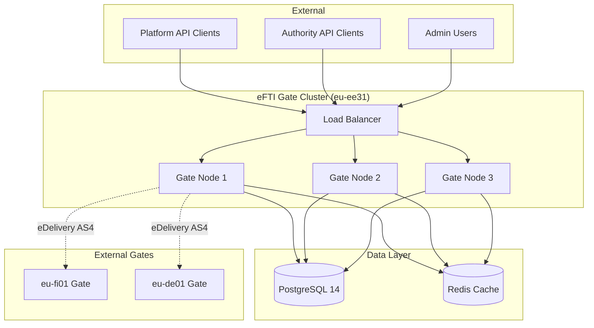
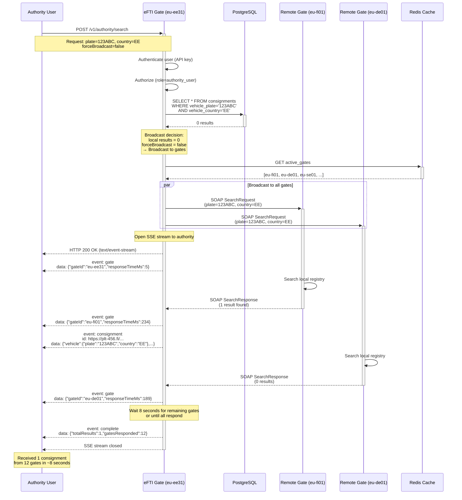
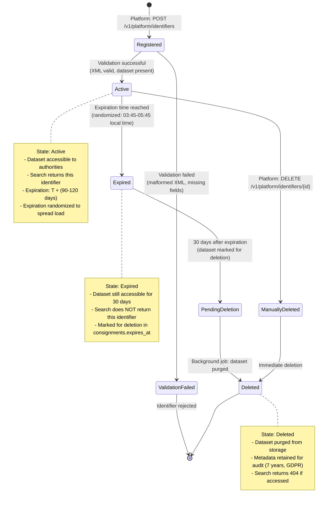
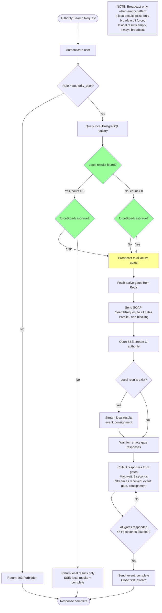

# PROMPT-07: Generate Mermaid Diagrams for eFTI Gate v2.0

> [!IMPORTANT]
> **Background prompt — not authoritative.** See [`PROMPT-00-INDEX.md`](PROMPT-00-INDEX.md) for historical context, including how stack references here (Kotlin / Klite / Digilogistika Keskus PoC paths) relate to the v2 spec's stack-open position.

## Context

You are helping create **complete visual documentation** for eFTI Gate v2.0 using Mermaid diagrams, a production system for electronic freight transport information exchange under EU Regulation 2024/2024.

Visual diagrams are critical for developers to understand:
- Sequence flows (e.g., identifier search with gate broadcast)
- State transitions (e.g., identifier lifecycle, dataset request states)
- System architecture (e.g., multi-node deployment, gate-to-gate communication)
- Decision flows (e.g., when to broadcast search vs. local-only)

This specification will be used by external developers during procurement to understand the system architecture and behavior.

## Your Task

Generate **25+ Mermaid diagram files** (`specs/diagrams/*.mmd`) covering:
- **Sequence diagrams**: API flows, gate-to-gate communication, background jobs
- **State diagrams**: Identifier lifecycle, dataset request states, platform status
- **Flowcharts**: Decision logic (broadcast conditions, authorization checks)
- **Architecture diagrams**: Multi-node deployment, component interactions

## Input Materials Required

Before starting, you must have access to:

1. **Epic Documentation**: `docs/Askend/efti_full_epics_en.md`
   - All 22 epics describe business flows requiring visualization
   - Epic 1.1: Identifier search (complex: local vs. broadcast decision)
   - Epic 1.2: Dataset provision (authority → gate → platform → authority)
   - Epic 1.4: Identifier expiration (background job flow)

2. **Current Gate Source Code**: `{CURRENT_GATE_SOURCE}/`
   - **Identifier search logic**: `gate/src/efti/EftiService.kt`
     - Broadcast-only-when-empty pattern (line 91)
     - SSE streaming implementation
   - **Gate ping**: `gate/src/efti/gates/GatePingScheduler.kt`
   - **eDelivery integration**: `edelivery/src/edelivery/SoapClient.kt`

3. **OpenAPI Specification**: `specs/openapi.yaml` (from PROMPT-01)
   - All endpoints (for sequence diagrams showing API calls)

4. **Database Schema**: `specs/db/schema.sql` (from PROMPT-02)
   - State enums (for state diagrams)
   - Table relationships (for architecture diagrams)

5. **Feedback Document**: `docs/Askend/feedback/CRITICAL-SPECIFICATION-GAPS.md`
   - Section 1.6: "Missing Specification File: Mermaid Diagrams"
   - Examples of required diagrams

## Specification Requirements

### 1. Diagram Categories

You must create diagrams for:

#### A. Sequence Diagrams (15+ diagrams)
Show interactions between components over time:
- Platform API flows (identifier registration, dataset upload, search)
- Authority API flows (search, dataset request)
- Gate-to-gate communication (broadcast search, dataset request)
- Admin API flows (platform registration, user management)
- Background jobs (identifier expiration, gate ping)

#### B. State Diagrams (5+ diagrams)
Show state transitions and lifecycle:
- Identifier lifecycle (registered → active → expired → deleted)
- Dataset request states (pending → forwarded → responded → completed)
- Platform status (pending → active → suspended → deleted)
- Authority status (pending → active → suspended → deleted)
- Gate connection states (unknown → healthy → degraded → unhealthy)

#### C. Flowcharts (3+ diagrams)
Show decision logic:
- Identifier search decision (local-only vs. broadcast)
- Authorization check flow (role-based permissions)
- Dataset access control (platform approval/denial)

#### D. Architecture Diagrams (2+ diagrams)
Show system structure:
- Multi-node deployment (load balancer → nodes → PostgreSQL → Redis)
- Gate-to-gate network (eFTI Gates across EU connected via eDelivery)

### 2. Required Diagrams (Minimum 25)

Create these specific diagrams:

**Sequence Diagrams (15):**
1. `seq-01-identifier-registration.mmd`: Platform registers identifier
2. `seq-02-identifier-search-local-only.mmd`: Authority search, results found locally
3. `seq-03-identifier-search-broadcast.mmd`: Authority search, broadcast to gates, results collected
4. `seq-04-identifier-search-no-results.mmd`: Authority search, no results, timeout
5. `seq-05-dataset-request.mmd`: Authority requests dataset from platform
6. `seq-06-dataset-request-denied.mmd`: Platform denies dataset request
7. `seq-07-dataset-upload.mmd`: Platform uploads/updates dataset
8. `seq-08-identifier-expiration.mmd`: Background job expires identifiers
9. `seq-09-gate-ping.mmd`: Background job pings remote gates
10. `seq-10-platform-registration.mmd`: Admin registers platform
11. `seq-11-authority-registration.mmd`: Admin registers authority
12. `seq-12-user-authentication.mmd`: User authenticates with API key
13. `seq-13-multi-platform-user.mmd`: Multi-platform user registers identifier
14. `seq-14-gate-to-gate-search.mmd`: Gate receives search from remote gate

**State Diagrams (5):**
16. `state-01-identifier-lifecycle.mmd`: Identifier states
17. `state-02-dataset-request.mmd`: Dataset request states
18. `state-03-platform-status.mmd`: Platform states
19. `state-04-authority-status.mmd`: Authority states
20. `state-05-gate-health.mmd`: Gate connection health states

**Flowcharts (3):**
21. `flow-01-search-broadcast-decision.mmd`: When to broadcast vs. local-only
22. `flow-02-authorization-check.mmd`: Role-based authorization logic
23. `flow-03-dataset-access-control.mmd`: Platform approval/denial logic

**Architecture Diagrams (2):**
24. `arch-01-multi-node-deployment.mmd`: Multi-node deployment architecture
25. `arch-02-gate-network.mmd`: eFTI Gate network (EU-wide)

### 3. Diagram Quality Requirements

Each diagram must:
- **Render correctly**: Validate in Mermaid Live Editor (https://mermaid.live)
- **Use realistic data**: Estonian plates "123ABC", gate IDs "eu-ee31", UUIDs
- **Include error paths**: Not just happy path (e.g., 404, 403, timeout)
- **Show timing**: Add notes for latency/timeouts where relevant
- **Be complete**: All participants, all messages, all states

### 4. Mermaid Syntax Standards

**Sequence Diagrams**:


**State Diagrams**:


**Flowcharts**:


**Architecture Diagrams**:


## Document Structure

Create individual `.mmd` files in `specs/diagrams/` directory:

```
specs/diagrams/
├── README.md                          ← Index of all diagrams
├── seq-01-identifier-registration.mmd
├── seq-02-identifier-search-local-only.mmd
├── seq-03-identifier-search-broadcast.mmd
├── seq-04-identifier-search-no-results.mmd
├── seq-05-dataset-request.mmd
├── seq-06-dataset-request-denied.mmd
├── seq-07-dataset-upload.mmd
├── seq-08-identifier-expiration.mmd
├── seq-09-gate-ping.mmd
├── seq-10-platform-registration.mmd
├── seq-11-authority-registration.mmd
├── seq-12-user-authentication.mmd
├── seq-13-multi-platform-user.mmd
├── seq-14-gate-to-gate-search.mmd
├── seq-15-gate-registry-sync.mmd
├── state-01-identifier-lifecycle.mmd
├── state-02-dataset-request.mmd
├── state-03-platform-status.mmd
├── state-04-authority-status.mmd
├── state-05-gate-health.mmd
├── flow-01-search-broadcast-decision.mmd
├── flow-02-authorization-check.mmd
├── flow-03-dataset-access-control.mmd
├── arch-01-multi-node-deployment.mmd
└── arch-02-gate-network.mmd
```

### README.md Format

Create `specs/diagrams/README.md`:

```markdown
# eFTI Gate v2.0 Diagrams

**Purpose**: Visual documentation for all system flows, states, and architecture.

**Format**: Mermaid diagrams (validate at https://mermaid.live)

## Sequence Diagrams (15)

| # | File | Description | Epic Reference |
|---|------|-------------|----------------|
| 1 | seq-01-identifier-registration.mmd | Platform registers identifier | Epic 1.5 |
| 2 | seq-02-identifier-search-local-only.mmd | Authority search (local results) | Epic 1.1 |
| 3 | seq-03-identifier-search-broadcast.mmd | Authority search (broadcast to gates) | Epic 1.1 |
| ... | ... | ... | ... |

## State Diagrams (5)

| # | File | Description | States Shown |
|---|------|-------------|--------------|
| 16 | state-01-identifier-lifecycle.mmd | Identifier lifecycle | Registered → Active → Expired → Deleted |
| 17 | state-02-dataset-request.mmd | Dataset request flow | Pending → Forwarded → Responded → Completed |
| ... | ... | ... | ... |

## Flowcharts (3)

| # | File | Description | Decision Criteria |
|---|------|-------------|-------------------|
| 21 | flow-01-search-broadcast-decision.mmd | Broadcast vs. local-only | Empty local results + forceBroadcast |
| ... | ... | ... | ... |

## Architecture Diagrams (2)

| # | File | Description | Components Shown |
|---|------|-------------|------------------|
| 24 | arch-01-multi-node-deployment.mmd | Multi-node cluster | LB, Nodes, PostgreSQL, Redis |
| 25 | arch-02-gate-network.mmd | EU-wide gate network | All gates + eDelivery connections |

## How to View

**Option 1: Mermaid Live Editor**
1. Open https://mermaid.live
2. Copy-paste .mmd file content
3. View rendered diagram

**Option 2: GitHub**
- GitHub automatically renders .mmd files in markdown

**Option 3: VS Code**
- Install "Markdown Preview Mermaid Support" extension
- Open .mmd file → Preview

## How to Edit

1. Edit .mmd file in any text editor
2. Validate in Mermaid Live Editor
3. Ensure diagram renders without errors
4. Save file

## Naming Conventions

- **seq-NN-*.mmd**: Sequence diagrams (numbered 01-15)
- **state-NN-*.mmd**: State diagrams (numbered 01-05)
- **flow-NN-*.mmd**: Flowcharts (numbered 01-03)
- **arch-NN-*.mmd**: Architecture diagrams (numbered 01-02)
```

## Example Diagrams (3 Complete Examples)

### Example 1: seq-03-identifier-search-broadcast.mmd



### Example 2: state-01-identifier-lifecycle.mmd



### Example 3: flow-01-search-broadcast-decision.mmd



## Quality Requirements

### Zero Tolerance
- ❌ No placeholders: "TBD", "TODO", "example", "lorem ipsum"
- ❌ No generic examples: "user123", "localhost", "test@example.com"
- ❌ No broken syntax: All diagrams must render in Mermaid Live Editor

### Realistic Data Requirements
- **Gate IDs**: "eu-ee31", "eu-fi01", "eu-de01" (pattern: `eu-{country}{number}`)
- **Platform IDs**: "plt-123", "plt-456"
- **Authority IDs**: "aut-001", "aut-002"
- **Vehicle plates**: "123ABC", "456XYZ" (Estonian/Finnish format)
- **UUIDs**: Valid v4 format from `uuidgen`
- **Timestamps**: ISO 8601 "2026-04-22T10:15:30Z"
- **HTTP endpoints**: Exact paths from OpenAPI spec

### Language Requirements
- **Clear labels**: "Authenticate user" not "auth"
- **With context**: "Wait 8 seconds for responses" not "wait"
- **Error paths**: Include 401, 403, 404, 500 responses

### Consistency Requirements
- **Terminology**: Use exact terms from epics (dataset, identifier, platform, authority, gate)
- **HTTP methods**: POST, GET, PUT, DELETE (uppercase)
- **Status codes**: 200, 201, 400, 403, 404, 409, 500
- **Naming**: Consistent participant names across diagrams

### Completeness Requirements
- ✅ All 25+ diagrams created as individual .mmd files
- ✅ All diagrams render without errors in Mermaid Live Editor
- ✅ All diagrams include error paths (not just happy path)
- ✅ README.md with complete index of all diagrams
- ✅ External developer can understand flows by viewing diagrams

## Validation Criteria

Before submitting diagrams:

### 1. Mermaid Rendering
```bash
# For each .mmd file, validate in Mermaid Live Editor
# 1. Open https://mermaid.live
# 2. Copy-paste content
# 3. Verify no syntax errors
# 4. Verify diagram renders correctly
```

### 2. File Count
```bash
ls specs/diagrams/*.mmd | wc -l
# Must be >= 25
```

### 3. README Completeness
- [ ] All 25+ diagrams listed in README.md
- [ ] Each diagram has description
- [ ] Each diagram has epic reference (if applicable)

### 4. Realistic Data
- [ ] Zero instances of: "example", "test", "lorem", "TBD", "TODO"
- [ ] All gate IDs follow pattern: `eu-{country}{number}`
- [ ] All HTTP paths match OpenAPI spec
- [ ] All UUIDs are valid v4 format

### 5. Cross-Reference Validation
- [ ] HTTP endpoints match OpenAPI spec
- [ ] Database tables match schema.sql
- [ ] State names match database enums (if applicable)
- [ ] Error codes match error catalog

### 6. Completeness
- [ ] Each sequence diagram shows complete flow (request → response)
- [ ] Each state diagram shows all states and transitions
- [ ] Each flowchart shows all decision paths
- [ ] Each architecture diagram shows all components

## Output Format

**Directory**: `specs/diagrams/`

**Files**:
- `README.md`: Index of all diagrams (5-10 pages)
- 25+ `.mmd` files: Individual Mermaid diagrams

**Format**: Mermaid syntax (validate at https://mermaid.live)

## Success Criteria

Your generated diagrams are complete when:

✅ **All 25+ diagrams created** as individual .mmd files
✅ **All diagrams render** in Mermaid Live Editor without errors
✅ **Zero placeholders** (TBD, TODO, example)
✅ **Realistic data** (Estonian plates, valid gate IDs, real UUIDs)
✅ **Error paths included** (not just happy path)
✅ **README.md complete** with index of all diagrams
✅ **Cross-references correct** (OpenAPI paths, DB tables, error codes)
✅ **Implementable** (external developer can understand flows by viewing diagrams)

## Important Notes

1. **Current Gate patterns**: Diagram must reflect Current Gate business logic (e.g., broadcast-only-when-empty in `seq-03`)

2. **Timing details**: Include latency/timeout notes where relevant (e.g., "Max wait: 8 seconds")


4. **GDPR compliance**: Show audit logging in dataset request flows

5. **Error handling**: Every sequence diagram should show at least one error path

## Additional Diagrams (Optional, Bonus)

If time permits, create additional diagrams:
- `seq-16-rate-limiting.mmd`: Gate-to-gate rate limiting
- `seq-17-circuit-breaker.mmd`: Circuit breaker on failing gate
- `flow-04-dataset-expiration-timing.mmd`: Randomized expiration (03:45-05:45)
- `arch-03-database-schema.mmd`: ER diagram (tables and relationships)

---

**Ready to generate?** Provide the input materials and start creating the diagrams.
