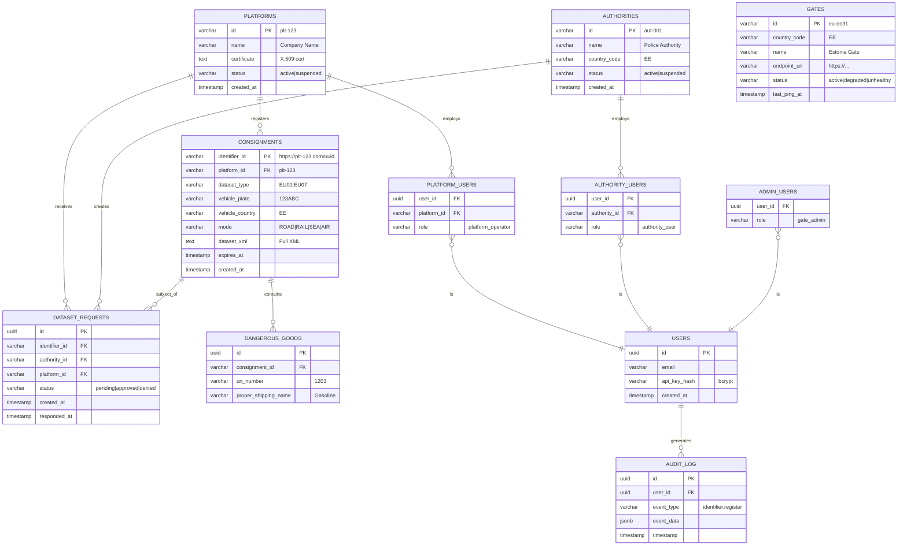

# PROMPT-09: Generate Database Documentation (README) for eFTI Gate v2.0

> [!IMPORTANT]
> **Background prompt — not authoritative.** See [`PROMPT-00-INDEX.md`](PROMPT-00-INDEX.md) for historical context, including how stack references here (Kotlin / Klite / Digilogistika Keskus PoC paths) relate to the v2 spec's stack-open position.

## Context

You are helping create **complete database documentation** for eFTI Gate v2.0, a production system for electronic freight transport information exchange under EU Regulation 2024/2024.

Database documentation is critical for:
- **Developer onboarding**: New developers understand database structure quickly
- **Operational support**: DBAs can optimize, troubleshoot, backup/restore
- **Compliance**: Document data retention policies (GDPR)
- **Performance tuning**: Understand indexing strategy, query patterns

This specification will be used by external developers during procurement to understand the database architecture, relationships, and operational requirements.

## Your Task

Generate a **complete database documentation file** (`specs/db/README.md`) that includes:
- Database overview (PostgreSQL version, extensions, configuration)
- Entity-Relationship (ER) diagram (Mermaid format)
- Table documentation (purpose, columns, relationships)
- Indexing strategy (which columns, why)
- Data retention policies (GDPR compliance)
- Backup/restore procedures
- Performance considerations
- Troubleshooting guide

## Input Materials Required

Before starting, you must have access to:

1. **Database Schema**: `specs/db/schema.sql` (from PROMPT-02)
   - All tables, columns, constraints, triggers
   - This is the source of truth for documentation

2. **Database Migrations**: `specs/db/migrations/V*.sql` (from PROMPT-08)
   - Indexes created in V3__create_indexes.sql
   - Seed data in V2__seed_data.sql

3. **Epic Documentation**: `docs/epics/` (per-epic files)
   - Business context for tables (why each table exists)
   - Data retention requirements (Epic 1.4: identifier expiration)

4. **OpenAPI Specification**: `specs/openapi.yaml` (from PROMPT-01)
   - API endpoints that query database
   - Query patterns (for index optimization)

5. **Current Gate Source Code**: `{CURRENT_GATE_SOURCE}/`
   - Database access patterns: `gate/src/efti/EftiService.kt`
   - Performance considerations from Current Gate

6. **Feedback Document**: `docs/Askend/feedback/CRITICAL-SPECIFICATION-GAPS.md`
   - Database documentation requirements

## Specification Requirements

### 1. Document Structure

Your `specs/db/README.md` should follow this structure:

```markdown
# eFTI Gate v2.0 Database Documentation

**Database**: PostgreSQL 14+ (tested on 14.10, 15.5, 16.1)
**Character Set**: UTF-8
**Timezone**: UTC
**Total Tables**: 12 core tables + 1 audit table

## Table of Contents

1. [Overview](#overview)
2. [Entity-Relationship Diagram](#entity-relationship-diagram)
3. [Tables](#tables)
   - [Platforms](#platforms)
   - [Authorities](#authorities)
   - [Consignments (Identifiers)](#consignments)
   - [Dangerous Goods](#dangerous-goods)
   - [Dataset Requests](#dataset-requests)
   - [Gates](#gates)
   - [Admin Users](#admin-users)
   - [Platform Users](#platform-users)
   - [Authority Users](#authority-users)
   - [Audit Log](#audit-log)
   - [Background Jobs](#background-jobs)
   - [Flyway Schema History](#flyway-schema-history)
4. [Indexing Strategy](#indexing-strategy)
5. [Data Retention Policies](#data-retention-policies)
6. [PostgreSQL Extensions](#postgresql-extensions)
7. [Triggers & Functions](#triggers--functions)
8. [Backup & Restore](#backup--restore)
9. [Performance Tuning](#performance-tuning)
10. [Troubleshooting](#troubleshooting)
11. [Development Setup](#development-setup)

---

## 1. Overview

The eFTI Gate database stores:
- **Platform data**: Companies providing freight data
- **Authority data**: Competent authorities requesting data
- **Identifier registry**: Consignment identifiers with metadata
- **Dataset requests**: Authority requests for consignment data
- **Gate registry**: Known eFTI gates across EU
- **User management**: Platform operators, authority users, admins
- **Audit trail**: GDPR-compliant logging of data access

### Database Features

- **Extensions**: pg_trgm (fuzzy search), pgcrypto (UUID generation), pg_stat_statements (query monitoring)
- **GDPR compliance**: 7-year audit log retention, automated data deletion
- **Performance**: Optimized for 10,000 req/sec (local queries), 100 concurrent searches

---

## 2. Entity-Relationship Diagram



---

## 3. Tables

### 3.1 `platforms`

**Purpose**: Freight platform companies that register identifiers and provide datasets.

**Columns**:
| Column | Type | Constraints | Description |
|--------|------|-------------|-------------|
| `id` | VARCHAR(50) | PRIMARY KEY | Platform ID (format: `plt-{number}`) |
| `name` | VARCHAR(255) | NOT NULL | Company name (e.g., "ABC Logistics") |
| `api_key_hash` | VARCHAR(255) | | Bcrypt hash of API key (for authentication) |
| `certificate` | TEXT | | X.509 certificate (PEM format, for mTLS) |
| `status` | VARCHAR(20) | NOT NULL, DEFAULT 'active' | Status: active, suspended, deleted |
| `created_at` | TIMESTAMP | NOT NULL, DEFAULT NOW() | Registration timestamp |
| `updated_at` | TIMESTAMP | | Last update timestamp |
| `deleted_at` | TIMESTAMP | | Soft delete timestamp |

**Relationships**:
- One platform has many consignments (`consignments.platform_id → platforms.id`)
- One platform has many users (`platform_users.platform_id → platforms.id`)
- One platform receives many dataset requests (`dataset_requests.platform_id → platforms.id`)

**Indexes**:
- Primary key: `id`
- Status filter: `idx_platforms_status` on `status`

**Business Rules**:
- Platform must be `status = 'active'` to register identifiers
- Platform can be suspended by admin (stops new identifier registrations)
- Soft delete: Set `deleted_at` instead of DELETE (preserve audit trail)

**Example Data**:
```sql
INSERT INTO platforms (id, name, status, created_at)
VALUES ('plt-123', 'ABC Logistics OÜ', 'active', NOW());
```

---

### 3.2 `authorities`

**Purpose**: Competent authorities (police, customs) that search identifiers and request datasets.

**Columns**:
| Column | Type | Constraints | Description |
|--------|------|-------------|-------------|
| `id` | VARCHAR(50) | PRIMARY KEY | Authority ID (format: `aut-{number}`) |
| `name` | VARCHAR(255) | NOT NULL | Authority name (e.g., "Police and Border Guard Board") |
| `country_code` | CHAR(2) | NOT NULL | ISO 3166-1 alpha-2 (EE, FI, DE, ...) |
| `api_key_hash` | VARCHAR(255) | | Bcrypt hash of API key |
| `status` | VARCHAR(20) | NOT NULL, DEFAULT 'active' | Status: active, suspended, deleted |
| `created_at` | TIMESTAMP | NOT NULL, DEFAULT NOW() | Registration timestamp |
| `updated_at` | TIMESTAMP | | Last update timestamp |
| `deleted_at` | TIMESTAMP | | Soft delete timestamp |

**Relationships**:
- One authority has many users (`authority_users.authority_id → authorities.id`)
- One authority creates many dataset requests (`dataset_requests.authority_id → authorities.id`)

**Indexes**:
- Primary key: `id`
- Country lookup: `idx_authorities_country_code` on `country_code`

**Business Rules**:
- Authority must be `status = 'active'` to search/request datasets
- Each country typically has 1-3 authorities (police, customs, transport inspectorate)

**Example Data**:
```sql
INSERT INTO authorities (id, name, country_code, status, created_at)
VALUES ('aut-001', 'Police and Border Guard Board', 'EE', 'active', NOW());
```

---

### 3.3 `consignments` (Identifiers)

**Purpose**: Consignment identifier registry. Each row represents one eFTI identifier with metadata.

**Columns**:
| Column | Type | Constraints | Description |
|--------|------|-------------|-------------|
| `identifier_id` | VARCHAR(500) | PRIMARY KEY | Full identifier URL (e.g., `https://plt-123.com/550e8400-...`) |
| `platform_id` | VARCHAR(50) | NOT NULL, FK → platforms | Platform that registered this identifier |
| `dataset_type` | VARCHAR(10) | NOT NULL | eFTI subset: EU01, EU07, ... |
| `vehicle_plate` | VARCHAR(20) | | Vehicle license plate (for search) |
| `vehicle_country` | CHAR(2) | | Vehicle country (ISO 3166-1 alpha-2) |
| `mode` | VARCHAR(10) | | Transport mode: ROAD, RAIL, SEA, AIR, MULTIMODAL |
| `dataset_xml` | TEXT | | Full eFTI dataset (XML format, up to 10MB) |
| `dataset_size_bytes` | INTEGER | | Dataset size (for monitoring) |
| `has_dangerous_goods` | BOOLEAN | DEFAULT FALSE | Quick filter for dangerous goods |
| `expires_at` | TIMESTAMP | | Expiration timestamp (randomized 03:45-05:45) |
| `created_at` | TIMESTAMP | NOT NULL, DEFAULT NOW() | Registration timestamp |
| `updated_at` | TIMESTAMP | | Last update timestamp |
| `deleted_at` | TIMESTAMP | | Soft delete timestamp |

**Relationships**:
- Many consignments belong to one platform (`consignments.platform_id → platforms.id`)
- One consignment has many dangerous goods (`dangerous_goods.consignment_id → consignments.identifier_id`)
- One consignment is subject of many dataset requests (`dataset_requests.identifier_id → consignments.identifier_id`)

**Indexes** (see section 4: Indexing Strategy):
- Primary key: `identifier_id`
- Vehicle plate: `idx_consignments_vehicle_plate` (B-tree), `idx_consignments_vehicle_plate_trgm` (GIN for fuzzy search)
- Composite: `idx_consignments_vehicle_plate_country`
- Expiration: `idx_consignments_expires_at`
- Platform ownership: `idx_consignments_platform_id`

**Business Rules**:
- `vehicle_plate` OR `mode` must be present (CHECK constraint: at least one must be NOT NULL)
- Expiration randomized: `expires_at` set to T + (90-120 days) + randomized time (03:45-05:45)
- Soft delete: Set `deleted_at` instead of DELETE (preserve audit trail)

**Example Data**:
```sql
INSERT INTO consignments (
    identifier_id, platform_id, dataset_type,
    vehicle_plate, vehicle_country, mode,
    dataset_xml, expires_at, created_at
)
VALUES (
    'https://plt-123.efti.com/550e8400-e29b-41d4-a716-446655440000',
    'plt-123',
    'EU07',
    '123ABC',
    'EE',
    'ROAD',
    '<consignment xmlns="...">...</consignment>',
    NOW() + INTERVAL '90 days' + (RANDOM() * INTERVAL '30 days') + INTERVAL '3 hours 45 minutes',
    NOW()
);
```

---

[Continue documenting all 12 tables with same level of detail...]

---

## 4. Indexing Strategy

### 4.1 Identifier Search (Most Critical)

**Query pattern**: Authority searches by vehicle plate and/or country

```sql
-- Exact match (most common)
SELECT * FROM consignments
WHERE vehicle_plate = '123ABC'
  AND vehicle_country = 'EE'
  AND deleted_at IS NULL;

-- Fuzzy match (partial plate)
SELECT * FROM consignments
WHERE vehicle_plate ILIKE '%23AB%'
  AND vehicle_country = 'EE'
  AND deleted_at IS NULL;
```

**Indexes**:
1. **Composite B-tree**: `idx_consignments_vehicle_plate_country` on `(vehicle_plate, vehicle_country)`
   - Covers exact match queries
   - ~5ms query time for 100,000 identifiers

2. **GIN trigram**: `idx_consignments_vehicle_plate_trgm` on `vehicle_plate` using `gin_trgm_ops`
   - Enables fuzzy search (LIKE, ILIKE)
   - ~20ms query time for partial match

3. **Expiration**: `idx_consignments_expires_at` on `expires_at WHERE expires_at IS NOT NULL`
   - Background job finds expired identifiers
   - Partial index (only rows with expiration date)

### 4.2 Row-Level Security (Authorization)

**Query pattern**: Platform operator queries own identifiers

```sql
SELECT * FROM consignments
WHERE platform_id = 'plt-123'
  AND deleted_at IS NULL;
```

**Index**: `idx_consignments_platform_id` on `platform_id`

### 4.3 Dangerous Goods Lookup

**Query pattern**: Search identifiers with specific UN number

```sql
SELECT c.* FROM consignments c
JOIN dangerous_goods dg ON dg.consignment_id = c.identifier_id
WHERE dg.un_number = '1203';
```

**Indexes**:
- `idx_dangerous_goods_un_number` on `un_number`
- `idx_dangerous_goods_consignment_id` on `consignment_id` (foreign key)

### 4.4 Full Index List

See `V3__create_indexes.sql` for complete index definitions.

**Total indexes**: 15+ (optimized for read-heavy workload)

---

## 5. Data Retention Policies

### 5.1 GDPR Compliance

**Audit Log**: 7 years retention (legal requirement)
```sql
-- Cleanup audit logs older than 7 years
DELETE FROM audit_log
WHERE timestamp < NOW() - INTERVAL '7 years';
```

**Identifier Metadata**: 7 years retention (after deletion)
```sql
-- Soft delete: Keep metadata, purge dataset XML
UPDATE consignments
SET dataset_xml = NULL,
    deleted_at = NOW()
WHERE identifier_id = :id;
```

**Dataset XML**: 30 days after expiration, then purged
```sql
-- Background job: Purge expired datasets after 30 days
UPDATE consignments
SET dataset_xml = NULL
WHERE expires_at < NOW() - INTERVAL '30 days'
  AND dataset_xml IS NOT NULL;
```

### 5.2 Automatic Cleanup Jobs

**Job 1: Expire identifiers** (runs daily at randomized 03:45-05:45)
```sql
UPDATE consignments
SET deleted_at = NOW()
WHERE expires_at < NOW()
  AND deleted_at IS NULL;
```

**Job 2: Purge datasets** (runs daily at 06:00)
```sql
UPDATE consignments
SET dataset_xml = NULL
WHERE deleted_at < NOW() - INTERVAL '30 days'
  AND dataset_xml IS NOT NULL;
```

**Job 3: Archive audit logs** (runs monthly)
```sql
-- Move old audit logs to archive table (cold storage)
INSERT INTO audit_log_archive
SELECT * FROM audit_log
WHERE timestamp < NOW() - INTERVAL '1 year';

DELETE FROM audit_log
WHERE timestamp < NOW() - INTERVAL '1 year';
```

---

## 6. PostgreSQL Extensions

### 6.1 Required Extensions

**pg_trgm**: Trigram matching for fuzzy search
```sql
CREATE EXTENSION IF NOT EXISTS pg_trgm;

-- Enables: ILIKE queries on vehicle_plate
SELECT * FROM consignments
WHERE vehicle_plate ILIKE '%23AB%';
```

**pgcrypto**: UUID generation, hashing
```sql
CREATE EXTENSION IF NOT EXISTS pgcrypto;

-- Generate UUID v4
SELECT gen_random_uuid();
```

**pg_stat_statements**: Query performance monitoring
```sql
CREATE EXTENSION IF NOT EXISTS pg_stat_statements;

-- Find slow queries
SELECT query, mean_exec_time, calls
FROM pg_stat_statements
ORDER BY mean_exec_time DESC
LIMIT 10;
```

### 6.2 Optional Extensions (Performance)

**pg_hint_plan**: Query optimizer hints (if needed for complex queries)

**timescaledb**: Time-series optimization for audit_log (if very high volume)

---

## 7. Triggers & Functions

### 7.1 Registry Synchronization (Multi-Node)

**Trigger**: Notify all nodes when gates registry changes

```sql
CREATE OR REPLACE FUNCTION notify_registry_change()
RETURNS TRIGGER AS $$
BEGIN
    PERFORM pg_notify('registry_change', NEW.id);
    RETURN NEW;
END;
$$ LANGUAGE plpgsql;

CREATE TRIGGER gates_notify_trigger
AFTER INSERT OR UPDATE OR DELETE ON gates
FOR EACH ROW EXECUTE FUNCTION notify_registry_change();
```

**Application code** (Kotlin example):
```kotlin
// Listen for registry changes
connection.createStatement().execute("LISTEN registry_change")

// When notified, reload gates registry from Redis/DB
while (true) {
    val notifications = connection.notifications
    if (notifications.isNotEmpty()) {
        reloadGatesRegistry()
    }
}
```

### 7.2 Audit Logging Trigger

**Trigger**: Auto-populate audit log on sensitive operations

```sql
CREATE OR REPLACE FUNCTION audit_dataset_access()
RETURNS TRIGGER AS $$
BEGIN
    INSERT INTO audit_log (user_id, event_type, event_data, timestamp)
    VALUES (
        current_setting('app.user_id')::uuid,
        'dataset.access',
        jsonb_build_object(
            'identifier_id', NEW.identifier_id,
            'authority_id', NEW.authority_id
        ),
        NOW()
    );
    RETURN NEW;
END;
$$ LANGUAGE plpgsql;

CREATE TRIGGER dataset_request_audit_trigger
AFTER INSERT ON dataset_requests
FOR EACH ROW EXECUTE FUNCTION audit_dataset_access();
```

---

## 8. Backup & Restore

### 8.1 Backup Strategy

**Full backup** (daily, 02:00 UTC):
```bash
pg_dump -U efti_admin -d efti_gate -F c -f /backups/efti_gate_$(date +%Y%m%d).dump
```

**Incremental backup** (WAL archiving, continuous):
```bash
# postgresql.conf
wal_level = replica
archive_mode = on
archive_command = 'cp %p /archive/%f'
```

**Retention**: 30 days full backups, 7 days WAL archives

### 8.2 Restore Procedure

**Full restore**:
```bash
# Stop application
systemctl stop efti-gate

# Drop existing database
dropdb -U postgres efti_gate

# Restore from dump
pg_restore -U postgres -C -d postgres /backups/efti_gate_20260422.dump

# Verify
psql -U efti_admin -d efti_gate -c "SELECT COUNT(*) FROM consignments;"

# Start application
systemctl start efti-gate
```

**Point-in-time recovery** (PITR):
```bash
# Restore base backup
pg_restore -U postgres -C -d postgres /backups/efti_gate_20260422.dump

# Create recovery.conf
cat > $PGDATA/recovery.conf <<EOF
restore_command = 'cp /archive/%f %p'
recovery_target_time = '2026-04-22 14:30:00'
EOF

# Start PostgreSQL (applies WAL up to target time)
pg_ctl start
```

---

## 9. Performance Tuning

### 9.1 PostgreSQL Configuration

**Connection pool**:
```conf
# postgresql.conf
max_connections = 200
shared_buffers = 4GB
effective_cache_size = 12GB
maintenance_work_mem = 1GB
```

**Query planner**:
```conf
random_page_cost = 1.1  # SSD
effective_io_concurrency = 200  # SSD
work_mem = 64MB
```

**Autovacuum** (important for high-write tables like audit_log):
```conf
autovacuum = on
autovacuum_max_workers = 4
autovacuum_naptime = 10s
```

### 9.2 Query Optimization

**Analyze query plans**:
```sql
EXPLAIN (ANALYZE, BUFFERS) SELECT * FROM consignments
WHERE vehicle_plate = '123ABC'
  AND vehicle_country = 'EE';
```

**Expected output**:
```
Index Scan using idx_consignments_vehicle_plate_country
  Filter: (deleted_at IS NULL)
  Rows: 1
  Time: 0.123 ms
```

**Slow query**? Check:
1. Index exists: `\d consignments`
2. Index used: `EXPLAIN ANALYZE` shows "Index Scan" (not "Seq Scan")
3. Statistics updated: `ANALYZE consignments;`

### 9.3 Connection Pooling (Application)

Use PgBouncer or HikariCP:
```conf
# PgBouncer config
[databases]
efti_gate = host=localhost port=5432 dbname=efti_gate

[pgbouncer]
pool_mode = transaction
max_client_conn = 1000
default_pool_size = 25
```

---

## 10. Troubleshooting

### 10.1 Slow Queries

**Symptom**: API response time > 500ms

**Diagnosis**:
```sql
-- Find slow queries
SELECT query, mean_exec_time, calls
FROM pg_stat_statements
WHERE mean_exec_time > 100  -- > 100ms
ORDER BY mean_exec_time DESC;
```

**Solutions**:
1. Missing index: Create index on filtered columns
2. Large dataset: Add pagination (`LIMIT`, `OFFSET`)
3. Complex JOIN: Denormalize or use materialized view

### 10.2 Connection Pool Exhaustion

**Symptom**: "FATAL: sorry, too many clients already"

**Diagnosis**:
```sql
-- Check active connections
SELECT count(*), state FROM pg_stat_activity
GROUP BY state;
```

**Solutions**:
1. Increase `max_connections` in postgresql.conf
2. Use connection pooler (PgBouncer)
3. Fix connection leaks in application code

### 10.3 Disk Space

**Symptom**: "FATAL: could not extend file: No space left on device"

**Diagnosis**:
```sql
-- Find largest tables
SELECT schemaname, tablename,
       pg_size_pretty(pg_total_relation_size(schemaname||'.'||tablename)) AS size
FROM pg_tables
WHERE schemaname = 'public'
ORDER BY pg_total_relation_size(schemaname||'.'||tablename) DESC;
```

**Solutions**:
1. Purge old audit logs: `DELETE FROM audit_log WHERE timestamp < NOW() - INTERVAL '2 years';`
2. Vacuum to reclaim space: `VACUUM FULL consignments;`
3. Add disk space

### 10.4 Replication Lag (Multi-Node)

**Symptom**: Nodes out of sync, stale data

**Diagnosis**:
```sql
-- On primary
SELECT * FROM pg_stat_replication;

-- Check lag
SELECT now() - pg_last_xact_replay_timestamp() AS replication_lag;
```

**Solutions**:
1. Network issue: Check connectivity between nodes
2. High write load: Increase `wal_sender_timeout`
3. Disk I/O bottleneck: Upgrade to faster SSD

---

## 11. Development Setup

### 11.1 Local PostgreSQL Installation

**Docker** (recommended for development):
```bash
docker run --name efti-postgres \
  -e POSTGRES_DB=efti_gate \
  -e POSTGRES_USER=efti_admin \
  -e POSTGRES_PASSWORD=dev_password \
  -p 5432:5432 \
  -d postgres:14-alpine

# Install extensions
docker exec efti-postgres psql -U efti_admin -d efti_gate -c "CREATE EXTENSION pg_trgm;"
```

**Native installation** (Ubuntu/Debian):
```bash
sudo apt install postgresql-14 postgresql-contrib
sudo -u postgres createdb efti_gate
sudo -u postgres createuser efti_admin -P
sudo -u postgres psql -c "GRANT ALL PRIVILEGES ON DATABASE efti_gate TO efti_admin;"
```

### 11.2 Apply Migrations

```bash
# Using Flyway
flyway -url=jdbc:postgresql://localhost:5432/efti_gate \
       -user=efti_admin \
       -password=dev_password \
       -locations=filesystem:specs/db/migrations \
       migrate

# Verify
psql -U efti_admin -d efti_gate -c "SELECT * FROM flyway_schema_history;"
```

### 11.3 Seed Development Data

```bash
psql -U efti_admin -d efti_gate -f specs/db/migrations/V2__seed_data.sql
```

### 11.4 Reset Database (Fresh Start)

```bash
# WARNING: Destroys all data
dropdb -U postgres efti_gate
createdb -U postgres efti_gate
psql -U postgres -c "GRANT ALL PRIVILEGES ON DATABASE efti_gate TO efti_admin;"

# Re-apply migrations
flyway migrate
```

---

**Database documentation complete**. External developers can understand and operate the database using this README.
```

---

## Quality Requirements

### Zero Tolerance
- ❌ No placeholders: "TBD", "TODO", "example"
- ❌ No generic examples: "user123", "localhost"
- ❌ No broken SQL: All code examples must be valid PostgreSQL syntax

### Realistic Data Requirements
- **Gate IDs**: "eu-ee31", "eu-fi01" (real pattern)
- **Platform IDs**: "plt-123" (not "platform1")
- **Authority IDs**: "aut-001" (not "authority1")
- **SQL examples**: Use realistic data (Estonian plates "123ABC", real UUIDs)

### Language Requirements
- **Clear explanations**: "This index optimizes vehicle plate searches" not "index for plates"
- **With context**: "7 years retention (GDPR requirement)" not "long retention"

### Consistency Requirements
- **Table names**: Exact match with schema.sql
- **Column names**: Exact match with schema.sql
- **Index names**: Exact match with V3__create_indexes.sql

### Completeness Requirements
- ✅ All 12 tables documented
- ✅ ER diagram included (Mermaid format)
- ✅ Indexing strategy explained
- ✅ Backup/restore procedures documented
- ✅ Troubleshooting guide included
- ✅ Development setup instructions provided

## Validation Criteria

Before submitting `README.md`:

### 1. ER Diagram Validation
```bash
# Copy ER diagram to Mermaid Live Editor
# https://mermaid.live
# Verify it renders correctly
```

### 2. SQL Syntax Validation
```bash
# Extract all SQL code blocks and test
grep -A 10 '```sql' specs/db/README.md | psql -U postgres -d test_db
```

### 3. Completeness Check
- [ ] All 12 tables documented (platforms, authorities, consignments, ...)
- [ ] All columns for each table listed
- [ ] All relationships explained
- [ ] All indexes documented
- [ ] Backup/restore procedures complete
- [ ] Troubleshooting section complete

### 4. Cross-Reference Validation
- [ ] Table names match schema.sql
- [ ] Column names match schema.sql
- [ ] Index names match V3__create_indexes.sql
- [ ] Foreign key relationships match schema.sql

### 5. Code Examples Validity
- [ ] All SQL examples are valid PostgreSQL syntax
- [ ] All bash commands are correct
- [ ] All configuration examples are realistic

## Output Format

**File**: `specs/db/README.md`

**Expected size**: 40-60 pages (A4), 10,000-15,000 words

**Format**: GitHub-flavored Markdown with:
- Mermaid ER diagram (use ```mermaid)
- SQL code blocks (use ```sql)
- Bash code blocks (use ```bash)
- Configuration blocks (use ```conf)
- Tables for column documentation

## Success Criteria

Your generated database documentation is complete when:

✅ **ER diagram included** and renders in Mermaid Live Editor
✅ **All 12 tables documented** with columns, relationships, business rules
✅ **Indexing strategy explained** with query patterns and performance notes
✅ **Data retention policies documented** (GDPR compliance)
✅ **Backup/restore procedures** complete and tested
✅ **Troubleshooting guide** covers common issues
✅ **Development setup** instructions enable new developer to set up database in < 30 minutes
✅ **Zero placeholders** (TBD, TODO, example)
✅ **All SQL examples valid** (can be executed in PostgreSQL)
✅ **Cross-references correct** (schema.sql, migrations, OpenAPI)
✅ **Implementable** (external developer can operate database using this README)

---

**Ready to generate?** Provide the input materials and start creating the database documentation.
