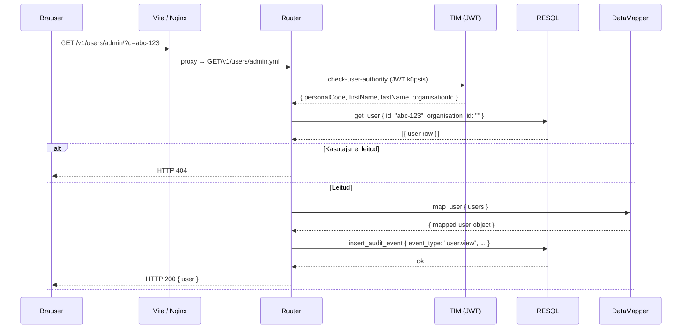
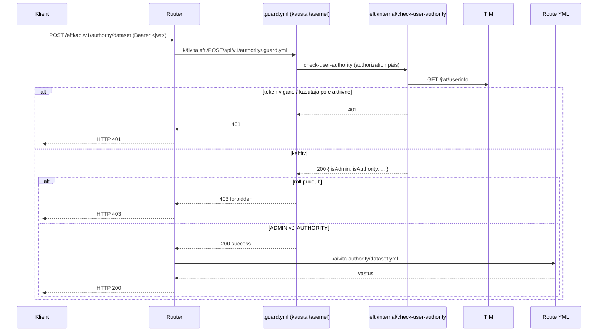

# eFTI REST API disainijuhend

Projekti teenuste arendamisel kasutatakse **contract-first** lähenemist — enne implementatsiooni koostatakse OpenAPI leping (`docs/openapi.yaml`), mis on Ruuter DSL struktuuri siduv allikas.

---

## 1. HTTP meetodite kasutamine

| Meetod | Kasutus | Idempotentne |
|--------|---------|--------------|
| `GET` | Ressursi lugemine (üksik või nimekiri) | Jah |
| `POST` | Uue ressursi loomine | Ei |
| `PUT` | Olemasoleva ressursi täielik uuendamine | Jah |
| `DELETE` | Ressursi eemaldamine | Jah |

**Reeglid:**

- `GET` päringud **ei tohi** muuta serveripoolset olekut.
- `POST` on reserveeritud loomisoperatsioonidele. Keerukate filtritega otsingud (nt CSV eksport) kasutavad `GET`-i query paramitega.
- `PUT` uuendab tervikuna — partial update'i jaoks kasutatakse samuti `PUT`-i, kuna DSL ei toeta `PATCH`-i loomulikult.
- `DELETE` toimib query paramitega, mitte request body-ga.

---

## 2. URI-de nimetamise reeglid

### 2.1 Üldpõhimõtted

- URI-d on **väiketähelised**, sõnad eraldatakse sidekriipsuga (`kebab-case`): `/user-groups`, `/audit-logs`.
- URI tähistab **ressursikollektsiooni või toimingut**, mitte HTTP meetodit — `GET /v1/users/admin/?q=123`, mitte `GET /v1/users/admin/get-user`.
- Versioon on URI esimene segment: `/v1/...`

### 2.2 Staatilised path segmendid vs query paramid

Ruuter DSL kasutab **staatilisi path segmente** failitee kaardistamiseks. Dünaamilised identifikaatorid edastatakse **query paramitena**.

| Tüüp | Näide | Selgitus |
|------|-------|----------|
| Staatiline segment | `/v1/users/admin` | `admin` on DSL kausta nimi |
| Staatiline toiming | `/v1/users/admin/search` | `search.yml` fail DSL-is |
| Query param (id) | `/v1/users/admin/?q=123` | dünaamiline identifikaator (`?q=` on de facto standard) |
| Query param (filter) | `/v1/users/admin/search/?q=Mari&page=1` | otsing ja leheküljed eraldi endpoint-is |

**Scope** (`admin` | `local`) on **staatiline path segment** — see kaardistub eraldi DSL failidega, millel on erinev äriloogika ja õigusekontrroll.

### 2.3 Keelatud mustrid

| Vale URI | Probleem |
|----------|----------|
| `GET /v1/users/admin/123` | `id` on path segmendina — Ruuter DSL ei suuda seda staatilise failiteena lahendada |
| `GET /v1/users/admin/get-user` | HTTP meetodi nimetus URI-s — meetod ise ütleb juba `GET` |
| `GET /v1/users/admin/user?id=123` | Ressursinimi `user` kordab `users` kogumiku nime — kasuta `GET /v1/users/admin/?q=123` |
| `POST /v1/users/admin/read/get` | CRUD-tegevus lisatasandil — `read/get` on redundantne |
| `POST /v1/users/admin/edit/insert` | CRUD-verb URI-s — loomine on `POST` meetodi ülesanne, mitte URI osa |
| `POST /v1/users/admin/list` | Nimekirja lugemine `POST`-iga — nimekirioperatsioonid on `GET` |
| `PUT /v1/users/admin/update?id=123` | `/update` kordab `PUT` meetodi tähendust — kasuta `PUT /v1/users/admin?id=123` |
| `DELETE /v1/users/admin/delete?id=123` | `/delete` kordab `DELETE` meetodi tähendust — kasuta `DELETE /v1/users/admin?id=123` |

### 2.4 Soovituslikud mustrid

| Toiming | Soovituslik URI | Selgitus |
|---------|-----------------|----------|
| Nimekirja otsing | `GET /v1/users/admin/search/?q=Mari&page=0&pageSize=20` | Eraldi `search` endpoint, `?q=` filtrina |
| Üksiku ressursi lugemine | `GET /v1/users/admin/?q=123` | `?q=` on de facto standard ID-paramina, ressursinimi ei kordu |
| Ressursi loomine | `POST /v1/users/admin` | HTTP meetod tähistab loomist |
| Ressursi uuendamine | `PUT /v1/users/admin?id=abc-123` | HTTP meetod tähistab uuendamist — verb URI-s on keelatud |
| Seosega ressursi lugemine | `GET /v1/user-groups/admin/users/?q=456` | `scope` path segmendina, `?q=` query paramina |
| Ressursi kustutamine | `DELETE /v1/user-groups/user?id=456&userId=789` | Mitu identifikaatorit query paramitena |

### 2.5 Andmevoo näidis — kasutaja detailvaate avamine



---

## 3. Veakoodid

Kõik veavastused järgivad [RFC 7807 Problem Details](https://datatracker.ietf.org/doc/html/rfc7807) formaati.

| HTTP kood | Tähendus | Kasutus eFTI-is |
|-----------|----------|-----------------|
| `200 OK` | Päring õnnestus | Lugemine, uuendamine |
| `201 Created` | Ressurss loodud | Uue kasutaja, grupi, klassifikaatori väärtuse loomine |
| `400 Bad Request` | Vigane päring | Puuduv kohustuslik väli, vale formaat |
| `401 Unauthorized` | Autentimata | JWT küpsis puudub või on aegunud |
| `403 Forbidden` | Puudub õigus | Kasutajal pole vajalikku permission koodi |
| `404 Not Found` | Ressurss puudub | Antud id-ga kirjet andmebaasis pole |
| `409 Conflict` | Konflikt | Isikukood on juba registreeritud, grupi nimi on juba olemas |
| `422 Unprocessable Entity` | Valideerimise viga | Välja väärtus ei vasta reeglitele (tühi nimi, vale kuupäev jne) |
| `500 Internal Server Error` | Serveriviga | Ootamatu viga RESQL-is või Ruuteris |
| `503 Service Unavailable` | Teenus maas | RESQL või andmebaas ei vasta |

### Vea vastuse formaat

```json
{
  "type": "VALIDATION_ERROR",
  "field": "email",
  "code": "invalid_format"
}
```

Kirjutamisoperatsioonide valideerimisvigu tagastab Ruuter DSL `status: 422` koos väljaga `field_error`.

---

## 4. Päringute struktuur

### 4.1 Nimekirja päringud (GET)

Kõik nimekirja-otspunktid toetavad järgmisi query parameid:

| Param | Tüüp | Kirjeldus |
|-------|------|-----------|
| `q` | string | Vabatekstotsing (`/search/` endpoint) või ressursi ID (üksiku ressursi endpoint) |
| `page` | integer | Lehekülje number (0-põhine) |
| `pageSize` | integer | Kirjete arv lehel |
| `sorting` | string | Sortimisväli ja suund (nt `name asc`) |

### 4.2 Ressursi päringud id järgi

`id` edastatakse **`?q=` query paramina** — see on de facto standard lühike identifikaatoriparameeter ja väldib ressursinime kordamist URI-s:

```
GET /v1/users/admin/?q=abc-123
GET /v1/classifiers/classifier/?q=42
GET /v1/logs/log/?q=99
```

### 4.3 Nimekirja otsing

Otsing toimub eraldi `/search/` endpointis `?q=` paramiga:

```
GET /v1/users/admin/search/?q=Mari&page=0&pageSize=20
GET /v1/user-groups/admin/search/?q=Põhja&page=0
```

### 4.4 Kirjutamisoperatsioonid

`id` (uuendatava ressursi identifikaator) edastatakse **request body-s**:

```json
PUT /v1/users/admin/update
{
  "id": "abc-123",
  "firstName": "Mari",
  ...
}
```

---

## 5. Versionimine

- Kõik API teed algavad `/v1/` prefiksiga.
- Murduva muutuse korral (breaking change) lisatakse uus versioon (`/v2/`) — vana versioon jääb tööle kuni kliendid on migreerinud.
- Auth teed (`/auth/...`) ei kasuta versiooniprefksit, kuna need on TIM-i omasüsteem.

---

## 6. Autentimine ja autoriseerimine

- Sirvija-liiklus autendib end TIM-i väljastatud JWT-ga (TARA OIDC järel), mis
  saadetakse `Authorization: Bearer <jwt>` päisena. Ruuter valideerib selle
  sisemise DSL-i `efti/internal/check-user-authority` kaudu (TIM-i kutse +
  `check_user_auth` DB-päring: aktiivsus, `token_revoked_at`).
- Masinliiklus:
  - **Platvormid** → `X-Api-Key` (ADR-004; räsi `platforms.api_key_hash` vastu).
  - **Väravatevaheline (G2G)** → AS4 mTLS `edelivery` konteineris; Ruuteri
    tasemel need teed on avalikud.
  - **X-Road** → `x-road-client` päis (`xroad/` projekt põhi-Ruuteris, `/xroad/**`; ei tohi olla
    avalikult ligipääsetav).

### 6.1 Guard-failid

Guard on `.guard.yml` fail meetodikausta all. **Ruuter jõustab ainult
kausta-tasemel `.guard.yml` faile** — lähim `.guard.yml`, mida leitakse route'i
kaustast ülespoole liikudes. Route-spetsiifilisi guard-faile
(`<route>.guard.yml` kõrvuti `<route>.yml`-ga) laaditakse, aga **ei jõustata** —
ära neile toetu. Kui üks route vajab õdedest erinevat auth-reeglit, pane see
omaette alamkausta koos oma `.guard.yml`-ga.

`template:` kutse käivitab siht-käsitleja mootori alamrutiinina ja **möödub
guardist** — avalik route võib `template:` kaudu jõuda käsitlejani, mis asub
guarditud kausta all (nii jõuavad G2G `-xml`/`-local` mähised guarditud
`authority/` käsitlejateni).

**Guardide kaart** (vt `docs/specs/permissions-matrix.md`):

| Kaust | Guard | Nõue |
|---|---|---|
| `admin/{GET,POST,PUT,DELETE}/v1/` | `check-admin-authority` | ADMIN |
| `auth/POST/` | — | avalik (callback, logout, dev-login) |
| `auth/GET/` | `check-user-authority` | autenditud kasutaja |
| `efti/GET/api/v1/` | `check-user-authority` | autenditud kasutaja |
| `efti/GET/api/v1/authority/` | `check-user-authority` + roll | ADMIN või AUTHORITY |
| `efti/POST/api/v1/` | — | avalik (G2G sisend: `dataset-xml`/`-local`, `follow-up-xml`/`-local`, `consignments/search-xml`, `ping` — ainult `edelivery` pärast AS4 mTLS) |
| `efti/POST/api/v1/authority/` | `check-user-authority` + roll | ADMIN või AUTHORITY — päris authority-käsitlejad (`dataset`, `follow-up`, `consignments-search`, `search`) |
| `platforms/POST/v1/` | `get_platform_by_api_key` | kehtiv `X-Api-Key` (räsi); ka G2G `consignments-xml` — vajab sisemist teenusetokenit kui G2G sisend taastatakse |
| `xroad/` (projektitasemel `xroad/.guard.yml`) | `get_authority_by_registry_code` | `x-road-client` päis viitab tuntud asutusele |

**Guard-faili struktuur** (`efti/POST/api/v1/authority/.guard.yml`):

```yaml
validate_auth:
  call: http.post
  args:
    url: "[#RUUTER_URL]/efti/internal/check-user-authority"
    headers:
      Content-Type: application/json
      authorization: ${incoming.headers.authorization}
    body: {}
  result: auth_result
  next: check_result

check_result:
  switch:
    - condition: ${auth_result.response.status != 200}
      next: guard_fail            # 401 — pole autenditud
    - condition: ${auth_result.response.body.isAdmin == true || auth_result.response.body.isAuthority == true}
      next: guard_success         # 200 — Ruuter jätkab route-failiga
  next: guard_fail_forbidden      # 403 — autenditud, aga vale roll

guard_success: { return: "success", status: 200, wrapper: false, next: end }
guard_fail:    { return: "${auth_result.response.body}", status: "${auth_result.response.status}", wrapper: false, next: end }
guard_fail_forbidden:
  return: ${JSON.parse('{"type":"https://api.efti.ee/errors/forbidden","title":"Forbidden","status":403,"detail":"This action requires the ADMIN or AUTHORITY role."}')}
  status: 403
  wrapper: false
  next: end
```

### 6.2 Guard andmevoog



> G2G sisend (`edelivery` → `POST /efti/api/v1/dataset-xml`) tabab avalikku
> `efti/POST/api/v1/.guard.yml`-i, seejärel jõuab `template: api/v1/authority/dataset`
> kaudu samasse käsitlejasse guardist mööda minnes.

---

## 7. Mock otspunktid

Arenduseks on kõigil otspunktidel mock vaste. Mock aktiveeritakse `frontend/.env.local` failiga:

```
VITE_USE_MOCK=true
```

Ruuter resolveerib mock faili lisades tee lõppu `/mock`:

```
GET /v1/users/admin/search/?q=Mari  →  GET/v1/users/admin/search/mock.yml
GET /v1/users/admin/?q=1  →  GET/v1/users/admin/mock.yml
```

---

## 8. DSL YAML valideerimine

Pärast iga Ruuter DSL faili loomist või muutmist käivita valideerimiskäsk repo juurkataloogist:

```bash
python3 -c "
import yaml, glob
for f in glob.glob('DSL/Ruuter/**/*.yml', recursive=True):
    try: yaml.safe_load(open(f))
    except yaml.YAMLError as e: print(f'FAIL {f}: {e}')
"
```

| Tulemus | Tähendus |
|---------|---------|
| Väljund puudub | Kõik failid on süntaktiliselt korrektsed |
| `FAIL DSL/Ruuter/.../foo.yml: ...` | Selles failis on YAML süntaksiviga — paranda enne commit'i |

> **Kohustuslik:** kõik vead tuleb parandada enne commit'i. CI pipeline lükkab tagasi malformeeritud YAML-i.

---

## 9. Seotud dokumendid

- `docs/openapi.yaml` — täielik API leping
- `docs/api-endpoints.md` — kõigi otspunktide loend tabelina
- `docs/audit-logging.md` — audit sündmuste logimise reeglid
- `docs/errors.json` — kõigi veatüüpide masinarloetav kataloog (kood, sõnum, stsenaariumid, otspunktid)
- `docs/db_errorhandling_rules.md` — andmebaasi veakäsitluse reeglid
- `DSL/Ruuter/efti/` — Ruuter DSL failid (tegelik implementatsioon)
