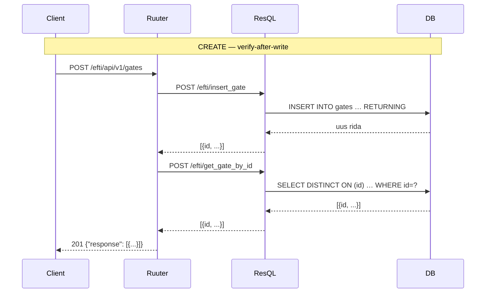
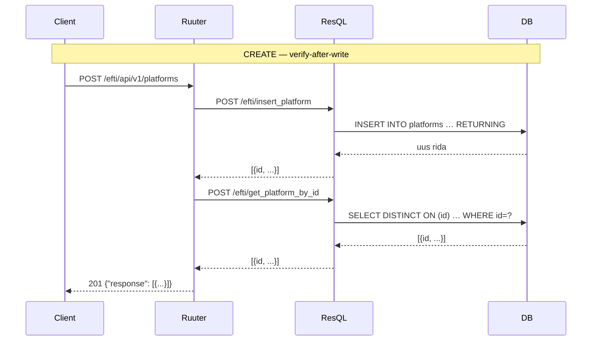
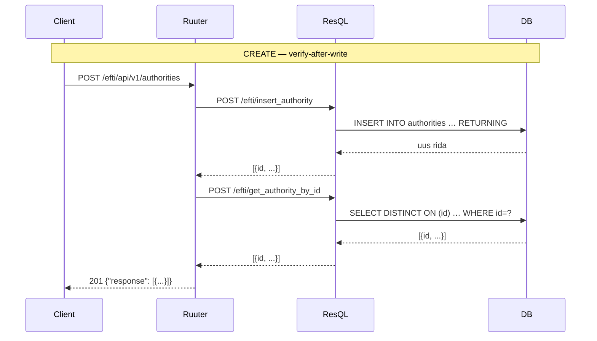

# API Endpoints — eFTI Gate EE

Dokument kirjeldab kõiki `openapi.yaml` spetsifitseeritud endpointe:
mis on **teostatud**, mis on **puudu** ja millised on näidisissendid/väljundid.

> **Ruuter URL-konventsioon:** Kuna Ruuter (Rust) ei toeta natiivset tee-parameetrit (`{gateId}`),
> kasutatakse dünaamiline identifikaator query-parameetrina: `GET /api/v1/gates?gateId=eu-xx01`
> asemel spec-i `GET /api/v1/gates/{gateId}`. Tegelikes DSL-failides **ei kasutata** eraldi
> `/get`, `/update` ega `/delete` staatilisi segmente — nimekirja- ja üksiku kirje päring
> käivitatakse samal teel, eristades `?gateId` (või `?platformId`, `?authorityId`, `?userId`)
> olemasolu. URI-s ei kasutata CRUD-verbe (`/get`, `/update`, `/delete`)
> — HTTP meetod ise tähistab toimingut. Spec-i URI-d ja tegelikud Ruuter URI-d erinevad — vt iga endpoindi juures märkus.

---

## Sisukord

1. [Üldsätted](#1-üldsätted)
2. [Seisundikaart](#2-seisundikaart)
3. [Health](#3-health)
4. [Admin — Gates](#4-admin--gates)
5. [Admin — Platforms](#5-admin--platforms)
6. [Admin — Authorities](#6-admin--authorities)
7. [Admin — Users](#7-admin--users)
8. [Admin — Audit](#8-admin--audit)
9. [Puuduvad endpointid](#9-puuduvad-endpointid)
10. [Veaformaat](#10-veaformaat)
11. [Ühised skeemid](#11-ühised-skeemid)

---

## 1. Üldsätted

| Teema | Reegel |
|---|---|
| **Kaks Ruuterit** | `efti` (8086) — admin UI + `auth/*`. `m2m` (8087) — masinliides: partnervärava eDelivery, Authority API, Platform API, X-Road. Vt [ADR-005](../architecture/decisions/005-m2m-ruuter-split.md). |
| **Auth (Admin, `efti`)** | TARA OIDC JWT — `Authorization: Bearer <jwt>` (RS256, JWKS) |
| **Auth (Authority API, `m2m`)** | X-Road-Client päis (RIA turvaserver) või eDelivery — kasutajata masinliiklus |
| **Auth (Platform API, `m2m`)** | API võti päises `X-Api-Key`; hoitakse SHA-256 räsina. Vt [ADR-004](../architecture/decisions/004-platform-api-key.md). |
| **Auth (eDelivery G2G, `m2m`)** | Puudub Ruuteri tasemel — AS4 / WS-Security lõpetab `edelivery` teenus, m2m Ruuter pole väljaspool võrku |
| **Auth (Cron)** | Staatiline `ARCHIVE_OPS_TOKEN` env-muutuja |
| **Health** | Autentimine puudub — avalik |
| **Guard-failid (`efti`)** | `GET /api/v1/*` → autentimine nõutav; `PUT/DELETE /api/v1/*` → ADMIN; `POST /api/v1/*` guard on avalik (Ruuter 0.9.x aheldab guarde, mitte-avalik katkestaks ka `auth/*`) — POST admin-endpointid kutsuvad `check-admin-authority` oma DSL-i alguses; `/api/v1/auth/*` → avalik |
| **Guard-failid (`m2m`)** | `m2m/POST/xroad/` → X-Road-Client; `m2m/POST/platform/` → `X-Api-Key`; `m2m/POST/edelivery/` → võrgu-usaldus; `m2m/{POST,GET}/authority/` → X-Road-Client või eDelivery |
| **Rollid** | `ADMIN` — kõik haldustoimingud; `AUTHORITY` — dataset/follow-up/authority-search; `'{}'` — puuduvad õigused (ainult `/api/v1/user`) |
| **Veavastuse formaat** | RFC 7807 `application/problem+json` |
| **`X-Request-ID`** | UUID päis kõigil muteerivaatel (POST/PUT/DELETE); duplikaat 10 min jooksul → 409 |
| **Paginatsioon** | `?limit=100&offset=0`; kogus `X-Total-Count` päises |
| **Kirjutused** | Append-only INSERT — pole UPDATE/DELETE. Viimane rida `created_at` järgi on kehtiv seis |
| **Pehme kustutus** | Kirjutab uue rea `is_*_active = FALSE` |

---

## 2. Seisundikaart

```mermaid
graph LR
    subgraph "✅ Teostatud"
        H1["GET /health/live"]
        H2["GET /health/ready"]
        G1["GET /api/v1/gates"]
        G2["POST /api/v1/gates"]
        G3["GET /api/v1/gates/own"]
        G4["GET /api/v1/gates?gateId={id}"]
        G5["PUT /api/v1/gates?gateId={id}"]
        G6["DELETE /api/v1/gates?gateId={id}"]
        G7["POST /api/v1/gates/ping ⚠️501"]
        P1["GET /api/v1/platforms"]
        P2["POST /api/v1/platforms"]
        P3["GET /api/v1/platforms?platformId={id}"]
        P4["PUT /api/v1/platforms?platformId={id}"]
        P5["DELETE /api/v1/platforms?platformId={id}"]
        P6["POST /api/v1/platforms/ping ⚠️501"]
        A1["GET /api/v1/authorities"]
        A2["POST /api/v1/authorities"]
        A3["GET /api/v1/authorities?authorityId={id}"]
        A4["PUT /api/v1/authorities?authorityId={id}"]
        A5["DELETE /api/v1/authorities?authorityId={id}"]
        U1["GET /api/v1/users"]
        U2["POST /api/v1/users"]
        U3["GET /api/v1/users?userId={id}"]
        U4["PUT /api/v1/users?userId={id}"]
        U5["DELETE /api/v1/users?userId={id}"]
        U6["POST /api/v1/users/revoke-token?userId={id}"]
        AU["GET /api/v1/audit"]
    end

    subgraph "✅ Teostatud (uued)"
        C1["GET /api/v1/consignments (filtriga)"]
        C2["DELETE /api/v1/consignments?consignmentId={id}"]
        PL1["GET /api/v1/status?datasetId={id}"]
        PL2["POST /api/v1/ping"]
        PL3["GET /api/v1/follow-up?datasetId={id}"]
        PL4["GET /api/v1/datasets?datasetId={id}"]
        AU1["GET /api/v1/identifiers?identifier={id}"]
        AU2["POST /api/v1/dataset"]
        AU3["POST /api/v1/follow-up"]
    end

    subgraph "✅ Teostatud (auth)"
        M1["GET /api/v1/user"]
        M2["POST /api/v1/auth/logout"]
        M3["POST /api/v1/auth/dev-login (dev only)"]
    end

    subgraph "❌ Puudub"
        M4["POST /api/v1/admin/*"]
        M5["POST /api/v1/auth/local-token"]
    end
```



**Kokkuvõte:**

| Kategooria | Kokku specs-is | Teostatud | Puudub |
|---|---|---:|---:|
| Health | 2 | **2** | 0 |
| Admin — Gates | 7 | **7** | 0 |
| Admin — Platforms | 6 | **6** | 0 |
| Admin — Authorities | 5 | **5** | 0 |
| Admin — Audit | 1 | **1** | 0 |
| Admin — Users | 7 | **7** | 0 |
| Admin — Consignments | 2 | **2** | 0 |
| Admin — Cron | 3 | 0 | **3** |
| Auth | 2 | **1** | **1** |
| Platform API | 6 | **6** | 0 |
| Authority API | 3 | **3** | 0 |
| **Kokku** | **44** | **40** | **4** |

---

## 3. Health

### `GET /efti/health/live` — Liveness probe

Kontrollib ainult et protsess jookseb. Kubernetes kasutab liveness probe'ina.
Auth puudub.

**Ruuter DSL:** `DSL/Ruuter/efti/GET/health/live.yml`

| | |
|---|---|
| **Vastus 200** | `text/plain` — keha `"OK"` |
| **Vastus 503** | RFC 7807 — teenus pole saadaval |

```
GET /efti/health/live

→ 200 OK
OK
```

---

### `GET /efti/health/ready` — Readiness probe

Kontrollib et DB ühendus töötab (ResQL `get_db_status` päring).
Auth puudub.

**Ruuter DSL:** `DSL/Ruuter/efti/GET/health/ready.yml`

| | |
|---|---|
| **Vastus 200** | `text/plain` — keha `"OK"` |
| **Vastus 503** | RFC 7807 — DB pole saadaval |

```
GET /efti/health/ready

→ 200 OK
OK
```

---

## 4. Admin — Gates

Kirjeldab eFTI värava (gate) registrit. Kõik kirjutused on append-only.
Gate'i `id` peab vastama mustrile `^eu-[a-z]{2}[0-9]{2}$` (nt `eu-ee01`).



---

### `GET /efti/api/v1/gates` — Loetle gates

**Spec:** `GET /api/v1/gates`
**Ruuter DSL:** `DSL/Ruuter/efti/GET/api/v1/gates.yml`

**Query parameetrid:**

| Parameeter | Tüüp | Vaikimisi | Märkus |
|---|---|---|---|
| `limit` | int | 20 | Max 1000 |
| `offset` | int | 0 | |

**Näidis:**

```
GET /efti/api/v1/gates?limit=2&offset=0

→ 200 OK
{
  "response": [
    {
      "id": "eu-ee01",
      "countryCode": "EE",
      "eDeliveryUrl": "https://efti.ria.ee/services/msh",
      "eDeliveryCert": null,
      "tlsCert": null,
      "status": "ONLINE",
      "lastPingAt": "2026-04-23T10:00:00Z",
      "isGateActive": true,
      "createdAt": "2026-01-15T09:00:00Z"
    }
  ]
}
```

> ⚠️ **Puudu spec-ist:** `X-Total-Count` päis pole veel teostatud.

---

### `POST /efti/api/v1/gates` — Loo gate

**Spec:** `POST /api/v1/gates`
**Ruuter DSL:** `DSL/Ruuter/efti/POST/api/v1/gates.yml`
**Voog:** INSERT → verify GET → 201

**Päringu keha:**

| Väli | Tüüp | Kohustuslik | Märkus |
|---|---|---|---|
| `id` | string | ✅ | Muster `eu-[a-z]{2}[0-9]{2}` |
| `countryCode` | string | ✅ | ISO 3166-1 alpha-2 |
| `eDeliveryUrl` | string (uri) | ✅ | AS4 MSH endpoint |
| `eDeliveryCert` | string\|null | ❌ | PEM-sertifikaat |
| `tlsCert` | string\|null | ❌ | mTLS sertifikaat |
| `status` | `ONLINE`\|`OFFLINE`\|`DISABLED` | ❌ | Vaikimisi `OFFLINE` |
| `isGateActive` | boolean | ❌ | Vaikimisi `true` |

```json
// Päring
POST /efti/api/v1/gates
Content-Type: application/json

{
  "id": "eu-de01",
  "countryCode": "DE",
  "eDeliveryUrl": "https://efti-peer.bkg.bund.de/services/msh",
  "eDeliveryCert": "-----BEGIN CERTIFICATE-----\nMIIC...-----END CERTIFICATE-----",
  "status": "OFFLINE"
}

// Vastus 201 Created
{
  "response": [
    {
      "id": "eu-de01",
      "countryCode": "DE",
      "eDeliveryUrl": "https://efti-peer.bkg.bund.de/services/msh",
      "status": "OFFLINE",
      "isGateActive": true,
      "createdAt": "2026-04-23T11:00:00Z"
    }
  ]
}
```

> ⚠️ **Puudu spec-ist:** 409 Conflict kui `id` juba eksisteerib pole veel teostatud — duplikaat lisatakse uue reana.

---

### `GET /efti/api/v1/gates/own` — Oma gate

**Spec:** `GET /api/v1/gates/own`
**Ruuter DSL:** `DSL/Ruuter/efti/GET/api/v1/gates/own.yml`

Loeb gate'i ID env-muutujast `OWN_GATE_ID` ja tagastab vastava kirje andmebaasist.

```
GET /efti/api/v1/gates/own

→ 200 OK
{
  "response": [
    {
      "id": "eu-ee01",
      "countryCode": "EE",
      "eDeliveryUrl": "https://efti.ria.ee/services/msh",
      "status": "ONLINE",
      "isGateActive": true
    }
  ]
}

→ 404 Not Found (kui OWN_GATE_ID ei ole seatud või kirje puudub DB-st)
{
  "response": "{\"error\": \"Not Found\"}"
}
```

---

### `GET /efti/api/v1/gates?gateId={id}` — Üks gate

**Spec:** `GET /api/v1/gates/{gateId}`
**Ruuter DSL:** `DSL/Ruuter/efti/GET/api/v1/gates.yml`

> ℹ️ **Ruuter workaround:** Spec-i tee-parameeter `{gateId}` on asendatud query-parameetriga `?gateId=`.

Tagastab viimase rea `DISTINCT ON (id) ORDER BY created_at DESC` — sealhulgas soft-kustutatud gate (`isGateActive: false`).

```
GET /efti/api/v1/gates?gateId=eu-de01

→ 200 OK
{
  "response": [
    {
      "id": "eu-de01",
      "countryCode": "DE",
      "status": "ONLINE",
      "isGateActive": true,
      "createdAt": "2026-04-23T11:00:00Z"
    }
  ]
}

→ 404 Not Found
{
  "response": "{\"error\": \"Not Found\"}"
}
```

---

### `PUT /efti/api/v1/gates?gateId={id}` — Uuenda gate

**Spec:** `PUT /api/v1/gates/{gateId}`
**Ruuter DSL:** `DSL/Ruuter/efti/PUT/api/v1/gates.yml`
**Voog:** INSERT uus rida → verify GET → 200

Päringu keha sama mis `POST /gates`.

```json
// Päring
PUT /efti/api/v1/gates?gateId=eu-de01
Content-Type: application/json

{
  "countryCode": "DE",
  "eDeliveryUrl": "https://efti-peer-new.bkg.bund.de/services/msh",
  "status": "ONLINE",
  "isGateActive": true
}

// Vastus 200 OK
{
  "response": [
    {
      "id": "eu-de01",
      "eDeliveryUrl": "https://efti-peer-new.bkg.bund.de/services/msh",
      "status": "ONLINE",
      "isGateActive": true
    }
  ]
}
```

---

### `DELETE /efti/api/v1/gates?gateId={id}` — Kustuta gate

**Spec:** `DELETE /api/v1/gates/{gateId}`
**Ruuter DSL:** `DSL/Ruuter/efti/DELETE/api/v1/gates.yml`
**Voog:** INSERT rida `is_gate_active=false` → verify GET (`isGateActive == false`) → 204

```
DELETE /efti/api/v1/gates?gateId=eu-de01

→ 204 No Content   (keha puudub)

→ 404 Not Found    (gateId ei eksisteeri)
→ 500              (kustutus õnnestus aga verify ebaõnnestus)
```

---

### `POST /efti/api/v1/gates/ping?gateId={id}` — Ping gate ⚠️ 501

**Spec:** `POST /api/v1/gates/{gateId}/ping`
**Ruuter DSL:** `DSL/Ruuter/efti/POST/api/v1/gates/ping.yml`

eDelivery AS4 ping pole skoobis — tagastab alati `501 Not Implemented` (parameetrit ignoreeritakse).

```
POST /efti/api/v1/gates/ping?gateId=eu-de01

→ 501 Not Implemented
{
  "response": "{\"error\": \"Not Implemented\"}"
}
```

---

## 5. Admin — Platforms

Platform'i kirje seob platvormi `baseUrl`-i eDelivery sertifikaadiga.
Platvorm autendib end masinliidesele API võtmega (`X-Api-Key`), mida hoitakse
SHA-256 räsina (`api_key_hash`) — vt [ADR-004](../architecture/decisions/004-platform-api-key.md).
Kasutajaliideses ja `GET` vastustes on näha ainult `apiKeyHint` (räsi 8 esimest
heksamärki) ja `apiKeyGeneratedAt`.



---

### `GET /efti/api/v1/platforms` — Loetle platforms

**Ruuter DSL:** `DSL/Ruuter/efti/GET/api/v1/platforms.yml`

**Query parameetrid:** `limit` (vaikimisi 20), `offset` (vaikimisi 0)

```
GET /efti/api/v1/platforms

→ 200 OK
{
  "response": [
    {
      "id": "plt-cargo-ee-001",
      "baseUrl": "https://api.cargo-ee.com/efti/v1",
      "supportsSubsetting": true,
      "isPlatformActive": true,
      "createdAt": "2026-03-01T08:00:00Z"
    }
  ]
}
```

---

### `POST /efti/api/v1/platforms` — Loo platform

**Ruuter DSL:** `DSL/Ruuter/efti/POST/api/v1/platforms.yml`

**Päringu keha:**

| Väli | Tüüp | Kohustuslik | Märkus |
|---|---|---|---|
| `id` | string | ✅ | Platvormi identifikaator |
| `baseUrl` | string (uri) | ✅ | REST API baas-URL |
| `supportsSubsetting` | boolean | ❌ | Vaikimisi `true` |
| `headers` | object | ❌ | Lisapäised (nt API võtmed) |
| `eDeliveryCert` | string\|null | ❌ | AS4 sertifikaat PEM |
| `tlsCert` | string\|null | ❌ | mTLS sertifikaat PEM |
| `certSubject` | string\|null | ❌ | mTLS lahendamiseks vajalik tootmises |
| `certSerial` | string\|null | ❌ | Sama sertifikaadi seeria |
| `isPlatformActive` | boolean | ❌ | Vaikimisi `true` |

```json
// Päring
POST /efti/api/v1/platforms
Content-Type: application/json

{
  "id": "plt-cargo-ee-001",
  "baseUrl": "https://api.cargo-ee.com/efti/v1",
  "supportsSubsetting": true,
  "headers": { "X-Api-Key": "secret-key-abc123" },
  "certSubject": "CN=eDelivery-Platform, O=Cargo EE OÜ, C=EE",
  "certSerial": "0123456789ABCDEF"
}

// Vastus 201 Created
{
  "response": [
    {
      "id": "plt-cargo-ee-001",
      "baseUrl": "https://api.cargo-ee.com/efti/v1",
      "supportsSubsetting": true,
      "isPlatformActive": true,
      "createdAt": "2026-04-23T11:05:00Z"
    }
  ]
}
```

---

### `GET /efti/api/v1/platforms?platformId={id}` — Üks platform

**Ruuter DSL:** `DSL/Ruuter/efti/GET/api/v1/platforms.yml`

```
GET /efti/api/v1/platforms?platformId=plt-cargo-ee-001

→ 200 OK
{
  "response": [
    {
      "id": "plt-cargo-ee-001",
      "baseUrl": "https://api.cargo-ee.com/efti/v1",
      "certSubject": "CN=eDelivery-Platform, O=Cargo EE OÜ, C=EE",
      "supportsSubsetting": true,
      "isPlatformActive": true
    }
  ]
}
```

---

### `PUT /efti/api/v1/platforms?platformId={id}` — Uuenda platform

**Ruuter DSL:** `DSL/Ruuter/efti/PUT/api/v1/platforms.yml`

Päringu keha sama mis POST. Voog: INSERT → verify → 200.

```json
// Vastus 200 OK
{
  "response": [
    {
      "id": "plt-cargo-ee-001",
      "baseUrl": "https://api.cargo-ee-v2.com/efti/v1",
      "isPlatformActive": true
    }
  ]
}
```

---

### `DELETE /efti/api/v1/platforms?platformId={id}` — Kustuta platform

**Ruuter DSL:** `DSL/Ruuter/efti/DELETE/api/v1/platforms.yml`

```
DELETE /efti/api/v1/platforms?platformId=plt-cargo-ee-001

→ 204 No Content
```

---

### `POST /efti/api/v1/platforms/ping?platformId={id}` — Ping platform ⚠️ 501

**Ruuter DSL:** `DSL/Ruuter/efti/POST/api/v1/platforms/ping.yml`

```
POST /efti/api/v1/platforms/ping?platformId=plt-cargo-ee-001

→ 501 Not Implemented
```

---

### `POST /efti/api/v1/platforms/api-key/{id}` — Genereeri API võti

**Ruuter DSL:** `DSL/Ruuter/efti/POST/api/v1/platforms/api-key.yml` · ADMIN

Genereerib platvormile uue `X-Api-Key` võtme. Lisab append-only `platforms` rea,
mis kannab kõik väljad edasi ja asendab `api_key_*` veerud. Avatekstina tagastatakse
võti **täpselt üks kord**.

```
POST /efti/api/v1/platforms/api-key/plt-cargo-ee-001

→ 201 Created
{
  "id": "plt-cargo-ee-001",
  "apiKey": "9f8e7d…c1b2",          // 48 heksamärki — näidatakse ainult siin
  "apiKeyHint": "3a1f9c02",
  "apiKeyGeneratedAt": "2026-08-31T09:12:00Z"
}

→ 404 Not Found   // tundmatu või kustutatud platvorm
```

---

## 6. Admin — Authorities

Pädev asutus (competent authority) on organisatsioon kellel on lubatud konkreetseid eFTI andmete alamhulki pärida.
`subsets` väli kitsendab ligipääsu: ainult loetletud EU01–EU07 koodid on lubatud.



---

### `GET /efti/api/v1/authorities` — Loetle authorities

**Ruuter DSL:** `DSL/Ruuter/efti/GET/api/v1/authorities.yml`

**Query parameetrid:** `limit` (vaikimisi 20), `offset` (vaikimisi 0)

```
GET /efti/api/v1/authorities

→ 200 OK
{
  "response": [
    {
      "id": "auth-mta",
      "countryCode": "EE",
      "name": "Maksu- ja Tolliamet",
      "subsets": ["EU01", "EU02", "EU05"],
      "isAuthorityActive": true
    }
  ]
}
```

---

### `POST /efti/api/v1/authorities` — Loo authority

**Ruuter DSL:** `DSL/Ruuter/efti/POST/api/v1/authorities.yml`

**Päringu keha:**

| Väli | Tüüp | Kohustuslik | Märkus |
|---|---|---|---|
| `id` | string | ✅ | Asutuse identifikaator, nt `"auth-mta"` |
| `countryCode` | string | ✅ | ISO 3166-1 alpha-2 |
| `name` | string | ✅ | Asutuse nimi |
| `subsets` | string[] | ✅ | Min 1; lubatud `EU01`–`EU07` |
| `isAuthorityActive` | boolean | ❌ | Vaikimisi `true` |

```json
// Päring
POST /efti/api/v1/authorities
Content-Type: application/json

{
  "id": "auth-mta",
  "countryCode": "EE",
  "name": "Maksu- ja Tolliamet",
  "subsets": ["EU01", "EU02", "EU05"]
}

// Vastus 201 Created
{
  "response": [
    {
      "id": "auth-mta",
      "countryCode": "EE",
      "name": "Maksu- ja Tolliamet",
      "subsets": ["EU01", "EU02", "EU05"],
      "isAuthorityActive": true,
      "createdAt": "2026-04-23T11:10:00Z"
    }
  ]
}
```

> ⚠️ **Resql piirang:** `subsets` JSON array konverteeritakse SQL-is:
> `ARRAY(SELECT jsonb_array_elements_text(:subsets::jsonb))`

---

### `GET /efti/api/v1/authorities?authorityId={id}` — Üks authority

**Ruuter DSL:** `DSL/Ruuter/efti/GET/api/v1/authorities.yml`

```
GET /efti/api/v1/authorities?authorityId=auth-mta

→ 200 OK
{
  "response": [
    {
      "id": "auth-mta",
      "countryCode": "EE",
      "name": "Maksu- ja Tolliamet",
      "subsets": ["EU01", "EU02", "EU05"],
      "isAuthorityActive": true
    }
  ]
}
```

---

### `PUT /efti/api/v1/authorities?authorityId={id}` — Uuenda authority

**Ruuter DSL:** `DSL/Ruuter/efti/PUT/api/v1/authorities.yml`

Päringu keha sama mis POST. Voog: INSERT → verify → 200.

```json
// Vastus 200 OK
{
  "response": [
    {
      "id": "auth-mta",
      "name": "Maksu- ja Tolliamet (uuendatud)",
      "subsets": ["EU01", "EU02", "EU03", "EU05"],
      "isAuthorityActive": true
    }
  ]
}
```

---

### `DELETE /efti/api/v1/authorities?authorityId={id}` — Kustuta authority

**Ruuter DSL:** `DSL/Ruuter/efti/DELETE/api/v1/authorities.yml`

```
DELETE /efti/api/v1/authorities?authorityId=auth-mta

→ 204 No Content
```

---

## 7. Admin — Users

Admin kasutajate haldus. Kasutaja seotakse `taraSub`-ga. Kõik kirjutused on append-only.

---

### `GET /efti/api/v1/users` — Loetle users

**Spec:** `GET /api/v1/users`
**Ruuter DSL:** `DSL/Ruuter/efti/GET/api/v1/users.yml`

**Query parameetrid:**

| Parameeter | Tüüp | Vaikimisi | Märkus |
|---|---|---|---|
| `limit` | int | 20 | |
| `offset` | int | 0 | |

```
GET /efti/api/v1/users?limit=2&offset=0

→ 200 OK
{
  "response": [
    {
      "rowId": "01923a8c-4f7c-7a1b-9c2e-fd0d9b0a4e11",
      "id": "550e8400-e29b-41d4-a716-446655440000",
      "taraSub": "EE12345678901",
      "name": "Mari Mets",
      "tokenRevokedAt": null,
      "isUserActive": true,
      "createdAt": "2026-04-23T11:15:00Z"
    }
  ]
}
```

---

### `POST /efti/api/v1/users` — Loo user

**Spec:** `POST /api/v1/users`
**Ruuter DSL:** `DSL/Ruuter/efti/POST/api/v1/users.yml`
**Voog:** INSERT → verify GET → 201

**Auth:** nõuab ADMIN rolli.

**Päringu keha:**

| Väli | Tüüp | Kohustuslik | Märkus |
|---|---|---|---|
| `taraSub` | string | ✅ | TARA `sub` väärtus |
| `name` | string | ✅ | |
| `roles` | `("ADMIN"\|"AUTHORITY")[]` | ❌ | Vaikimisi `[]` |

```json
// Päring
POST /efti/api/v1/users
Content-Type: application/json

{
  "taraSub": "EE12345678901",
  "name": "Mari Mets",
  "roles": ["AUTHORITY"]
}

// Vastus 201 Created
{
  "response": [
    {
      "rowId": "01923a8c-4f7c-7a1b-9c2e-fd0d9b0a4e11",
      "id": "550e8400-e29b-41d4-a716-446655440000",
      "taraSub": "EE12345678901",
      "name": "Mari Mets",
      "tokenRevokedAt": null,
      "isUserActive": true,
      "createdAt": "2026-04-23T11:15:00Z"
    }
  ]
}
```

> ℹ️ **Tähelepanu:** duplicate `taraSub` korral tagastab `409 Conflict`.

---

### `GET /efti/api/v1/users?userId={id}` — Üks user

**Spec:** `GET /api/v1/users/{userId}`
**Ruuter DSL:** `DSL/Ruuter/efti/GET/api/v1/users.yml`

> ℹ️ **Ruuter workaround:** Spec-i tee-parameeter `{userId}` on asendatud query-parameetriga `?userId=`.

```
GET /efti/api/v1/users?userId=550e8400-e29b-41d4-a716-446655440000

→ 200 OK
{
  "response": [
    {
      "rowId": "01923a8c-4f7c-7a1b-9c2e-fd0d9b0a4e11",
      "id": "550e8400-e29b-41d4-a716-446655440000",
      "taraSub": "EE12345678901",
      "name": "Mari Mets",
      "tokenRevokedAt": null,
      "isUserActive": true,
      "createdAt": "2026-04-23T11:15:00Z"
    }
  ]
}
```

---

### `PUT /efti/api/v1/users?userId={id}` — Uuenda user

**Spec:** `PUT /api/v1/users/{userId}`
**Ruuter DSL:** `DSL/Ruuter/efti/PUT/api/v1/users.yml`
**Voog:** INSERT uus rida → verify GET → 200

**Auth:** nõuab ADMIN rolli. Admin ei saa endalt ADMIN rolli eemaldada (→ 403).

Päringu keha sama mis `POST /users` (sh `roles`).

```json
// Päring
PUT /efti/api/v1/users?userId=550e8400-e29b-41d4-a716-446655440000
Content-Type: application/json

{
  "name": "Mari Mets-Uuendatud",
  "roles": ["AUTHORITY"]
}

// Vastus 200 OK
{
  "response": [
    {
      "id": "550e8400-e29b-41d4-a716-446655440000",
      "name": "Mari Mets-Uuendatud",
      "isUserActive": true
    }
  ]
}
```

---

### `DELETE /efti/api/v1/users?userId={id}` — Kustuta user

**Spec:** `DELETE /api/v1/users/{userId}`
**Ruuter DSL:** `DSL/Ruuter/efti/DELETE/api/v1/users.yml`
**Voog:** INSERT rida `is_user_active=false` → verify GET → 204

> ⚠️ **Lahtine:** admin ei tohiks saada enda kontot kustutada — self-delete kaitse lisatakse järgmises PR-is.

```
DELETE /efti/api/v1/users?userId=550e8400-e29b-41d4-a716-446655440000

→ 204 No Content   (keha puudub)

→ 404 Not Found    (userId ei eksisteeri)
→ 500              (kustutus õnnestus aga verify ebaõnnestus)
```

---

### `POST /efti/api/v1/users/revoke-token?userId={id}` — Tühista kasutaja token

**Spec:** `POST /api/v1/users/{userId}/revoke-token`
**Ruuter DSL:** `DSL/Ruuter/efti/POST/api/v1/users/revoke-token.yml`
**Voog:** revoke → verify GET (`tokenRevokedAt != null`) → 204

```
POST /efti/api/v1/users/revoke-token?userId=550e8400-e29b-41d4-a716-446655440000

→ 204 No Content
```

---

## 8. Admin — Audit

Auditilogi on append-only, andmeid ei muudeta. Säilitatakse vähemalt 7 aastat (GDPR art 30).

**Ruuter DSL:** `DSL/Ruuter/efti/GET/api/v1/audit.yml`

### `GET /efti/api/v1/audit` — Auditilogi päring

**Query parameetrid:**

| Parameeter | Tüüp | Kohustuslik | Märkus |
|---|---|---|---|
| `resource` | string | ❌ | `gates`, `platforms`, `authorities`, `users`, `consignments`, `identifiers`, `dataset`, `session` |
| `resourceId` | string | ❌ | Ressursi konkreetne ID |
| `userId` | UUID | ❌ | Toimingu tegija |
| `from` | datetime (ISO 8601) | ❌ | Algus |
| `to` | datetime (ISO 8601) | ❌ | Lõpp |
| `limit` | int | ❌ | Vaikimisi 20 |
| `offset` | int | ❌ | Vaikimisi 0 |

```
GET /efti/api/v1/audit?resource=gates&limit=2

→ 200 OK
{
  "response": [
    {
      "rowId": "01923a8c-4f7c-7a1b-9c2e-fd0d9b0a4e11",
      "userId": "550e8400-e29b-41d4-a716-446655440000",
      "action": "create_gate",
      "resource": "gates",
      "resourceId": "eu-de01",
      "ipAddress": "203.0.113.45",
      "details": { "countryCode": "DE" },
      "recordedAt": "2026-04-22T10:20:35Z"
    }
  ]
}
```

> ⚠️ **Puudu:** Auditilogi kirjeid ei kirjutata praegu automaatselt (trigger-loogika pole teostatud).
> Tabel eksisteerib aga jääb tühjaks kuni auditi kirjutamise voog pole rakendatud.

---

## 9. Lisaendpointid ja staatused

### 9.1 Auth

| Meetod | Spec path | Kirjeldus |
|---|---|---|
| `POST` | `/api/v1/auth/local-token` | Break-glass kohalik admin token (HTTP Basic, vaikimisi keelatud) |
| `POST` | `/api/v1/auth/logout` | Tühista JWT (lisab `jti` sessioonide musta nimekirja) |

---

### 9.2 Users (Admin)

| Meetod | Spec path | Kirjeldus |
|---|---|---|
| `GET` | `/api/v1/user` | Praeguse sisseloginud kasutaja profiil (any-auth) |

> ℹ️ Ülejäänud `users` endpointid (`GET/POST/PUT/DELETE`, `revoke-token`) on teostatud (vt [Admin — Users](#7-admin--users)).

---

### 9.3 Consignments (Admin) ✅

| Meetod | Ruuter DSL | Kirjeldus |
|---|---|---|
| `GET` | `DSL/Ruuter/efti/GET/api/v1/consignments.yml` | Saadetiste nimekiri (filter: `status`, `platformId`, `transportMode`, `dangerousGoods`) |
| `DELETE` | `DSL/Ruuter/efti/DELETE/api/v1/consignments.yml` | Pehme kustutus (append-only `status=DELETED`) |

> ℹ️ **Ruuter workaround:** `{datasetId}` path param on asendatud `?consignmentId=` query-parameetriga.

**GET filtrid:**

| Parameeter | Tüüp | Kirjeldus |
|---|---|---|
| `status` | string | `ACTIVE`, `DELETED` — vaikimisi kõik |
| `platformId` | string | Platvormi ID filter |
| `transportMode` | string | Transpordirežiim (nt `1`) |
| `dangerousGoods` | string | Ohtlike kaupade kood |
| `limit` | int | Vaikimisi 20 |
| `offset` | int | Vaikimisi 0 |

---

### 9.4 Cron Admin

Autentimine: staatiline `ARCHIVE_OPS_TOKEN` bearer token.

| Meetod | Spec path | Kirjeldus |
|---|---|---|
| `POST` | `/api/v1/admin/archive` | Käivita arhiveerimise pühkimine (CronManager-ist) |
| `POST` | `/api/v1/admin/expire-identifiers` | Märgi maantee-saadetised aegunuks (14-päeva kabotaaž) |
| `POST` | `/api/v1/admin/ping-gates` | Kontrolli kõiki partnergate'e ja kirjuta ONLINE/OFFLINE read |

---

### 9.5 Platform API (mTLS) ✅

Auth: mTLS X.509 — reversproxy edastab `X-Client-Cert-Subject` + `X-Client-Cert-Serial` (praegu `allow-all`).

| Meetod | Ruuter DSL | Ruuter tee | Kirjeldus |
|---|---|---|---|
| `POST` | `DSL/Ruuter/efti/POST/api/v1/consignments.yml` | `POST /efti/api/v1/consignments` | FTI004 XML upload → INSERT (verify-after-write) → JSON vastus |
| `DELETE` | `DSL/Ruuter/efti/DELETE/api/v1/consignments.yml` | `DELETE /efti/api/v1/consignments?consignmentId={id}` | Pehme kustutus + verify |
| `GET` | `DSL/Ruuter/efti/GET/api/v1/status.yml` | `GET /efti/api/v1/status?datasetId={id}` | Saadetise staatus |
| `POST` | `DSL/Ruuter/efti/POST/api/v1/ping.yml` | `POST /efti/api/v1/ping` | Kättesaadavuse kontroll — tagastab 204 |
| `GET` | `DSL/Ruuter/efti/GET/api/v1/follow-up.yml` | `GET /efti/api/v1/follow-up?datasetId={id}&requestId={id}` | Järelkontrolli sõnumid platformile |
| `GET` | `DSL/Ruuter/efti/GET/api/v1/datasets.yml` | `GET /efti/api/v1/datasets?datasetId={id}` | Andmestiku XML (raw) |

> ℹ️ **Ruuter workaround:** Kõik `{id}` path parameetrid on asendatud query-parameetritega.

---

### 9.6 Authority API (TARA JWT) ✅

Auth: TARA OIDC JWT — nõuab `AUTHORITY` või `ADMIN` rolli (`POST /api/v1/.guard` authority-or-admin guard).
`GET /api/v1/identifiers` on any-auth guard all (piisab autentimisest).

| Meetod | Ruuter DSL | Ruuter tee | Kirjeldus |
|---|---|---|---|
| `GET` | `DSL/Ruuter/efti/GET/api/v1/identifiers.yml` | `GET /efti/api/v1/identifiers?identifier={id}` | Otsing `mainTransportId` / `usedEquipmentIds` järgi |
| `POST` | `DSL/Ruuter/efti/POST/api/v1/dataset.yml` | `POST /efti/api/v1/dataset` | FTI010 XML andmestik, filtreerituna `subsets[]` järgi — nõuab AUTHORITY/ADMIN |
| `POST` | `DSL/Ruuter/efti/POST/api/v1/follow-up.yml` | `POST /efti/api/v1/follow-up` | FTI025 XML sisend → log → FTI030 XML vastus — nõuab AUTHORITY/ADMIN |
| `POST` | `DSL/Ruuter/efti/POST/api/v1/authority/search.yml` | `POST /efti/api/v1/authority/search` | Asutuste otsing — nõuab AUTHORITY/ADMIN |
| `POST` | `DSL/Ruuter/efti/POST/api/v1/authority/follow-up.yml` | `POST /efti/api/v1/authority/follow-up` | Authority järelkontroll — nõuab AUTHORITY/ADMIN |

> ℹ️ **Body:** `{ "gateId": "...", "platformId": "...", "datasetId": "...", "subsets": ["EU01", "EU02"] }` — `subsets: []` tagastab kogu andmestiku.

---

## 10. Veaformaat

Kõik vead järgivad RFC 7807 `application/problem+json` formaati.

```json
{
  "type": "https://api.efti.ee/errors/gate-not-found",
  "code": "GATE_NOT_FOUND",
  "title": "Not Found",
  "status": 404,
  "detail": "Gate 'eu-zz99' not found",
  "instance": "/api/v1/gates/eu-zz99",
  "requestId": "7c9e6679-7425-40de-944b-e07fc1f90ae7"
}
```

> ⚠️ **Praegune olukord:** Ruuter kasutab lihtsat `{"response": "{\"error\": \"...\"}"}`
> formaati — RFC 7807 tugi lisatakse koos autentimisega.

**Olulisemad veakoodid:**

| HTTP | `code` | Kirjeldus |
|---|---|---|
| 400 | `BAD_REQUEST_GENERAL` | Vigane sisend |
| 400 | `INVALID_XML` | Vigane XML payload |
| 401 | `TOKEN_INVALID` | JWT vigane |
| 401 | `TOKEN_EXPIRED` | JWT aegunud |
| 403 | `FORBIDDEN` | Puudulikud õigused |
| 403 | `FORBIDDEN_SUBSET` | Puudub ligipääs taotletud alamhulgale |
| 404 | `GATE_NOT_FOUND` | Gate ei eksisteeri |
| 404 | `PLATFORM_NOT_FOUND` | Platform ei eksisteeri |
| 404 | `AUTHORITY_NOT_FOUND` | Authority ei eksisteeri |
| 404 | `USER_NOT_FOUND` | User ei eksisteeri |
| 409 | `DUPLICATE_REQUEST_ID` | `X-Request-ID` juba kasutatud 10 min jooksul |
| 409 | `CONFLICT` | Kirje juba eksisteerib |
| 429 | `RATE_LIMIT_EXCEEDED` | Liiga palju päringuid |
| 500 | `INTERNAL_ERROR` | Süsteemiviga |
| 500 | `DATABASE_ERROR` | Andmebaasiviga |
| 501 | *(puudub)* | Pole teostatud (ping stub) |
| 502 | `GATEWAY_UNAVAILABLE` | Partner pole kättesaadav |
| 503 | `SERVICE_UNAVAILABLE` | Teenus pole valmis |
| 504 | `GATE_TIMEOUT` | Partner aegus |

---

## 11. Ühised skeemid

### `Gate` (lugemine)

| Väli | Tüüp | Märkus |
|---|---|---|
| `id` | string | Muster `eu-[a-z]{2}[0-9]{2}` |
| `countryCode` | string | ISO 3166-1 alpha-2 |
| `eDeliveryUrl` | string | AS4 MSH endpoint |
| `eDeliveryCert` | string\|null | PEM |
| `tlsCert` | string\|null | PEM |
| `status` | `ONLINE`\|`OFFLINE`\|`DISABLED` | Viimase pingi tulemus |
| `lastPingAt` | datetime\|null | Viimane edukas ping |
| `isGateActive` | boolean | `false` = pehme kustutus |
| `createdAt` | datetime | Selle rea INSERT aeg |

### `Platform` (lugemine)

| Väli | Tüüp | Märkus |
|---|---|---|
| `id` | string | |
| `baseUrl` | string | REST API baas-URL |
| `headers` | object | Väljuvad lisapäised |
| `eDeliveryCert` | string\|null | |
| `tlsCert` | string\|null | |
| `certSubject` | string\|null | mTLS lahendamiseks |
| `certSerial` | string\|null | |
| `supportsSubsetting` | boolean | |
| `isPlatformActive` | boolean | |
| `createdAt` | datetime | |

### `Authority` (lugemine)

| Väli | Tüüp | Märkus |
|---|---|---|
| `id` | string | |
| `countryCode` | string | |
| `name` | string | |
| `subsets` | string[] | `EU01`–`EU07` |
| `isAuthorityActive` | boolean | |
| `createdAt` | datetime | |

### `User` (lugemine)

| Väli | Tüüp | Märkus |
|---|---|---|
| `rowId` | string | UUID, unikaalne rea identifikaator |
| `id` | string | UUID |
| `taraSub` | string | TARA autentimise sub |
| `name` | string | |
| `roles` | `("ADMIN"\|"AUTHORITY")[]` | Kasutajale määratud rollid |
| `isAdmin` | boolean | `true` kui `ADMIN` ∈ roles |
| `isAuthority` | boolean | `true` kui `AUTHORITY` ∈ roles |
| `tokenRevokedAt` | datetime\|null | Tokeni tühistamise aeg |
| `isUserActive` | boolean | `false` = pehme kustutus |
| `createdAt` | datetime | |

### `Subset` enum

| Kood | Kirjeldus |
|---|---|
| `EU01` | Saadetise identifikaator |
| `EU02` | Transpordivahend |
| `EU03` | Kaup |
| `EU04` | Asukohad |
| `EU05` | Ohtlikud kaubad |
| `EU06` | Jäätmed |
| `EU07` | Kaubanduspartnerid |

### Ruuteri vastusformaat

Kõik Ruuteri vastused on mähitud `{"response": ...}` keebi:

```json
// Array vastus (loetelu, üks kirje)
{ "response": [{ "id": "eu-ee01", ... }] }

// Tühi vastus (204)
(keha puudub)

// Veale (varem spec-st erinevalt)
{ "response": "{\"error\": \"Not Found\"}" }
```

---

*Uuendatud `feat/guards-rbac` harust. Viimati uuendatud: 2026-08-28.*
