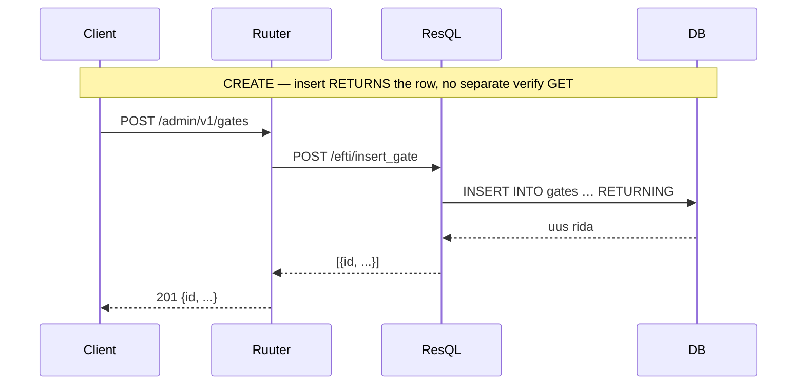
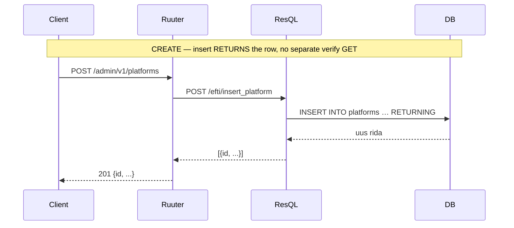
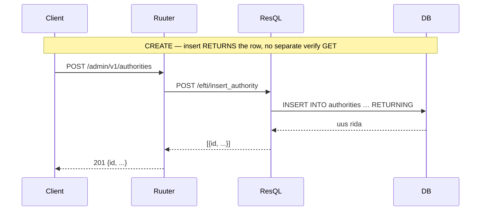

# API Endpoints — eFTI Gate EE

Dokument kirjeldab kõiki `openapi.yaml` spetsifitseeritud endpointe:
mis on **teostatud**, mis on **puudu** ja millised on näidisissendid/väljundid.

> **Ruuter URL-konventsioon:** Ruuter toetab tee-parameetreid (`incoming.params.pathParams[0]`) —
> spec-i `GET /api/v1/gates/{gateId}` kuju kehtib ka tegelikes DSL-failides, mitte
> `?gateId=` query-kujul. Tegelikes DSL-failides **ei kasutata** eraldi `/get`, `/update`
> ega `/delete` staatilisi segmente — nimekirja- ja üksiku kirje päring käivitatakse samal
> failil, eristades `pathParams[0]` olemasolu. URI-s ei kasutata CRUD-verbe (`/get`, `/update`,
> `/delete`) — HTTP meetod ise tähistab toimingut.
>
> **Ruuter projektid:** DSL puu on jaotatud eraldi Ruuter "projektideks", igaüks oma
> URL-prefiksi ja `.guard.yml`-iga: `admin/` → `/admin/v1/**` (TARA JWT, admin CRUD:
> gates/platforms/authorities/users/audit/consignments), `efti/` → `/efti/**`
> (G2G + Authority API + health), `platforms/` → `/platforms/v1/**` (X-Api-Key, ADR-004),
> `auth/` → `/auth/**` (TARA OIDC login/logout/profiil), `xroad/` → `/xroad/**`
> (X-Road turvaserver, ADR-006). Spec-i URI-d ja tegelikud Ruuter URI-d erinevad — vt iga
> endpoindi juures märkus.

---

## Sisukord

1. [Üldsätted](#1-üldsätted)
2. [Seisundikaart](#2-seisundikaart)
3. [Health](#3-health)
4. [Admin — Gates](#4-admin--gates)
5. [Admin — Platforms](#5-admin--platforms)
6. [Admin — Authorities](#6-admin--authorities)
7. [Admin — Users](#7-admin--users)
8. [Admin — Audit](#8-admin--audit)
9. [Puuduvad endpointid](#9-puuduvad-endpointid)
10. [Veaformaat](#10-veaformaat)
11. [Ühised skeemid](#11-ühised-skeemid)

---

## 1. Üldsätted

| Teema | Reegel |
|---|---|
| **Auth (Admin)** | TARA OIDC JWT — `Authorization: Bearer <jwt>` (RS256, JWKS) |
| **Auth (Authority API)** | TARA OIDC JWT — sama mehhanism, nõuab autentimist |
| **Auth (Platform API)** | `X-Api-Key` päis (SHA-256 võrreldakse `platforms.api_key_hash`-iga, ADR-004) — **mitte** mTLS |
| **Auth (Cron)** | Staatiline `ARCHIVE_OPS_TOKEN` env-muutuja |
| **Health** | Autentimine puudub — avalik |
| **Guard-failid** | Ainult kausta-tasemel `.guard.yml` jõustatakse (`template:` kutsed mööduvad guardist). `admin/.guard.yml` → üks projektitasemeline guard kogu `/admin/v1/**` jaoks (TARA JWT, `check-admin-authority`); `efti/api/v1/**` (kogu GET+POST, sh `authority/`) → **gate-internal only**, `X-Internal-Service-Token` (ADR-006) — **mitte** TARA/JWT ega avalik; ainult `efti/GET/api/v1/test/*` on erandkorras avalik; `platforms/.guard.yml` → üks projektitasemeline guard kogu `/platforms/v1/**` jaoks (X-Api-Key, ADR-004); `auth/POST/*` → avalik, `auth/GET/*` → autentimine nõutav (`check-user-authority`); vt `AGENTS.md` "Guard map" |
| **Õigusmudel** | Kõik autentitud kasutajad saavad täieliku ligipääsu. Asutus ise autendib organisatsioonina X-Roadi kaudu (`authorities.registry_code`), mitte kasutajana. |
| **Veavastuse formaat** | RFC 7807 `application/problem+json` |
| **`X-Request-ID`** | UUID päis kõigil muteerivaatel (POST/PUT/DELETE); duplikaat 10 min jooksul → 409 |
| **Paginatsioon** | `?limit=100&offset=0`; kogus `X-Total-Count` päises |
| **Kirjutused** | Append-only INSERT — pole UPDATE/DELETE. Viimane rida `created_at` järgi on kehtiv seis |
| **Pehme kustutus** | Kirjutab uue rea `is_*_active = FALSE` |

---

## 2. Seisundikaart

```mermaid
graph LR
    subgraph "✅ Teostatud"
        H1["GET /health/live"]
        H2["GET /health/ready"]
        G1["GET /admin/v1/gates"]
        G2["POST /admin/v1/gates"]
        G3["GET /admin/v1/gates/own"]
        G4["GET /admin/v1/gates/{id}"]
        G5["PUT /admin/v1/gates/{id}"]
        G6["DELETE /admin/v1/gates/{id}"]
        G7["POST /admin/v1/gates/ping/{id}"]
        P1["GET /admin/v1/platforms"]
        P2["POST /admin/v1/platforms"]
        P3["GET /admin/v1/platforms/{id}"]
        P4["PUT /admin/v1/platforms/{id}"]
        P5["DELETE /admin/v1/platforms/{id}"]
        P6["POST /admin/v1/platforms/ping/{id}"]
        P7["POST /admin/v1/platforms/api-key/{id}"]
        A1["GET /admin/v1/authorities"]
        A2["POST /admin/v1/authorities"]
        A3["GET /admin/v1/authorities/{id}"]
        A4["PUT /admin/v1/authorities/{id}"]
        A5["DELETE /admin/v1/authorities/{id}"]
        U1["GET /admin/v1/users"]
        U2["POST /admin/v1/users"]
        U3["GET /admin/v1/users/{id}"]
        U4["PUT /admin/v1/users/{id}"]
        U5["DELETE /admin/v1/users/{id}"]
        U6["POST /admin/v1/users/revoke-token/{id}"]
        AU["GET /admin/v1/audit"]
    end

    subgraph "✅ Teostatud (uued)"
        C1["GET /admin/v1/consignments (filtriga)"]
        C2["DELETE /admin/v1/consignments/{id}"]
        PL1["GET /efti/api/v1/status/{id}"]
        PL2["POST /platforms/v1/consignments"]
        PL3["GET /efti/api/v1/follow-up/{id}"]
        AU2["POST /efti/api/v1/authority/dataset"]
        AU3["POST /efti/api/v1/authority/follow-up"]
    end

    subgraph "✅ Teostatud (auth)"
        M1["GET /auth/user"]
        M2["POST /auth/logout"]
        M3["POST /auth/dev-login (dev only)"]
    end

    subgraph "❌ Puudub"
        M4["POST /api/v1/admin/* (cron: archive/expire/ping-gates)"]
        M5["POST /api/v1/auth/local-token"]
        AU1["GET .../identifiers (pole DSL-i)"]
        PL4["GET .../datasets (pole DSL-i)"]
    end
```



**Kokkuvõte:**

| Kategooria | Kokku specs-is | Teostatud | Puudub |
|---|---|---:|---:|
| Health | 2 | **2** | 0 |
| Admin — Gates | 7 | **7** | 0 |
| Admin — Platforms | 6 | **6** | 0 |
| Admin — Authorities | 5 | **5** | 0 |
| Admin — Audit | 1 | **1** | 0 |
| Admin — Users | 7 | **7** | 0 |
| Admin — Consignments | 2 | **2** | 0 |
| Admin — Cron | 3 | 0 | **3** |
| Auth | 2 | **1** | **1** |
| Platform API | 6 | **6** | 0 |
| Authority API | 3 | **3** | 0 |
| **Kokku** | **44** | **40** | **4** |

---

## 3. Health

### `GET /efti/health/live` — Liveness probe

Kontrollib ainult et protsess jookseb. Kubernetes kasutab liveness probe'ina.
Auth puudub.

**Ruuter DSL:** `DSL/Ruuter/efti/GET/health/live.yml`

| | |
|---|---|
| **Vastus 200** | `text/plain` — keha `"OK"` |
| **Vastus 503** | RFC 7807 — teenus pole saadaval |

```
GET /efti/health/live

→ 200 OK
OK
```

---

### `GET /efti/health/ready` — Readiness probe

Kontrollib et DB ühendus töötab (ResQL `get_db_status` päring).
Auth puudub.

**Ruuter DSL:** `DSL/Ruuter/efti/GET/health/ready.yml`

| | |
|---|---|
| **Vastus 200** | `text/plain` — keha `"OK"` |
| **Vastus 503** | RFC 7807 — DB pole saadaval |

```
GET /efti/health/ready

→ 200 OK
OK
```

---

## 4. Admin — Gates

Kirjeldab eFTI värava (gate) registrit. Kõik kirjutused on append-only.
Gate'i `id` peab vastama mustrile `^eu-[a-z]{2}[0-9]{2}$` (nt `eu-ee01`).



---

### `GET /admin/v1/gates` — Loetle gates

**Spec:** `GET /api/v1/gates`
**Ruuter DSL:** `DSL/Ruuter/admin/GET/v1/gates.yml`

**Query parameetrid:**

| Parameeter | Tüüp | Vaikimisi | Märkus |
|---|---|---|---|
| `limit` | int | 20 | Max 1000 |
| `offset` | int | 0 | |

**Näidis:**

```
GET /admin/v1/gates?limit=2&offset=0

→ 200 OK
[
  {
    "id": "eu-ee01",
    "countryCode": "EE",
    "eDeliveryUrl": "https://efti.ria.ee/services/msh",
    "eDeliveryCert": null,
    "tlsCert": null,
    "status": "ONLINE",
    "lastPingAt": "2026-04-23T10:00:00Z",
    "isGateActive": true,
    "createdAt": "2026-01-15T09:00:00Z"
  }
]
```

> ⚠️ **Puudu spec-ist:** `X-Total-Count` päis pole veel teostatud.

---

### `POST /admin/v1/gates` — Loo gate

**Spec:** `POST /api/v1/gates`
**Ruuter DSL:** `DSL/Ruuter/admin/POST/v1/gates.yml`
**Voog:** INSERT (`insert_gate` RETURNS täisrea) → 201

**Päringu keha:**

| Väli | Tüüp | Kohustuslik | Märkus |
|---|---|---|---|
| `id` | string | ✅ | Muster `eu-[a-z]{2}[0-9]{2}` |
| `countryCode` | string | ✅ | ISO 3166-1 alpha-2 |
| `eDeliveryUrl` | string (uri) | ✅ | AS4 MSH endpoint |
| `eDeliveryCert` | string\|null | ❌ | PEM-sertifikaat |
| `tlsCert` | string\|null | ❌ | mTLS sertifikaat |
| `status` | `ONLINE`\|`OFFLINE`\|`DISABLED` | ❌ | Vaikimisi `OFFLINE` |
| `isGateActive` | boolean | ❌ | Vaikimisi `true` |

```json
// Päring
POST /admin/v1/gates
Content-Type: application/json

{
  "id": "eu-de01",
  "countryCode": "DE",
  "eDeliveryUrl": "https://efti-peer.bkg.bund.de/services/msh",
  "eDeliveryCert": "-----BEGIN CERTIFICATE-----\nMIIC...-----END CERTIFICATE-----",
  "status": "OFFLINE"
}

// Vastus 201 Created
{
  "id": "eu-de01",
  "countryCode": "DE",
  "eDeliveryUrl": "https://efti-peer.bkg.bund.de/services/msh",
  "status": "OFFLINE",
  "isGateActive": true,
  "createdAt": "2026-04-23T11:00:00Z"
}
```

> ⚠️ **Puudu spec-ist:** 409 Conflict kui `id` juba eksisteerib pole veel teostatud — duplikaat lisatakse uue reana.

---

### `GET /admin/v1/gates/own` — Oma gate

**Spec:** `GET /api/v1/gates/own`
**Ruuter DSL:** `DSL/Ruuter/admin/GET/v1/gates/own.yml`

Loeb gate'i ID env-muutujast `OWN_GATE_ID` ja tagastab vastava kirje andmebaasist.

```
GET /admin/v1/gates/own

→ 200 OK
{
  "id": "eu-ee01",
  "countryCode": "EE",
  "eDeliveryUrl": "https://efti.ria.ee/services/msh",
  "status": "ONLINE",
  "isGateActive": true
}

→ 404 Not Found (kui OWN_GATE_ID ei ole seatud või kirje puudub DB-st)
{"error": "Not Found"}
```

---

### `GET /admin/v1/gates/{gateId}` — Üks gate

**Spec:** `GET /api/v1/gates/{gateId}`
**Ruuter DSL:** `DSL/Ruuter/admin/GET/v1/gates.yml` (sama fail kui nimekiri — eristub `pathParams[0]` olemasoluga)

Tagastab viimase rea `DISTINCT ON (id) ORDER BY created_at DESC` — sealhulgas soft-kustutatud gate (`isGateActive: false`).

```
GET /admin/v1/gates/eu-de01

→ 200 OK
{
  "id": "eu-de01",
  "countryCode": "DE",
  "status": "ONLINE",
  "isGateActive": true,
  "createdAt": "2026-04-23T11:00:00Z"
}

→ 404 Not Found
{"error": "Not Found"}
```

---

### `PUT /admin/v1/gates/{gateId}` — Uuenda gate

**Spec:** `PUT /api/v1/gates/{gateId}`
**Ruuter DSL:** `DSL/Ruuter/admin/PUT/v1/gates.yml`
**Voog:** INSERT uus rida (`update_gate` RETURNS täisrea) → 200

Päringu keha sama mis `POST /gates`.

```json
// Päring
PUT /admin/v1/gates/eu-de01
Content-Type: application/json

{
  "countryCode": "DE",
  "eDeliveryUrl": "https://efti-peer-new.bkg.bund.de/services/msh",
  "status": "ONLINE",
  "isGateActive": true
}

// Vastus 200 OK
{
  "id": "eu-de01",
  "eDeliveryUrl": "https://efti-peer-new.bkg.bund.de/services/msh",
  "status": "ONLINE",
  "isGateActive": true
}
```

---

### `DELETE /admin/v1/gates/{gateId}` — Kustuta gate

**Spec:** `DELETE /api/v1/gates/{gateId}`
**Ruuter DSL:** `DSL/Ruuter/admin/DELETE/v1/gates.yml`
**Voog:** INSERT rida `is_gate_active=false` (`soft_delete_gate` RETURNS tombstone-rea, kontrollitakse selle pealt) → 204

```
DELETE /admin/v1/gates/eu-de01

→ 204 No Content   (keha puudub)

→ 404 Not Found    (gateId ei eksisteeri)
→ 500              (kustutus õnnestus aga tombstone-i kontroll ebaõnnestus)
```

---

### `POST /admin/v1/gates/ping/{gateId}` — Ping gate

**Spec:** `POST /api/v1/gates/{gateId}/ping`
**Ruuter DSL:** `DSL/Ruuter/admin/POST/v1/gates/ping.yml`

> ℹ️ **Parandus:** doc väitis varem, et see on alati `501` stub — tegelikult on täielikult
> teostatud: kutsub `[#EDELIVERY_URL]/api/v1/ping/{gateId}`, kirjutab `ONLINE`/`OFFLINE`
> staatuse (`update_gate_ping`) ja tagastab uuendatud gate'i rea.

```
POST /admin/v1/gates/ping/eu-de01

→ 200 OK   (ping õnnestus, status=ONLINE)
{ "id": "eu-de01", "status": "ONLINE", ... }

→ 404 Not Found   (gateId ei eksisteeri)
→ 502 Bad Gateway (ping ebaõnnestus, status kirjutati OFFLINE)
```

---

## 5. Admin — Platforms

Platform'i kirje seob platvormi `baseUrl`-i eDelivery sertifikaadiga.



---

### `GET /admin/v1/platforms` — Loetle platforms

**Ruuter DSL:** `DSL/Ruuter/admin/GET/v1/platforms.yml`

**Query parameetrid:** `limit` (vaikimisi 20), `offset` (vaikimisi 0)

```
GET /admin/v1/platforms

→ 200 OK
[
  {
    "id": "plt-cargo-ee-001",
    "baseUrl": "https://api.cargo-ee.com/efti/v1",
    "supportsSubsetting": true,
    "isPlatformActive": true,
    "createdAt": "2026-03-01T08:00:00Z"
  }
]
```

---

### `POST /admin/v1/platforms` — Loo platform

**Ruuter DSL:** `DSL/Ruuter/admin/POST/v1/platforms.yml`

**Päringu keha:**

| Väli | Tüüp | Kohustuslik | Märkus |
|---|---|---|---|
| `id` | string | ✅ | Platvormi identifikaator |
| `baseUrl` | string (uri) | ✅ | REST API baas-URL |
| `supportsSubsetting` | boolean | ❌ | Vaikimisi `true` |
| `headers` | object | ❌ | Lisapäised (nt API võtmed) |
| `eDeliveryCert` | string\|null | ❌ | AS4 sertifikaat PEM |
| `tlsCert` | string\|null | ❌ | mTLS sertifikaat PEM |
| `isPlatformActive` | boolean | ❌ | Vaikimisi `true` |

```json
// Päring
POST /admin/v1/platforms
Content-Type: application/json

{
  "id": "plt-cargo-ee-001",
  "baseUrl": "https://api.cargo-ee.com/efti/v1",
  "supportsSubsetting": true,
  "headers": { "X-Api-Key": "secret-key-abc123" }
}

// Vastus 201 Created
{
  "id": "plt-cargo-ee-001",
  "baseUrl": "https://api.cargo-ee.com/efti/v1",
  "supportsSubsetting": true,
  "isPlatformActive": true,
  "createdAt": "2026-04-23T11:05:00Z"
}
```

---

### `GET /admin/v1/platforms/{platformId}` — Üks platform

**Ruuter DSL:** `DSL/Ruuter/admin/GET/v1/platforms.yml`

```
GET /admin/v1/platforms/plt-cargo-ee-001

→ 200 OK
{
  "id": "plt-cargo-ee-001",
  "baseUrl": "https://api.cargo-ee.com/efti/v1",
  "supportsSubsetting": true,
  "isPlatformActive": true
}
```

---

### `PUT /admin/v1/platforms/{platformId}` — Uuenda platform

**Ruuter DSL:** `DSL/Ruuter/admin/PUT/v1/platforms.yml`

Päringu keha sama mis POST. Voog: INSERT → 200 (`update_platform` RETURNS täisrea).

```json
// Vastus 200 OK
{
  "id": "plt-cargo-ee-001",
  "baseUrl": "https://api.cargo-ee-v2.com/efti/v1",
  "isPlatformActive": true
}
```

---

### `DELETE /admin/v1/platforms/{platformId}` — Kustuta platform

**Ruuter DSL:** `DSL/Ruuter/admin/DELETE/v1/platforms.yml`

```
DELETE /admin/v1/platforms/plt-cargo-ee-001

→ 204 No Content
```

---

### `POST /admin/v1/platforms/ping/{platformId}` — Ping platform

**Ruuter DSL:** `DSL/Ruuter/admin/POST/v1/platforms/ping.yml`

> ℹ️ **Parandus:** doc väitis varem, et see on alati `501` stub — tegelikult on teostatud:
> pingib `eDeliveryCert`-i olemasolul AS4 kaudu, muidu platvormi `baseUrl`-i otse.

```
POST /admin/v1/platforms/ping/plt-cargo-ee-001

→ 200 OK / 502 Bad Gateway
```

---

### `POST /admin/v1/platforms/api-key/{platformId}` — Genereeri X-Api-Key

**Ruuter DSL:** `DSL/Ruuter/admin/POST/v1/platforms/api-key.yml`

> ℹ️ **Dokumenteerimata endpoint (ADR-004):** genereerib platvormile uue `X-Api-Key`
> väärtuse, mida kasutatakse `platforms/` projekti (Platform API) autentimiseks —
> vt [9.5 Platform API](#95-platform-api-x-api-key). Võti tagastatakse plaintekstina
> ainult üks kord; hoitakse ainult SHA-256 räsina (`platforms.api_key_hash`).

```
POST /admin/v1/platforms/api-key/plt-cargo-ee-001

→ 200 OK
{ "apiKey": "..." }
```

---

## 6. Admin — Authorities

Pädev asutus (competent authority) on organisatsioon kellel on lubatud konkreetseid eFTI andmete alamhulki pärida.
`subsets` väli kitsendab ligipääsu: ainult loetletud EU01–EU07 koodid on lubatud.



---

### `GET /admin/v1/authorities` — Loetle authorities

**Ruuter DSL:** `DSL/Ruuter/admin/GET/v1/authorities.yml`

**Query parameetrid:** `limit` (vaikimisi 20), `offset` (vaikimisi 0)

```
GET /admin/v1/authorities

→ 200 OK
[
  {
    "id": "auth-mta",
    "countryCode": "EE",
    "name": "Maksu- ja Tolliamet",
    "subsets": ["EU01", "EU02", "EU05"],
    "isAuthorityActive": true
  }
]
```

---

### `POST /admin/v1/authorities` — Loo authority

**Ruuter DSL:** `DSL/Ruuter/admin/POST/v1/authorities.yml`

**Päringu keha:**

| Väli | Tüüp | Kohustuslik | Märkus |
|---|---|---|---|
| `id` | string | ✅ | Asutuse identifikaator, nt `"auth-mta"` |
| `name` | string | ✅ | Asutuse nimi |
| `registryCode` | string | ✅ | X-Roadi `memberCode` (`authorities.registry_code`) |
| `subsets` | string[] | ✅ | Min 1; lubatud `EU01`–`EU07` |
| `isAuthorityActive` | boolean | ❌ | Vaikimisi `true` |

```json
// Päring
POST /admin/v1/authorities
Content-Type: application/json

{
  "id": "auth-mta",
  "name": "Maksu- ja Tolliamet",
  "registryCode": "70000740",
  "subsets": ["EU01", "EU02", "EU05"]
}

// Vastus 201 Created
{
  "id": "auth-mta",
  "name": "Maksu- ja Tolliamet",
  "registryCode": "70000740",
  "subsets": ["EU01", "EU02", "EU05"],
  "isAuthorityActive": true,
  "createdAt": "2026-04-23T11:10:00Z"
}
```

> ⚠️ **Doc parandus:** endpoint ei võta `countryCode` välja — asutus on seotud
> X-Roadi `registryCode`-ga, mitte riigikoodiga.
>
> ⚠️ **Resql piirang:** `subsets` array serialiseeritakse handleris `JSON.stringify(...)`-ga
> ja konverteeritakse ResQL-i poolel `ARRAY(SELECT jsonb_array_elements_text(:subsets::jsonb))`.

---

### `GET /admin/v1/authorities/{authorityId}` — Üks authority

**Ruuter DSL:** `DSL/Ruuter/admin/GET/v1/authorities.yml`

```
GET /admin/v1/authorities/auth-mta

→ 200 OK
{
  "id": "auth-mta",
  "name": "Maksu- ja Tolliamet",
  "registryCode": "70000740",
  "subsets": ["EU01", "EU02", "EU05"],
  "isAuthorityActive": true
}
```

---

### `PUT /admin/v1/authorities/{authorityId}` — Uuenda authority

**Ruuter DSL:** `DSL/Ruuter/admin/PUT/v1/authorities.yml`

Päringu keha sama mis POST. Voog: INSERT → 200 (`update_authority` RETURNS täisrea).

```json
// Vastus 200 OK
{
  "id": "auth-mta",
  "name": "Maksu- ja Tolliamet (uuendatud)",
  "subsets": ["EU01", "EU02", "EU03", "EU05"],
  "isAuthorityActive": true
}
```

---

### `DELETE /admin/v1/authorities/{authorityId}` — Kustuta authority

**Ruuter DSL:** `DSL/Ruuter/admin/DELETE/v1/authorities.yml`

```
DELETE /admin/v1/authorities/auth-mta

→ 204 No Content
```

---

## 7. Admin — Users

Admin kasutajate haldus. Kasutaja seotakse `taraSub`-ga. Kõik kirjutused on append-only.

---

### `GET /admin/v1/users` — Loetle users

**Spec:** `GET /api/v1/users`
**Ruuter DSL:** `DSL/Ruuter/admin/GET/v1/users.yml`

**Query parameetrid:**

| Parameeter | Tüüp | Vaikimisi | Märkus |
|---|---|---|---|
| `limit` | int | 20 | |
| `offset` | int | 0 | |

```
GET /admin/v1/users?limit=2&offset=0

→ 200 OK
[
  {
    "rowId": "01923a8c-4f7c-7a1b-9c2e-fd0d9b0a4e11",
    "id": "550e8400-e29b-41d4-a716-446655440000",
    "taraSub": "EE12345678901",
    "name": "Mari Mets",
    "tokenRevokedAt": null,
    "isUserActive": true,
    "createdAt": "2026-04-23T11:15:00Z"
  }
]
```

---

### `POST /admin/v1/users` — Loo user

**Spec:** `POST /api/v1/users`
**Ruuter DSL:** `DSL/Ruuter/admin/POST/v1/users.yml`
**Voog:** `check_tara_sub_exists` → INSERT (`insert_user` RETURNS täisrea) → 201

**Auth:** nõuab autentimist (kaetud `admin/.guard.yml`-ga).

**Päringu keha:**

| Väli | Tüüp | Kohustuslik | Märkus |
|---|---|---|---|
| `taraSub` | string | ✅ | TARA `sub` väärtus |
| `name` | string | ✅ | |

```json
// Päring
POST /admin/v1/users
Content-Type: application/json

{
  "taraSub": "EE12345678901",
  "name": "Mari Mets"
}

// Vastus 201 Created
{
  "rowId": "01923a8c-4f7c-7a1b-9c2e-fd0d9b0a4e11",
  "id": "550e8400-e29b-41d4-a716-446655440000",
  "taraSub": "EE12345678901",
  "name": "Mari Mets",
  "tokenRevokedAt": null,
  "isUserActive": true,
  "createdAt": "2026-04-23T11:15:00Z"
}
```

> ℹ️ **Tähelepanu:** duplicate `taraSub` korral tagastab `409 Conflict`.

---

### `GET /admin/v1/users/{userId}` — Üks user

**Spec:** `GET /api/v1/users/{userId}`
**Ruuter DSL:** `DSL/Ruuter/admin/GET/v1/users.yml` (sama fail kui nimekiri)

```
GET /admin/v1/users/550e8400-e29b-41d4-a716-446655440000

→ 200 OK
{
  "rowId": "01923a8c-4f7c-7a1b-9c2e-fd0d9b0a4e11",
  "id": "550e8400-e29b-41d4-a716-446655440000",
  "taraSub": "EE12345678901",
  "name": "Mari Mets",
  "tokenRevokedAt": null,
  "isUserActive": true,
  "createdAt": "2026-04-23T11:15:00Z"
}
```

---

### `PUT /admin/v1/users/{userId}` — Uuenda user

**Spec:** `PUT /api/v1/users/{userId}`
**Ruuter DSL:** `DSL/Ruuter/admin/PUT/v1/users.yml`
**Voog:** INSERT uus rida (`update_user` RETURNS täisrea) → 200

**Auth:** nõuab autentimist.

Päringu keha sama mis `POST /users`.

```json
// Päring
PUT /admin/v1/users/550e8400-e29b-41d4-a716-446655440000
Content-Type: application/json

{
  "name": "Mari Mets-Uuendatud"
}

// Vastus 200 OK
{
  "id": "550e8400-e29b-41d4-a716-446655440000",
  "name": "Mari Mets-Uuendatud",
  "isUserActive": true
}
```

---

### `DELETE /admin/v1/users/{userId}` — Kustuta user

**Spec:** `DELETE /api/v1/users/{userId}`
**Ruuter DSL:** `DSL/Ruuter/admin/DELETE/v1/users.yml`
**Voog:** `check_not_self` → INSERT rida `is_user_active=false` (`soft_delete_user` RETURNS tombstone-rea) → 204

> ✅ **Parandus:** self-delete kaitse on **teostatud**, mitte lahtine — `check_not_self` võrdleb
> `caller.id`-d (guard'i pandud kontekst) sihtmärgi `pathParams[0]`-ga ja tagastab `400
> BAD_REQUEST_GENERAL`, kui admin üritab kustutada iseennast. Doc väitis varem, et see on
> rakendamata; vt ka [docs/planning/user_api_known_restrictions.md](../planning/user_api_known_restrictions.md).

```
DELETE /admin/v1/users/550e8400-e29b-41d4-a716-446655440000

→ 204 No Content   (keha puudub)
→ 400 BAD_REQUEST_GENERAL (admin üritab kustutada iseennast)
→ 404 Not Found    (userId ei eksisteeri)
→ 500              (kustutus õnnestus aga tombstone-i kontroll ebaõnnestus)
```

---

### `POST /admin/v1/users/revoke-token/{userId}` — Tühista kasutaja token

**Spec:** `POST /api/v1/users/{userId}/revoke-token`
**Ruuter DSL:** `DSL/Ruuter/admin/POST/v1/users/revoke-token.yml`

```
POST /admin/v1/users/revoke-token/550e8400-e29b-41d4-a716-446655440000

→ 204 No Content
```

---

## 8. Admin — Audit

Auditilogi on append-only, andmeid ei muudeta. Säilitatakse vähemalt 7 aastat (GDPR art 30).

**Ruuter DSL:** `DSL/Ruuter/admin/GET/v1/audit.yml`

### `GET /admin/v1/audit` — Auditilogi päring

**Query parameetrid:**

| Parameeter | Tüüp | Kohustuslik | Märkus |
|---|---|---|---|
| `resource` | string | ❌ | `gates`, `platforms`, `authorities`, `users`, `consignments`, `identifiers`, `dataset`, `session` |
| `resourceId` | string | ❌ | Ressursi konkreetne ID |
| `userId` | UUID | ❌ | Toimingu tegija |
| `from` | datetime (ISO 8601) | ❌ | Algus |
| `to` | datetime (ISO 8601) | ❌ | Lõpp |
| `limit` | int | ❌ | Vaikimisi 20 |
| `offset` | int | ❌ | Vaikimisi 0 |

```
GET /admin/v1/audit?resource=gates&limit=2

→ 200 OK
[
  {
    "rowId": "01923a8c-4f7c-7a1b-9c2e-fd0d9b0a4e11",
    "userId": "550e8400-e29b-41d4-a716-446655440000",
    "action": "create_gate",
    "resource": "gates",
    "resourceId": "eu-de01",
    "ipAddress": "203.0.113.45",
    "details": { "countryCode": "DE" },
    "recordedAt": "2026-04-22T10:20:35Z"
  }
]
```

> ⚠️ **Puudu:** Auditilogi kirjeid ei kirjutata praegu automaatselt (trigger-loogika pole teostatud).
> Tabel eksisteerib aga jääb tühjaks kuni auditi kirjutamise voog pole rakendatud.

---

## 9. Lisaendpointid ja staatused

### 9.1 Auth

Reaalne Ruuter DSL: `DSL/Ruuter/auth/` (eraldi projekt, `/auth/**`), mitte `efti/api/v1/auth/*`.

| Meetod | Spec path | Ruuter tee | Ruuter DSL | Kirjeldus |
|---|---|---|---|---|
| `POST` | `/api/v1/auth/local-token` | — | *(puudub)* | Break-glass kohalik admin token (HTTP Basic, vaikimisi keelatud) — ei ole teostatud |
| `POST` | — | `POST /auth/callback` | `DSL/Ruuter/auth/POST/callback.yml` | OIDC callback — vahetab TARA koodi JWT vastu; dokumenteerimata |
| `POST` | `/api/v1/auth/logout` | `POST /auth/logout` | `DSL/Ruuter/auth/POST/logout.yml` | Tühista JWT (TIM-i mustas nimekirjas) |
| `POST` | — | `POST /auth/dev-login` | `DSL/Ruuter/auth/POST/dev-login.yml` | Dev/CI login ilma TARA redirect'ita — ainult arenduseks |

---

### 9.2 Users (Admin)

| Meetod | Spec path | Ruuter tee | Ruuter DSL | Kirjeldus |
|---|---|---|---|---|
| `GET` | `/api/v1/user` | `GET /auth/user` | `DSL/Ruuter/auth/GET/user.yml` | Praeguse sisseloginud kasutaja profiil (any-auth) |

> ✅ **Parandus:** see endpoint **on teostatud** (`auth/GET/user.yml`, kaitstud
> `auth/GET/.guard.yml`-ga) — doc ja [docs/planning/user_api_known_restrictions.md](../planning/user_api_known_restrictions.md)
> väitsid varem, et see puudub / vajab loomist `efti/GET/api/v1/user.yml`-is.
>
> Ülejäänud `users` endpointid (`GET/POST/PUT/DELETE`, `revoke-token`) on teostatud
> `admin/` projekti all (vt [Admin — Users](#7-admin--users)).

---

### 9.3 Consignments (Admin) ✅

| Meetod | Ruuter DSL | Kirjeldus |
|---|---|---|
| `GET` | `DSL/Ruuter/admin/GET/v1/consignments.yml` | Saadetiste nimekiri |
| `DELETE` | `DSL/Ruuter/admin/DELETE/v1/consignments.yml` | Pehme kustutus (append-only `status=DELETED`) |

> ⚠️ **Doc parandus:** endpoint on `/admin/v1/consignments/{consignmentId}` (tee-parameeter),
> mitte `efti/api/v1/consignments?consignmentId=`.
>
> ⚠️ **Funktsionaalne lünk:** `GET` saadab ResQL-ile alati `criteria: {}` — `status`,
> `platformId`, `transportMode` ja `dangerousGoods` query-parameetreid **ei loeta ega
> rakendata** praegu (varasem doc väitis, et filtrid töötavad). `limit`/`offset` toimivad.

**GET query-parameetrid (ainult paginatsioon on ühendatud):**

| Parameeter | Tüüp | Kirjeldus |
|---|---|---|
| `limit` | int | Vaikimisi 100 |
| `offset` | int | Vaikimisi 0 |

---

### 9.4 Cron Admin

Autentimine: staatiline `ARCHIVE_OPS_TOKEN` bearer token.

| Meetod | Spec path | Kirjeldus |
|---|---|---|
| `POST` | `/api/v1/admin/archive` | Käivita arhiveerimise pühkimine (CronManager-ist) |
| `POST` | `/api/v1/admin/expire-identifiers` | Märgi maantee-saadetised aegunuks (14-päeva kabotaaž) |
| `POST` | `/api/v1/admin/ping-gates` | Kontrolli kõiki partnergate'e ja kirjuta ONLINE/OFFLINE read |

---

### 9.5 Platform API (X-Api-Key, ADR-004) ✅

> ⚠️ **Suur doc parandus:** varem kirjeldati seda sektsiooni kui `efti/api/v1/*` mTLS-iga
> kaitstud "Platform API"-t. Tegelikkuses on need **kaks erinevat asja**:
>
> 1. **`platforms/` on eraldi Ruuter projekt** (`/platforms/v1/**`), kaitstud `X-Api-Key`
>    päisega (ADR-004, SHA-256 võrdlus `platforms.api_key_hash`-iga) — **mitte mTLS-iga**.
>    Ainult saadetiste sisestamine (konsignmendi XML upload) käib siin.
> 2. **`efti/api/v1/*`** (status, follow-up, ping) **ei ole platvormile avatud API** — see
>    on **gate-internal only**, kaitstud `X-Internal-Service-Token`-iga (ADR-006), ligipääsetav
>    ainult teistelt gate-komponentidelt (nt eDelivery konteiner), mitte otse platvormidelt.
>    Vt `AGENTS.md` "Guard map".

**Platvormi-poolne sisend (`platforms/` projekt, X-Api-Key):**

| Meetod | Ruuter DSL | Ruuter tee | Kirjeldus |
|---|---|---|---|
| `POST` | `DSL/Ruuter/platforms/POST/v1/consignments.yml` | `POST /platforms/v1/consignments[/{datasetId}]` | FTI004 XML upload otse platvormilt → INSERT → JSON vastus. Guard lisab `${platform}` konteksti. |
| `POST` | `DSL/Ruuter/platforms/POST/v1/consignments-xml.yml` | `POST /platforms/v1/consignments-xml` | Sama, eDelivery kaudu tulnud XML → `template:` kutsub `consignments.yml`-i (guardist möödub, kontekst puudub — vt fail) → XML vastus |

**Gate-internal (`efti/` projekt, `X-Internal-Service-Token`, ADR-006 — mitte otse platvormidele):**

| Meetod | Ruuter DSL | Ruuter tee | Kirjeldus |
|---|---|---|---|
| `GET` | `DSL/Ruuter/efti/GET/api/v1/status.yml` | `GET /efti/api/v1/status/{datasetId}` | Saadetise staatus |
| `POST` | `DSL/Ruuter/efti/POST/api/v1/ping.yml` | `POST /efti/api/v1/ping` | Kättesaadavuse kontroll — tagastab 204 |
| `GET` | `DSL/Ruuter/efti/GET/api/v1/follow-up.yml` | `GET /efti/api/v1/follow-up/{datasetId}` | Järelkontrolli sõnumid |

**Admin-poolne konsignmentide loend/kustutus** käib `admin/` projekti all, vt [9.3](#93-consignments-admin-).

> ❌ **Puudub:** `GET .../datasets` (andmestiku XML raw) — spetsifikatsioonis on, aga vastavat
> DSL-faili (`datasets.yml`) ei eksisteeri üheski Ruuter projektis.

---

### 9.6 Authority API (TARA JWT) — osaliselt ✅, osaliselt gate-internal

> ⚠️ **Doc parandus:** kõik `efti/POST/api/v1/authority/*` ja `efti/GET/api/v1/*` teed
> (sh `identifiers`) käivad tegelikult `X-Internal-Service-Token`-i, mitte TARA JWT-ga —
> vt [9.5](#95-platform-api-x-api-key-adr-004-) märkust ja `AGENTS.md` "Guard map". TARA JWT
> kehtib `authority/dataset` ja `authority/follow-up` peal teisel kihil — X-Roadi/väline
> asutus autendib end `xroad/` projekti kaudu (vt [9.7](#97-x-road-api-turvaserver-)), mis
> edastab `template:`-iga (ilma TARA JWT-ta, sisemise võrgu üle) `efti/`-le.

| Meetod | Ruuter DSL | Ruuter tee | Kirjeldus |
|---|---|---|---|
| `POST` | `DSL/Ruuter/efti/POST/api/v1/authority/dataset.yml` | `POST /efti/api/v1/authority/dataset` | FTI010 XML andmestik, filtreerituna `subsets[]` järgi |
| `POST` | `DSL/Ruuter/efti/POST/api/v1/authority/follow-up.yml` | `POST /efti/api/v1/authority/follow-up` | FTI025 XML sisend → log → FTI030 XML vastus |
| `POST` | `DSL/Ruuter/efti/POST/api/v1/authority/search.yml` | `POST /efti/api/v1/authority/search` | Saadetiste otsing: kohalik + broadcast teistele väravatele |

> ❌ **Puudub:** `GET .../identifiers` (otsing `mainTransportId`/`usedEquipmentIds` järgi) —
> spetsifikatsioonis on, aga vastavat DSL-faili (`identifiers.yml`) ei eksisteeri. Lähim
> vaste on `xroad/POST/v1/transport-means.yml` (vt [9.7](#97-x-road-api-turvaserver-)).

> Väravatevahelised (G2G) sisendteed `efti/POST/api/v1/{dataset,follow-up}-xml`,
> `…-local` ja `consignments/search-xml` jäävad avalikuks (neid kutsub ainult
> `edelivery` konteiner pärast AS4 mTLS-i) ning jõuavad samade käsitlejateni
> `template:` kaudu, mis guardist möödub.

> ℹ️ **Body:** `{ "gateId": "...", "platformId": "...", "datasetId": "...", "subsets": ["EU01", "EU02"] }` — `subsets: []` tagastab kogu andmestiku.

---

### 9.7 X-Road API (Turvaserver) ✅

Eesti riiklik laiendus (ADR-006). Teenindab **põhi-Ruuter** `xroad/` projektis, teed
`/xroad/**` pordil 8086 — eraldi `ruuter-xroad` konteinerit / porti 8087 enam ei ole.

Auth: X-Roadi turvaserver tuvastab helistaja **organisatsiooni** mTLS-iga ja edastab selle
`X-Road-Client` päises (`instance/memberClass/memberCode[/subsystemCode]`); `memberCode` seotakse
`authorities.registry_code`-ga. `X-Road-Id` on kohustuslik (korrelatsioon). `X-Road-UserId` ei anna
kunagi õigusi. Üks projektitasemeline `xroad/.guard.yml` katab kõik meetodid;
`xroad/GET/health/.guard.yml` (`override_ancestors`) hoiab health-probe avalikuna.

> ⚠️ **Juurutus:** `/xroad/**` jagab porti 8086 avaliku API-ga — avalik ingress **ei tohi** seda
> teed marsruutida; ainult turvaserver tohib selleni pääseda (ADR-006).

| Meetod | Ruuter DSL | Ruuter tee | Kirjeldus |
|---|---|---|---|
| `POST` | `DSL/Ruuter/xroad/POST/v1/echo.yml` | `POST /xroad/v1/echo` | Ühenduvustest — kajastab X-Road päised, lahendatud asutuse rea ja keha |
| `GET` | `DSL/Ruuter/xroad/GET/v1/subsets.yml` | `GET /xroad/v1/subsets` | Helistaja enda lubatud alamhulgad (`authorities.subsets`) `X-Road-Client` põhjal |
| `GET` | `DSL/Ruuter/xroad/GET/health/ready.yml` | `GET /xroad/health/ready` | Valmisoleku proov (avalik, ilma X-Road päisteta) |
| `POST` | `DSL/Ruuter/xroad/POST/v1/transport-means.yml` | `POST /xroad/v1/transport-means` | Veovahenditunnus sisse (numbrimärk / IMO / õhusõiduki reg / konteinernumber), väravale teadaolev identifikaatori-tasemel data välja. Sobitab `main_transport_id`, `used_equipment_ids` ja `carried_equipment_ids`. `scope`: `existence` (bool, alla sekundi) \| `local` (vaikimisi) \| `allgates` (501, tuleb hiljem). Nõuab `EU02`-t; andmestiku sisu ei tagasta |
| `POST` | `DSL/Ruuter/xroad/POST/v1/dataset.yml` | `POST /xroad/v1/dataset` | Edastab `efti/POST/api/v1/authority/dataset`-ile; jõustab enne `authorities.subsets` (403 `FORBIDDEN_SUBSET`) |
| `POST` | `DSL/Ruuter/xroad/POST/v1/search.yml` | `POST /xroad/v1/search` | Edastab `efti/POST/api/v1/authority/search`-ile; alamhulkade kontrolli ei ole (identifikaatoripäring) |
| `POST` | `DSL/Ruuter/xroad/POST/v1/follow-up.yml` | `POST /xroad/v1/follow-up` | Edastab `efti/POST/api/v1/authority/follow-up`-ile |

Keeldumised: **401** `UNAUTHORIZED` (`X-Road-Client` puudub/vigane), **400** `MISSING_REQUIRED_HEADER`
(`X-Road-Id` puudub), **403** `FORBIDDEN` (`memberCode` ei vasta ühelegi `ACTIVE` asutusele või
vastab mitmele).

---

## 10. Veaformaat

Kõik vead järgivad RFC 7807 `application/problem+json` formaati.

```json
{
  "type": "https://api.efti.ee/errors/gate-not-found",
  "code": "GATE_NOT_FOUND",
  "title": "Not Found",
  "status": 404,
  "detail": "Gate 'eu-zz99' not found",
  "instance": "/api/v1/gates/eu-zz99",
  "requestId": "7c9e6679-7425-40de-944b-e07fc1f90ae7"
}
```

> ⚠️ **Praegune olukord:** Ruuter kasutab lihtsat `{"response": "{\"error\": \"...\"}"}`
> formaati — RFC 7807 tugi lisatakse koos autentimisega.

**Olulisemad veakoodid:**

| HTTP | `code` | Kirjeldus |
|---|---|---|
| 400 | `BAD_REQUEST_GENERAL` | Vigane sisend |
| 400 | `INVALID_XML` | Vigane XML payload |
| 401 | `TOKEN_INVALID` | JWT vigane |
| 401 | `TOKEN_EXPIRED` | JWT aegunud |
| 403 | `FORBIDDEN` | Puudulikud õigused |
| 403 | `FORBIDDEN_SUBSET` | Puudub ligipääs taotletud alamhulgale |
| 404 | `GATE_NOT_FOUND` | Gate ei eksisteeri |
| 404 | `PLATFORM_NOT_FOUND` | Platform ei eksisteeri |
| 404 | `AUTHORITY_NOT_FOUND` | Authority ei eksisteeri |
| 404 | `USER_NOT_FOUND` | User ei eksisteeri |
| 409 | `DUPLICATE_REQUEST_ID` | `X-Request-ID` juba kasutatud 10 min jooksul |
| 409 | `CONFLICT` | Kirje juba eksisteerib |
| 429 | `RATE_LIMIT_EXCEEDED` | Liiga palju päringuid |
| 500 | `INTERNAL_ERROR` | Süsteemiviga |
| 500 | `DATABASE_ERROR` | Andmebaasiviga |
| 501 | *(puudub)* | Pole teostatud (nt cron admin, `xroad` `scope: allgates`) |
| 502 | `GATEWAY_UNAVAILABLE` | Partner pole kättesaadav |
| 503 | `SERVICE_UNAVAILABLE` | Teenus pole valmis |
| 504 | `GATE_TIMEOUT` | Partner aegus |

---

## 11. Ühised skeemid

### `Gate` (lugemine)

| Väli | Tüüp | Märkus |
|---|---|---|
| `id` | string | Muster `eu-[a-z]{2}[0-9]{2}` |
| `countryCode` | string | ISO 3166-1 alpha-2 |
| `eDeliveryUrl` | string | AS4 MSH endpoint |
| `eDeliveryCert` | string\|null | PEM |
| `tlsCert` | string\|null | PEM |
| `status` | `ONLINE`\|`OFFLINE`\|`DISABLED` | Viimase pingi tulemus |
| `lastPingAt` | datetime\|null | Viimane edukas ping |
| `isGateActive` | boolean | `false` = pehme kustutus |
| `createdAt` | datetime | Selle rea INSERT aeg |

### `Platform` (lugemine)

| Väli | Tüüp | Märkus |
|---|---|---|
| `id` | string | |
| `baseUrl` | string | REST API baas-URL |
| `headers` | object | Väljuvad lisapäised |
| `eDeliveryCert` | string\|null | |
| `tlsCert` | string\|null | |
| `supportsSubsetting` | boolean | |
| `isPlatformActive` | boolean | |
| `createdAt` | datetime | |

### `Authority` (lugemine)

| Väli | Tüüp | Märkus |
|---|---|---|
| `id` | string | |
| `countryCode` | string | |
| `name` | string | |
| `subsets` | string[] | `EU01`–`EU07` |
| `isAuthorityActive` | boolean | |
| `createdAt` | datetime | |

### `User` (lugemine)

| Väli | Tüüp | Märkus |
|---|---|---|
| `rowId` | string | UUID, unikaalne rea identifikaator |
| `id` | string | UUID |
| `taraSub` | string | TARA autentimise sub |
| `name` | string | |
| `tokenRevokedAt` | datetime\|null | Tokeni tühistamise aeg |
| `isUserActive` | boolean | `false` = pehme kustutus |
| `createdAt` | datetime | |

### `Subset` enum

| Kood | Kirjeldus |
|---|---|
| `EU01` | Saadetise identifikaator |
| `EU02` | Transpordivahend |
| `EU03` | Kaup |
| `EU04` | Asukohad |
| `EU05` | Ohtlikud kaubad |
| `EU06` | Jäätmed |
| `EU07` | Kaubanduspartnerid |

### Ruuteri vastusformaat

> ⚠️ **Doc parandus:** Ruuteri vastus mähitakse `{"response": ...}` keebisse vaikimisi, kuid
> enamik `admin/` (ja mitmed `efti/`) DSL-e määravad handleri tasemel `wrapper: false` ning
> tagastavad **mähkimata** JSON-i (objekti või array'd) otse. Näited allpool selles dokumendis
> on läbivalt uuendatud mähkimata kujule, kus vastav DSL kasutab `wrapper: false`.

```json
// Mähitud (kui DSL ei sea wrapper: false)
{ "response": [{ "id": "eu-ee01", ... }] }

// Mähkimata (kui DSL seab wrapper: false — enamik admin/ endpointe)
[{ "id": "eu-ee01", ... }]

// Tühi vastus (204)
(keha puudub)

// Viga (mähkimata, `type`/`title`/`status`/`detail` kujul enamikus uuemates handlerites)
{ "error": "Not Found" }
```

---

*Uuendatud `feat/guards-rbac` harust. Viimati uuendatud: 2026-09-04 — DSL failiteed ja
`admin/`/`platforms/`/`auth/` projektide marsruudid parandatud (vt commit ajalugu).*
