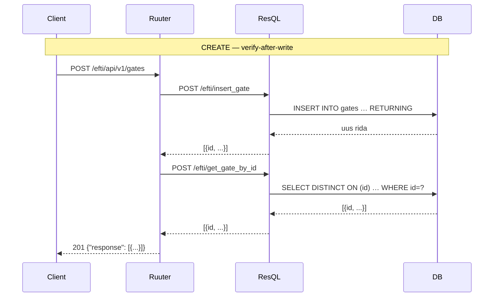
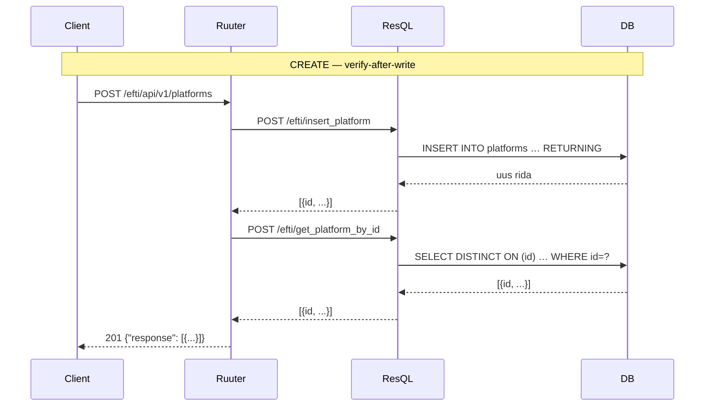
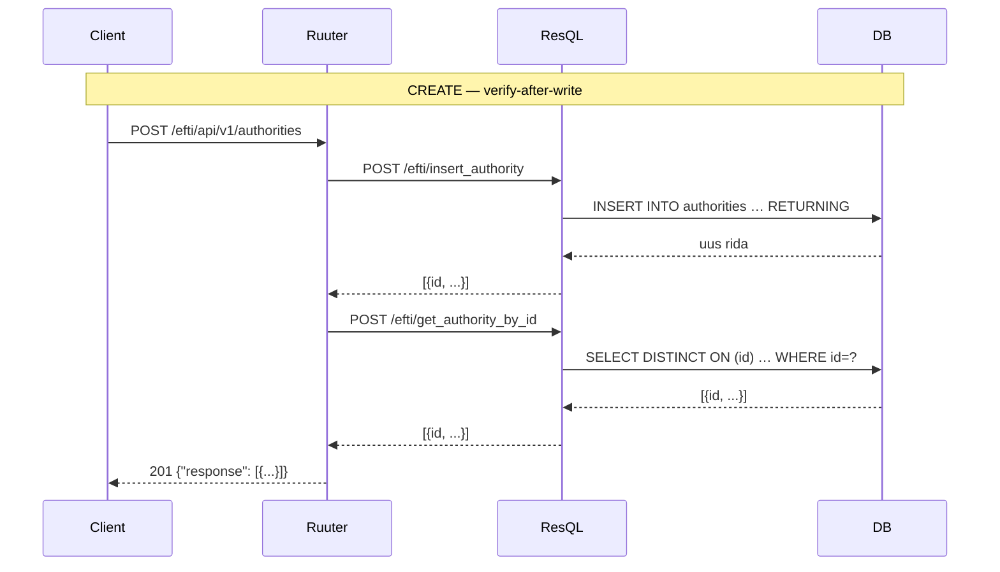

# API Endpoints — eFTI Gate EE

Dokument kirjeldab kõiki `openapi.yaml` spetsifitseeritud endpointe:
mis on **teostatud**, mis on **puudu** ja millised on näidisissendid/väljundid.

> **Ruuter URL-konventsioon:** Kuna Ruuter (Rust) ei toeta natiivset tee-parameetrit `{gateId}`,
> kasutatakse workaround: `GET /api/v1/gates?gateId=eu-xx01` asemel `GET /api/v1/gates/{gateId}`.
> Spec-i URI-d ja tegelikud Ruuter URI-d erinevad — vt iga endpoindi juures märkus.

---

## Sisukord

1. [Üldsätted](#1-üldsätted)
2. [Seisundikaart](#2-seisundikaart)
3. [Health](#3-health)
4. [Admin — Gates](#4-admin--gates)
5. [Admin — Platforms](#5-admin--platforms)
6. [Admin — Authorities](#6-admin--authorities)
7. [Admin — Audit](#7-admin--audit)
8. [Puuduvad endpointid](#8-puuduvad-endpointid)
9. [Veaformaat](#9-veaformaat)
10. [Ühised skeemid](#10-ühised-skeemid)

---

## 1. Üldsätted

| Teema | Reegel |
|---|---|
| **Auth (Admin)** | TARA OIDC JWT — `Authorization: Bearer <jwt>` (RS256, JWKS) |
| **Auth (Platform API)** | mTLS X.509 — reversproxy edastab `X-Client-Cert-Subject` + `X-Client-Cert-Serial` |
| **Auth (Cron)** | Staatiline `ARCHIVE_OPS_TOKEN` env-muutuja |
| **Health** | Autentimine puudub — avalik |
| **Praegused guard-failid** | Kõik `allow-all` (autentimine lisatakse hiljem) |
| **Veavastuse formaat** | RFC 7807 `application/problem+json` |
| **`X-Request-ID`** | UUID päis kõigil muteerivaatel (POST/PUT/DELETE); duplikaat 10 min jooksul → 409 |
| **Paginatsioon** | `?limit=100&offset=0`; kogus `X-Total-Count` päises |
| **Kirjutused** | Append-only INSERT — pole UPDATE/DELETE. Viimane rida `created_at` järgi on kehtiv seis |
| **Pehme kustutus** | Kirjutab uue rea `status = 'DELETED'` (gates, platforms); `is_active = FALSE` (authorities, users) |

---

## 2. Seisundikaart

```mermaid
graph LR
    subgraph "✅ Teostatud"
        H1["GET /health/live"]
        H2["GET /health/ready"]
        G1["GET /api/v1/gates"]
        G2["POST /api/v1/gates"]
        G3["GET /api/v1/gates/own"]
        G4["GET /api/v1/gates/{gateId}"]
        G5["PUT /api/v1/gates/{gateId}"]
        G6["DELETE /api/v1/gates/{gateId}"]
        G7["POST /api/v1/gates/{gateId}/ping ⚠️501"]
        P1["GET /api/v1/platforms"]
        P2["POST /api/v1/platforms"]
        P3["GET /api/v1/platforms/{platformId}"]
        P4["PUT /api/v1/platforms/{platformId}"]
        P5["DELETE /api/v1/platforms/{platformId}"]
        P6["POST /api/v1/platforms/{platformId}/ping ⚠️501"]
        A1["GET /api/v1/authorities"]
        A2["POST /api/v1/authorities"]
        A3["GET /api/v1/authorities/{authorityId}"]
        A4["PUT /api/v1/authorities/{authorityId}"]
        A5["DELETE /api/v1/authorities/{authorityId}"]
        AU["GET /api/v1/audit"]
    end

    subgraph "❌ Puudub"
        M1["POST /api/v1/auth/*"]
        M2["GET/POST/PUT/DELETE /api/v1/users/*"]
        M3["GET/DELETE /api/v1/consignments/*"]
        M4["POST /api/v1/admin/*"]
        M5["Platform API — /v1/identifiers/*"]
        M6["Authority API — /v1/identifiers/{id} GET"]
        M7["Authority API — /v1/dataset/*"]
        M8["Authority API — /v1/follow-up/*"]
    end
```



**Kokkuvõte:**

| Kategooria | Kokku specs-is | Teostatud | Puudub |
|---|---|---|---|
| Health | 2 | **2** | 0 |
| Admin — Gates | 6 | **6** | 0 |
| Admin — Platforms | 6 | **6** | 0 |
| Admin — Authorities | 5 | **5** | 0 |
| Admin — Audit | 1 | **1** | 0 |
| Admin — Users | 7 | 0 | **7** |
| Admin — Consignments | 2 | 0 | **2** |
| Admin — Cron | 3 | 0 | **3** |
| Auth | 2 | 0 | **2** |
| Platform API | 6 | 0 | **6** |
| Authority API | 3 | 0 | **3** |
| **Kokku** | **43** | **21** | **22** |

---

## 3. Health

### `GET /efti/health/live` — Liveness probe

Kontrollib ainult et protsess jookseb. Kubernetes kasutab liveness probe'ina.
Auth puudub.

**Ruuter DSL:** `DSL/Ruuter/efti/GET/health/live.yml`

| | |
|---|---|
| **Vastus 200** | `text/plain` — keha `"OK"` |
| **Vastus 503** | RFC 7807 — teenus pole saadaval |

```
GET /efti/health/live

→ 200 OK
OK
```

---

### `GET /efti/health/ready` — Readiness probe

Kontrollib et DB ühendus töötab (ResQL `get_db_status` päring).
Auth puudub.

**Ruuter DSL:** `DSL/Ruuter/efti/GET/health/ready.yml`

| | |
|---|---|
| **Vastus 200** | `text/plain` — keha `"OK"` |
| **Vastus 503** | RFC 7807 — DB pole saadaval |

```
GET /efti/health/ready

→ 200 OK
OK
```

---

## 4. Admin — Gates

Kirjeldab eFTI värava (gate) registrit. Kõik kirjutused on append-only.
Gate'i `id` peab vastama mustrile `^eu-[a-z]{2}[0-9]{2}$` (nt `eu-ee01`).



---

### `GET /efti/api/v1/gates` — Loetle gates

**Spec:** `GET /api/v1/gates`
**Ruuter DSL:** `DSL/Ruuter/efti/GET/api/v1/gates.yml`

**Query parameetrid:**

| Parameeter | Tüüp | Vaikimisi | Märkus |
|---|---|---|---|
| `limit` | int | 20 | Max 1000 |
| `offset` | int | 0 | |

**Näidis:**

```
GET /efti/api/v1/gates?limit=2&offset=0

→ 200 OK
{
  "response": [
    {
      "id": "eu-ee01",
      "countryCode": "EE",
      "eDeliveryUrl": "https://efti.ria.ee/services/msh",
      "eDeliveryCert": null,
      "tlsCert": null,
      "status": "ONLINE",
      "lastPingAt": "2026-04-23T10:00:00Z",
      "createdAt": "2026-01-15T09:00:00Z"
    }
  ]
}
```

> ⚠️ **Puudu spec-ist:** `X-Total-Count` päis pole veel teostatud.

---

### `POST /efti/api/v1/gates` — Loo gate

**Spec:** `POST /api/v1/gates`
**Ruuter DSL:** `DSL/Ruuter/efti/POST/api/v1/gates.yml`
**Voog:** INSERT → verify GET → 201

**Päringu keha:**

| Väli | Tüüp | Kohustuslik | Märkus |
|---|---|---|---|
| `id` | string | ✅ | Muster `eu-[a-z]{2}[0-9]{2}` |
| `countryCode` | string | ✅ | ISO 3166-1 alpha-2 |
| `eDeliveryUrl` | string (uri) | ✅ | AS4 MSH endpoint |
| `eDeliveryCert` | string\|null | ❌ | PEM-sertifikaat |
| `tlsCert` | string\|null | ❌ | mTLS sertifikaat |
| `status` | `ONLINE`\|`OFFLINE`\|`DISABLED`\|`DELETED` | ❌ | Vaikimisi `OFFLINE` |

```json
// Päring
POST /efti/api/v1/gates
Content-Type: application/json

{
  "id": "eu-de01",
  "countryCode": "DE",
  "eDeliveryUrl": "https://efti-peer.bkg.bund.de/services/msh",
  "eDeliveryCert": "-----BEGIN CERTIFICATE-----\nMIIC...-----END CERTIFICATE-----",
  "status": "OFFLINE"
}

// Vastus 201 Created
{
  "response": [
    {
      "id": "eu-de01",
      "countryCode": "DE",
      "eDeliveryUrl": "https://efti-peer.bkg.bund.de/services/msh",
      "status": "OFFLINE",
      "createdAt": "2026-04-23T11:00:00Z"
    }
  ]
}
```

> ⚠️ **Puudu spec-ist:** 409 Conflict kui `id` juba eksisteerib pole veel teostatud — teine INSERT lisatakse uue reana.

---

### `GET /efti/api/v1/gates/own` — Oma gate

**Spec:** `GET /api/v1/gates/own`
**Ruuter DSL:** `DSL/Ruuter/efti/GET/api/v1/gates/own.yml`

Loeb gate'i ID env-muutujast `OWN_GATE_ID` ja tagastab vastava kirje andmebaasist.

```
GET /efti/api/v1/gates/own

→ 200 OK
{
  "response": [
    {
      "id": "eu-ee01",
      "countryCode": "EE",
      "eDeliveryUrl": "https://efti.ria.ee/services/msh",
      "status": "ONLINE",
    }
  ]
}

→ 404 Not Found (kui OWN_GATE_ID ei ole seatud või kirje puudub DB-st)
{
  "response": "{\"error\": \"Not Found\"}"
}
```

---

### `GET /efti/api/v1/gates?gateId={id}` — Üks gate

**Spec:** `GET /api/v1/gates/{gateId}`
**Ruuter DSL:** `DSL/Ruuter/efti/GET/api/v1/gates.yml`

> ℹ️ **Ruuter workaround:** Spec-i tee-parameeter `{gateId}` on asendatud query-parameetriga `?gateId=`.

Tagastab viimase rea `DISTINCT ON (id) ORDER BY created_at DESC` — sealhulgas soft-kustutatud gate (`status: DELETED`).

```
GET /efti/api/v1/gates?gateId=eu-de01

→ 200 OK
{
  "response": [
    {
      "id": "eu-de01",
      "countryCode": "DE",
      "status": "ONLINE",
      "createdAt": "2026-04-23T11:00:00Z"
    }
  ]
}

→ 404 Not Found
{
  "response": "{\"error\": \"Not Found\"}"
}
```

---

### `PUT /efti/api/v1/gates?gateId={id}` — Uuenda gate

**Spec:** `PUT /api/v1/gates/{gateId}`
**Ruuter DSL:** `DSL/Ruuter/efti/PUT/api/v1/gates.yml`
**Voog:** INSERT uus rida → verify GET → 200

Päringu keha sama mis `POST /gates`.

```json
// Päring
PUT /efti/api/v1/gates?gateId=eu-de01
Content-Type: application/json

{
  "countryCode": "DE",
  "eDeliveryUrl": "https://efti-peer-new.bkg.bund.de/services/msh",
  "status": "ONLINE",
}

// Vastus 200 OK
{
  "response": [
    {
      "id": "eu-de01",
      "eDeliveryUrl": "https://efti-peer-new.bkg.bund.de/services/msh",
      "status": "ONLINE",
    }
  ]
}
```

---

### `DELETE /efti/api/v1/gates?gateId={id}` — Kustuta gate

**Spec:** `DELETE /api/v1/gates/{gateId}`
**Ruuter DSL:** `DSL/Ruuter/efti/DELETE/api/v1/gates.yml`
**Voog:** INSERT rida `status='DELETED'` → verify GET (`status == 'DELETED'`) → 204

```
DELETE /efti/api/v1/gates?gateId=eu-de01

→ 204 No Content   (keha puudub)

→ 404 Not Found    (gateId ei eksisteeri)
→ 500              (kustutus õnnestus aga verify ebaõnnestus)
```

---

### `POST /efti/api/v1/gates/ping?gateId={id}` — Ping gate ⚠️ 501

**Spec:** `POST /api/v1/gates/{gateId}/ping`
**Ruuter DSL:** `DSL/Ruuter/efti/POST/api/v1/gates/ping.yml`

eDelivery AS4 ping pole skoobis — tagastab alati `501 Not Implemented`.

```
POST /efti/api/v1/gates/ping?gateId=eu-de01

→ 501 Not Implemented
{
  "response": "{\"error\": \"Not Implemented\"}"
}
```

---

## 5. Admin — Platforms

Platform'i kirje seob platvormi `baseUrl`-i eDelivery sertifikaadiga.
mTLS autentimisel otsib gate `(certSubject, certSerial)` paari.



---

### `GET /efti/api/v1/platforms` — Loetle platforms

**Ruuter DSL:** `DSL/Ruuter/efti/GET/api/v1/platforms.yml`

**Query parameetrid:** `limit` (vaikimisi 20), `offset` (vaikimisi 0)

```
GET /efti/api/v1/platforms

→ 200 OK
{
  "response": [
    {
      "id": "plt-cargo-ee-001",
      "baseUrl": "https://api.cargo-ee.com/efti/v1",
      "supportsSubsetting": true,
      "status": "ONLINE",
      "createdAt": "2026-03-01T08:00:00Z"
    }
  ]
}
```

---

### `POST /efti/api/v1/platforms` — Loo platform

**Ruuter DSL:** `DSL/Ruuter/efti/POST/api/v1/platforms.yml`

**Päringu keha:**

| Väli | Tüüp | Kohustuslik | Märkus |
|---|---|---|---|
| `id` | string | ✅ | Platvormi identifikaator |
| `baseUrl` | string (uri) | ✅ | REST API baas-URL |
| `supportsSubsetting` | boolean | ❌ | Vaikimisi `true` |
| `headers` | object | ❌ | Lisapäised (nt API võtmed) |
| `eDeliveryCert` | string\|null | ❌ | AS4 sertifikaat PEM |
| `tlsCert` | string\|null | ❌ | mTLS sertifikaat PEM |
| `certSubject` | string\|null | ❌ | mTLS lahendamiseks vajalik tootmises |
| `certSerial` | string\|null | ❌ | Sama sertifikaadi seeria |
| `status` | `ONLINE`\|`OFFLINE`\|`DISABLED`\|`DELETED` | ❌ | Vaikimisi `ONLINE` |

```json
// Päring
POST /efti/api/v1/platforms
Content-Type: application/json

{
  "id": "plt-cargo-ee-001",
  "baseUrl": "https://api.cargo-ee.com/efti/v1",
  "supportsSubsetting": true,
  "status": "ONLINE",
  "headers": { "X-Api-Key": "secret-key-abc123" },
  "certSubject": "CN=eDelivery-Platform, O=Cargo EE OÜ, C=EE",
  "certSerial": "0123456789ABCDEF"
}

// Vastus 201 Created
{
  "response": [
    {
      "id": "plt-cargo-ee-001",
      "baseUrl": "https://api.cargo-ee.com/efti/v1",
      "supportsSubsetting": true,
      "status": "ONLINE",
      "createdAt": "2026-04-23T11:05:00Z"
    }
  ]
}
```

---

### `GET /efti/api/v1/platforms?platformId={id}` — Üks platform

**Ruuter DSL:** `DSL/Ruuter/efti/GET/api/v1/platforms.yml`

```
GET /efti/api/v1/platforms?platformId=plt-cargo-ee-001

→ 200 OK
{
  "response": [
    {
      "id": "plt-cargo-ee-001",
      "baseUrl": "https://api.cargo-ee.com/efti/v1",
      "certSubject": "CN=eDelivery-Platform, O=Cargo EE OÜ, C=EE",
      "supportsSubsetting": true,
      "status": "ONLINE"
    }
  ]
}
```

---

### `PUT /efti/api/v1/platforms?platformId={id}` — Uuenda platform

**Ruuter DSL:** `DSL/Ruuter/efti/PUT/api/v1/platforms.yml`

Päringu keha sama mis POST. Voog: INSERT → verify → 200.

```json
// Vastus 200 OK
{
  "response": [
    {
      "id": "plt-cargo-ee-001",
      "baseUrl": "https://api.cargo-ee-v2.com/efti/v1",
      "status": "ONLINE"
    }
  ]
}
```

---

### `DELETE /efti/api/v1/platforms?platformId={id}` — Kustuta platform

**Ruuter DSL:** `DSL/Ruuter/efti/DELETE/api/v1/platforms.yml`

```
DELETE /efti/api/v1/platforms?platformId=plt-cargo-ee-001

→ 204 No Content
```

---

### `POST /efti/api/v1/platforms/ping?platformId={id}` — Ping platform ⚠️ 501

**Ruuter DSL:** `DSL/Ruuter/efti/POST/api/v1/platforms/ping.yml`

```
POST /efti/api/v1/platforms/ping?platformId=plt-cargo-ee-001

→ 501 Not Implemented
```

---

## 6. Admin — Authorities

Pädev asutus (competent authority) on organisatsioon kellel on lubatud konkreetseid eFTI andmete alamhulki pärida.
`subsets` väli kitsendab ligipääsu: ainult loetletud EU01–EU07 koodid on lubatud.



---

### `GET /efti/api/v1/authorities` — Loetle authorities

**Ruuter DSL:** `DSL/Ruuter/efti/GET/api/v1/authorities.yml`

**Query parameetrid:** `limit` (vaikimisi 20), `offset` (vaikimisi 0)

```
GET /efti/api/v1/authorities

→ 200 OK
{
  "response": [
    {
      "id": "auth-mta",
      "countryCode": "EE",
      "name": "Maksu- ja Tolliamet",
      "subsets": ["EU01", "EU02", "EU05"],
      "isActive": true
    }
  ]
}
```

---

### `POST /efti/api/v1/authorities` — Loo authority

**Ruuter DSL:** `DSL/Ruuter/efti/POST/api/v1/authorities.yml`

**Päringu keha:**

| Väli | Tüüp | Kohustuslik | Märkus |
|---|---|---|---|
| `id` | string | ✅ | Asutuse identifikaator, nt `"auth-mta"` |
| `countryCode` | string | ✅ | ISO 3166-1 alpha-2 |
| `name` | string | ✅ | Asutuse nimi |
| `subsets` | string[] | ✅ | Min 1; lubatud `EU01`–`EU07` |
| `isActive` | boolean | ❌ | Vaikimisi `true` |

```json
// Päring
POST /efti/api/v1/authorities
Content-Type: application/json

{
  "id": "auth-mta",
  "countryCode": "EE",
  "name": "Maksu- ja Tolliamet",
  "subsets": ["EU01", "EU02", "EU05"]
}

// Vastus 201 Created
{
  "response": [
    {
      "id": "auth-mta",
      "countryCode": "EE",
      "name": "Maksu- ja Tolliamet",
      "subsets": ["EU01", "EU02", "EU05"],
      "isActive": true,
      "createdAt": "2026-04-23T11:10:00Z"
    }
  ]
}
```

> ⚠️ **Resql piirang:** `subsets` JSON array konverteeritakse SQL-is:
> `ARRAY(SELECT jsonb_array_elements_text(:subsets::jsonb))`

---

### `GET /efti/api/v1/authorities?authorityId={id}` — Üks authority

**Ruuter DSL:** `DSL/Ruuter/efti/GET/api/v1/authorities.yml`

```
GET /efti/api/v1/authorities?authorityId=auth-mta

→ 200 OK
{
  "response": [
    {
      "id": "auth-mta",
      "countryCode": "EE",
      "name": "Maksu- ja Tolliamet",
      "subsets": ["EU01", "EU02", "EU05"],
      "isActive": true
    }
  ]
}
```

---

### `PUT /efti/api/v1/authorities?authorityId={id}` — Uuenda authority

**Ruuter DSL:** `DSL/Ruuter/efti/PUT/api/v1/authorities.yml`

Päringu keha sama mis POST. Voog: INSERT → verify → 200.

```json
// Vastus 200 OK
{
  "response": [
    {
      "id": "auth-mta",
      "name": "Maksu- ja Tolliamet (uuendatud)",
      "subsets": ["EU01", "EU02", "EU03", "EU05"],
      "isActive": true
    }
  ]
}
```

---

### `DELETE /efti/api/v1/authorities?authorityId={id}` — Kustuta authority

**Ruuter DSL:** `DSL/Ruuter/efti/DELETE/api/v1/authorities.yml`

```
DELETE /efti/api/v1/authorities?authorityId=auth-mta

→ 204 No Content
```

---

## 7. Admin — Audit

Auditilogi on append-only, andmeid ei muudeta. Säilitatakse vähemalt 7 aastat (GDPR art 30).

**Ruuter DSL:** `DSL/Ruuter/efti/GET/api/v1/audit.yml`

### `GET /efti/api/v1/audit` — Auditilogi päring

**Query parameetrid:**

| Parameeter | Tüüp | Kohustuslik | Märkus |
|---|---|---|---|
| `resource` | string | ❌ | `gates`, `platforms`, `authorities`, `users`, `consignments`, `identifiers`, `dataset`, `session` |
| `resourceId` | string | ❌ | Ressursi konkreetne ID |
| `userId` | UUID | ❌ | Toimingu tegija |
| `from` | datetime (ISO 8601) | ❌ | Algus |
| `to` | datetime (ISO 8601) | ❌ | Lõpp |
| `limit` | int | ❌ | Vaikimisi 20 |
| `offset` | int | ❌ | Vaikimisi 0 |

```
GET /efti/api/v1/audit?resource=gates&limit=2

→ 200 OK
{
  "response": [
    {
      "rowId": "01923a8c-4f7c-7a1b-9c2e-fd0d9b0a4e11",
      "userId": "550e8400-e29b-41d4-a716-446655440000",
      "action": "create_gate",
      "resource": "gates",
      "resourceId": "eu-de01",
      "ipAddress": "203.0.113.45",
      "details": { "countryCode": "DE" },
      "recordedAt": "2026-04-22T10:20:35Z"
    }
  ]
}
```

> ⚠️ **Puudu:** Auditilogi kirjeid ei kirjutata praegu automaatselt (trigger-loogika pole teostatud).
> Tabel eksisteerib aga jääb tühjaks kuni auditi kirjutamise voog pole rakendatud.

---

## 8. Puuduvad endpointid

### 8.1 Auth

| Meetod | Spec path | Kirjeldus |
|---|---|---|
| `POST` | `/api/v1/auth/local-token` | Break-glass kohalik admin token (HTTP Basic, vaikimisi keelatud) |
| `POST` | `/api/v1/auth/logout` | Tühista JWT (lisab `jti` sessioonide musta nimekirja) |

---

### 8.2 Users (Admin)

| Meetod | Spec path | Kirjeldus |
|---|---|---|
| `GET` | `/api/v1/users` | Kasutajate nimekiri (filter: `gateId`, `platformId`, `authorityId`) |
| `POST` | `/api/v1/users` | Loo kasutaja (`taraSub`, `name`, `roles` kohustuslikud) |
| `GET` | `/api/v1/users/{userId}` | Üks kasutaja UUID järgi |
| `PUT` | `/api/v1/users/{userId}` | Uuenda kasutaja (append-only) |
| `DELETE` | `/api/v1/users/{userId}` | Kustuta kasutaja (ise ennast kustutada ei saa) |
| `POST` | `/api/v1/users/{userId}/revoke-token` | Tühista kõik kasutaja tokenid |
| `GET` | `/api/v1/user` | Praeguse sisseloginud kasutaja profiil |

---

### 8.3 Consignments (Admin)

| Meetod | Spec path | Kirjeldus |
|---|---|---|
| `GET` | `/api/v1/consignments` | Saadetiste nimekiri (filter: `status`, `platformId`, `mode`, `dangerousGoods`, kuupäevad) |
| `DELETE` | `/api/v1/consignments/{datasetId}` | Sunnikustutus (ainult SUPER_ADMIN) |

---

### 8.4 Cron Admin

Autentimine: staatiline `ARCHIVE_OPS_TOKEN` bearer token.

| Meetod | Spec path | Kirjeldus |
|---|---|---|
| `POST` | `/api/v1/admin/archive` | Käivita arhiveerimise pühkimine (CronManager-ist) |
| `POST` | `/api/v1/admin/expire-identifiers` | Märgi maantee-saadetised aegunuks (14-päeva kabotaaž) |
| `POST` | `/api/v1/admin/ping-gates` | Kontrolli kõiki partnergate'e ja kirjuta ONLINE/OFFLINE read |

---

### 8.5 Platform API (mTLS)

| Meetod | Spec path | Kirjeldus |
|---|---|---|
| `POST` | `/v1/identifiers/{datasetId}` | Registreeri saadetise identifikaator XML-ina |
| `DELETE` | `/v1/identifiers/{datasetId}` | Platvormi algatatud saadetise kustutus |
| `GET` | `/v1/status/{datasetId}` | Saadetise registreerimise staatuse kontroll |
| `POST` | `/v1/ping` | Platvormi kättesaadavuse kontroll (gate → platform) |
| `GET` | `/v1/follow-up/{datasetId}/{requestId}` | Platform saab asutuse järelkontrolli sõnumid |
| `GET` | `/v1/datasets/{datasetId}` | Platform toob oma andmestiku (alamhulga test) |

---

### 8.6 Authority API (TARA JWT)

| Meetod | Spec path | Kirjeldus |
|---|---|---|
| `GET` | `/v1/identifiers/{identifier}` | Otsing sõiduki registreerimisnumbri/konteineri järgi; JSON või SSE stream |
| `GET` | `/v1/dataset/{gateId}/{platformId}/{datasetId}` | Täieliku saadetise andmestik XML filtreerituna `subsetId[]` järgi |
| `POST` | `/v1/follow-up/{gateId}/{platformId}/{datasetId}/{datasetRequestId}` | Asutuse järelkontrolli sõnum platformile (max 2000 märki) |

---

## 9. Veaformaat

Kõik vead järgivad RFC 7807 `application/problem+json` formaati.

```json
{
  "type": "https://api.efti.ee/errors/gate-not-found",
  "code": "GATE_NOT_FOUND",
  "title": "Not Found",
  "status": 404,
  "detail": "Gate 'eu-zz99' not found",
  "instance": "/api/v1/gates/eu-zz99",
  "requestId": "7c9e6679-7425-40de-944b-e07fc1f90ae7"
}
```

> ⚠️ **Praegune olukord:** Ruuter kasutab lihtsat `{"response": "{\"error\": \"...\"}"}`
> formaati — RFC 7807 tugi lisatakse koos autentimisega.

**Olulisemad veakoodid:**

| HTTP | `code` | Kirjeldus |
|---|---|---|
| 400 | `BAD_REQUEST_GENERAL` | Vigane sisend |
| 400 | `INVALID_XML` | Vigane XML payload |
| 401 | `TOKEN_INVALID` | JWT vigane |
| 401 | `TOKEN_EXPIRED` | JWT aegunud |
| 403 | `FORBIDDEN` | Puudulikud õigused |
| 403 | `FORBIDDEN_SUBSET` | Puudub ligipääs taotletud alamhulgale |
| 404 | `GATE_NOT_FOUND` | Gate ei eksisteeri |
| 404 | `PLATFORM_NOT_FOUND` | Platform ei eksisteeri |
| 404 | `AUTHORITY_NOT_FOUND` | Authority ei eksisteeri |
| 409 | `DUPLICATE_REQUEST_ID` | `X-Request-ID` juba kasutatud 10 min jooksul |
| 409 | `CONFLICT` | Kirje juba eksisteerib |
| 429 | `RATE_LIMIT_EXCEEDED` | Liiga palju päringuid |
| 500 | `INTERNAL_ERROR` | Süsteemiviga |
| 500 | `DATABASE_ERROR` | Andmebaasiviga |
| 501 | *(puudub)* | Pole teostatud (ping stub) |
| 502 | `GATEWAY_UNAVAILABLE` | Partner pole kättesaadav |
| 503 | `SERVICE_UNAVAILABLE` | Teenus pole valmis |
| 504 | `GATE_TIMEOUT` | Partner aegus |

---

## 10. Ühised skeemid

### `Gate` (lugemine)

| Väli | Tüüp | Märkus |
|---|---|---|
| `id` | string | Muster `eu-[a-z]{2}[0-9]{2}` |
| `countryCode` | string | ISO 3166-1 alpha-2 |
| `eDeliveryUrl` | string | AS4 MSH endpoint |
| `eDeliveryCert` | string\|null | PEM |
| `tlsCert` | string\|null | PEM |
| `status` | `ONLINE`\|`OFFLINE`\|`DISABLED`\|`DELETED` | Viimase pingi tulemus / pehme kustutus |
| `lastPingAt` | datetime\|null | Viimane edukas ping |
| `createdAt` | datetime | Selle rea INSERT aeg |

### `Platform` (lugemine)

| Väli | Tüüp | Märkus |
|---|---|---|
| `id` | string | |
| `baseUrl` | string | REST API baas-URL |
| `headers` | object | Väljuvad lisapäised |
| `eDeliveryCert` | string\|null | |
| `tlsCert` | string\|null | |
| `certSubject` | string\|null | mTLS lahendamiseks |
| `certSerial` | string\|null | |
| `supportsSubsetting` | boolean | |
| `status` | `ONLINE`\|`OFFLINE`\|`DISABLED`\|`DELETED` | pehme kustutus = DELETED |
| `createdAt` | datetime | |

### `Authority` (lugemine)

| Väli | Tüüp | Märkus |
|---|---|---|
| `id` | string | |
| `countryCode` | string | |
| `name` | string | |
| `subsets` | string[] | `EU01`–`EU07` |
| `isActive` | boolean | |
| `createdAt` | datetime | |

### `Subset` enum

| Kood | Kirjeldus |
|---|---|
| `EU01` | Saadetise identifikaator |
| `EU02` | Transpordivahend |
| `EU03` | Kaup |
| `EU04` | Asukohad |
| `EU05` | Ohtlikud kaubad |
| `EU06` | Jäätmed |
| `EU07` | Kaubanduspartnerid |

### Ruuteri vastusformaat

Kõik Ruuteri vastused on mähitud `{"response": ...}` keebi:

```json
// Array vastus (loetelu, üks kirje)
{ "response": [{ "id": "eu-ee01", ... }] }

// Tühi vastus (204)
(keha puudub)

// Veale (varem spec-st erinevalt)
{ "response": "{\"error\": \"Not Found\"}" }
```

---

*Genereeritud `feature/admin-api` harust. Viimati uuendatud: 2026-08-12.*
