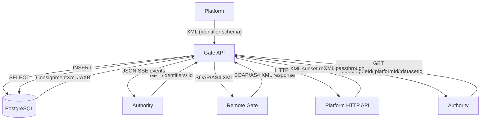

# eFTI Gate v2.0 Data Transformations Specification

**Version**: 1.0  
**Date**: 2026-04-23  
**Status**: Development-ready specification  

---

## 1. Overview

### 1.1 Purpose

The eFTI Gate handles four data formats and must transform between them precisely and consistently:

- **XML (eFTI identifier schema)** — `http://efti.eu/v1/consignment/identifier` — submitted by platforms, parsed to extract identifier metadata
- **XML (eFTI eDelivery schema)** — `http://efti.eu/v1/edelivery` — wraps consignment XML for gate-to-gate AS4 messaging
- **JSON (REST API)** — Request/response bodies for the Gate's HTTP API (authority search results, admin management)
- **SQL/PostgreSQL** — Normalized storage: `consignments`, `identifiers` tables

### 1.2 Transformation Flow



### 1.3 Key Principle: The Gate Is Content-Agnostic

The Gate **does not** validate or transform dataset XML content (the full CMDS payload stored on platforms). It only:
1. Parses the **identifier XML** submitted by platforms to extract searchable metadata
2. Wraps/unwraps XML in eDelivery SOAP envelopes for G2G communication
3. Passes through dataset XML unchanged from platform to authority

---

## 2. eFTI Identifier XML Schema

### 2.1 Namespace and Root Element

```
Namespace: http://efti.eu/v1/consignment/identifier
Root element: <consignment>
XSD reference: https://github.com/EFTI4EU/reference-implementation/blob/main/schema/xsd/consignment-identifier.xsd
```

### 2.2 Schema Structure (Identifier Subset)

The identifier XML submitted by platforms contains transport metadata used for searching. The Gate extracts and stores:

| XML Path | Database Column | Type | Required |
|----------|----------------|------|----------|
| `//mainCarriageTransportMovement[1]/modeCode` | `consignments.mode` | text | No |
| `//mainCarriageTransportMovement[1]/dangerousGoodsIndicator` | `consignments.dangerousGoods` | boolean | No |
| `//deliveryEvent/actualOccurrenceDateTime` | `consignments.deliveredAt` | timestamptz | No |
| `//mainCarriageTransportMovement/usedTransportMeans/id` | `identifiers.id` (type=`means`) | text | No |
| `//mainCarriageTransportMovement/usedTransportMeans/registrationCountry/code` | `identifiers.countryCode` | varchar(2) | No |
| `//usedTransportEquipment/id` | `identifiers.id` (type=`equipment`) | text | No |
| `//usedTransportEquipment/registrationCountry/code` | `identifiers.countryCode` | varchar(2) | No |
| `//usedTransportEquipment/carriedTransportEquipment/id` | `identifiers.id` (type=`carried`) | text | No |

### 2.3 Identifier Types

| Enum value | Description | Example |
|------------|-------------|---------|
| `means` | Vehicle registration plate (truck, tractor) from `usedTransportMeans.id` | `123ABC` |
| `equipment` | Container or trailer ID from `usedTransportEquipment.id` | `MSCU1234567` |
| `carried` | Nested equipment from `carriedTransportEquipment.id` | `TRLU9876543` |

### 2.4 Transport Mode Codes

| Code | Description |
|------|-------------|
| `1` | Maritime |
| `2` | Rail |
| `3` | Road |
| `4` | Air |
| `5` | Mail |
| `6` | Multimodal |
| `7` | Fixed transport |
| `8` | Inland waterway |
| `9` | Unknown |

---

## 3. Transformation Scenarios

### 3.1 XML → Database (Identifier Extraction)

This is the **primary transformation** in the Gate. Performed in `EftiParser.parseIdentifiers()` using JAXB unmarshalling into `ConsignmentXml`.

#### 3.1.1 Single Vehicle (means) — Standard Road Transport

**Use case**: Platform registers a road transport consignment with one truck.

**Input XML** (POST `/identifiers/550e8400-e29b-41d4-a716-446655440000`):
```xml
<consignment xmlns="http://efti.eu/v1/consignment/identifier">
  <mainCarriageTransportMovement>
    <dangerousGoodsIndicator>false</dangerousGoodsIndicator>
    <modeCode>3</modeCode>
    <usedTransportMeans>
      <id schemeAgencyId="6">123ABC</id>
      <registrationCountry>
        <code>EE</code>
      </registrationCountry>
    </usedTransportMeans>
  </mainCarriageTransportMovement>
  <deliveryEvent>
    <actualOccurrenceDateTime formatId="205">202604231015+0300</actualOccurrenceDateTime>
  </deliveryEvent>
</consignment>
```

**Transformation rules** (from `EftiParser.parseIdentifiers()`):
1. Strip XML declaration if present (`dropXmlHeader()`)
2. JAXB unmarshal into `ConsignmentXml`
3. Take `mainCarriageTransportMovement.firstOrNull()` as primary movement
4. Build `Consignment` record from UIL + primary movement fields
5. Iterate all `mainCarriageTransportMovement` entries → extract `usedTransportMeans` → `Identifier(type=means)`
6. Iterate all `usedTransportEquipment` → `Identifier(type=equipment)` + nested `carriedTransportEquipment` → `Identifier(type=carried)`

**Output — INSERT into `consignments`**:
```sql
INSERT INTO consignments (datasetId, platformId, gateId, xml, mode, dangerousGoods, deliveredAt, createdAt, updatedAt)
VALUES (
  '550e8400-e29b-41d4-a716-446655440000',
  'demo',
  'eu-ee31',
  '<consignment xmlns="http://efti.eu/v1/consignment/identifier">...</consignment>',
  '3',
  false,
  '2026-04-23T07:15:00Z',
  now(),
  now()
);
```

**Output — INSERT into `identifiers`**:
```sql
INSERT INTO identifiers (id, datasetId, type, countryCode)
VALUES ('123ABC', '550e8400-e29b-41d4-a716-446655440000', 'means', 'EE');
```

**Edge cases**:
- `modeCode` missing → `consignments.mode = NULL`
- `dangerousGoodsIndicator` missing → `consignments.dangerousGoods = NULL`
- `registrationCountry` missing → `identifiers.countryCode = NULL`
- `deliveryEvent` missing → `consignments.deliveredAt = NULL`

---

#### 3.1.2 Multiple Vehicles — Multiple `mainCarriageTransportMovement` Elements

**Use case**: Road train with tractor and trailer registered as separate transport means.

**Input XML**:
```xml
<consignment xmlns="http://efti.eu/v1/consignment/identifier">
  <mainCarriageTransportMovement>
    <dangerousGoodsIndicator>false</dangerousGoodsIndicator>
    <modeCode>3</modeCode>
    <usedTransportMeans>
      <id schemeAgencyId="6">456XYZ</id>
      <registrationCountry>
        <code>FI</code>
      </registrationCountry>
    </usedTransportMeans>
  </mainCarriageTransportMovement>
  <mainCarriageTransportMovement>
    <dangerousGoodsIndicator>false</dangerousGoodsIndicator>
    <modeCode>3</modeCode>
    <usedTransportMeans>
      <id schemeAgencyId="6">789DEF</id>
      <registrationCountry>
        <code>FI</code>
      </registrationCountry>
    </usedTransportMeans>
  </mainCarriageTransportMovement>
</consignment>
```

**Transformation rules**: Identical to 3.1.1, but loop produces two `Identifier` records.

**Output — INSERT into `consignments`**:
```sql
INSERT INTO consignments (datasetId, platformId, gateId, xml, mode, dangerousGoods)
VALUES ('660f9511-f39c-42e5-b827-557766551111', 'demo', 'eu-ee31', '...xml...', '3', false);
```

**Output — INSERT into `identifiers`** (two rows):
```sql
INSERT INTO identifiers (id, datasetId, type, countryCode) VALUES
  ('456XYZ', '660f9511-f39c-42e5-b827-557766551111', 'means', 'FI'),
  ('789DEF', '660f9511-f39c-42e5-b827-557766551111', 'means', 'FI');
```

---

#### 3.1.3 Transport Equipment (Container) + Dangerous Goods

**Use case**: Container shipment with dangerous goods indicator.

**Input XML**:
```xml
<consignment xmlns="http://efti.eu/v1/consignment/identifier">
  <mainCarriageTransportMovement>
    <dangerousGoodsIndicator>true</dangerousGoodsIndicator>
    <modeCode>3</modeCode>
    <usedTransportMeans>
      <id schemeAgencyId="6">123ABC</id>
      <registrationCountry>
        <code>EE</code>
      </registrationCountry>
    </usedTransportMeans>
  </mainCarriageTransportMovement>
  <usedTransportEquipment>
    <id schemeAgencyId="6">MSCU1234567</id>
    <registrationCountry>
      <code>EE</code>
    </registrationCountry>
    <carriedTransportEquipment>
      <id schemeAgencyId="6">TRLU9876543</id>
    </carriedTransportEquipment>
  </usedTransportEquipment>
</consignment>
```

**Output — INSERT into `consignments`**:
```sql
INSERT INTO consignments (datasetId, platformId, gateId, xml, mode, dangerousGoods)
VALUES ('770fa622-a49d-53f6-c938-668877662222', 'demo', 'eu-ee31', '...xml...', '3', true);
```

**Output — INSERT into `identifiers`** (three rows):
```sql
INSERT INTO identifiers (id, datasetId, type, countryCode) VALUES
  ('123ABC',      '770fa622-a49d-53f6-c938-668877662222', 'means',     'EE'),
  ('MSCU1234567', '770fa622-a49d-53f6-c938-668877662222', 'equipment', 'EE'),
  ('TRLU9876543', '770fa622-a49d-53f6-c938-668877662222', 'carried',   NULL);
```

**Note**: `carriedTransportEquipment` inherits the parent equipment's `countryCode` in the current implementation.

---

#### 3.1.4 XML with Missing Optional Fields

**Use case**: Minimal valid identifier submission — only vehicle plate, no mode or dangerous goods.

**Input XML**:
```xml
<consignment xmlns="http://efti.eu/v1/consignment/identifier">
  <mainCarriageTransportMovement>
    <usedTransportMeans>
      <id schemeAgencyId="6">789DEF</id>
    </usedTransportMeans>
  </mainCarriageTransportMovement>
</consignment>
```

**Output — INSERT into `consignments`** (NULL for optional columns):
```sql
INSERT INTO consignments (datasetId, platformId, gateId, xml, mode, dangerousGoods, deliveredAt)
VALUES ('880fb733-b59e-64a7-d049-779988773333', 'demo', 'eu-ee31', '...xml...', NULL, NULL, NULL);
```

**Output — INSERT into `identifiers`**:
```sql
INSERT INTO identifiers (id, datasetId, type, countryCode)
VALUES ('789DEF', '880fb733-b59e-64a7-d049-779988773333', 'means', NULL);
```

---

#### 3.1.5 Malformed XML → Error Response (No DB Write)

**Use case**: Platform submits XML with unclosed tag.

**Input XML**:
```xml
<consignment xmlns="http://efti.eu/v1/consignment/identifier">
  <mainCarriageTransportMovement>
    <modeCode>3</modeCode>
```

**Transformation rules**:
1. `dropXmlHeader()` — no header, no change
2. `ConsignmentXml.parse(xml)` → JAXB `unmarshal()` throws `JAXBException` wrapping `SAXParseException`
3. `runCatching { parser.parseIdentifiers(uil, xml) }.getOrElse { e -> throw BadRequestException("Error parsing identifiers: $e") }`
4. `BadRequestException` propagated → HTTP 400

**Output — RFC 7807 JSON error response**:
```json
{
  "type": "https://efti.eu/errors/invalid-xml",
  "title": "Invalid XML",
  "status": 400,
  "detail": "Error parsing identifiers: javax.xml.bind.UnmarshalException: unexpected end of document",
  "instance": "/identifiers/990gc844-c60f-75b8-e150-880099884444"
}
```

**No database write occurs.**

---

#### 3.1.6 XML with XML Declaration Header

**Use case**: Platform includes `<?xml version="1.0" encoding="UTF-8"?>` in submission.

**Input** (raw body):
```xml
<?xml version="1.0" encoding="UTF-8"?>
<consignment xmlns="http://efti.eu/v1/consignment/identifier">
  <mainCarriageTransportMovement>
    <modeCode>3</modeCode>
    <usedTransportMeans>
      <id schemeAgencyId="6">123ABC</id>
    </usedTransportMeans>
  </mainCarriageTransportMovement>
</consignment>
```

**Transformation rule** — `dropXmlHeader()` from `edelivery` module:
```kotlin
// Called in EftiService.saveIdentifiers() before parsing
val xml = xml.dropXmlHeader()
// Result: strips first line if it starts with "<?xml"
// Before: "<?xml version=\"1.0\"?>\n<consignment..."
// After:  "<consignment..."
```

**Stored in `consignments.xml`**: Without the XML declaration (header-stripped version).

---

#### 3.1.7 Delivery DateTime Parsing

**Use case**: `actualOccurrenceDateTime` with format ID `205` (Instant with timezone offset).

**Input XML element**:
```xml
<deliveryEvent>
  <actualOccurrenceDateTime formatId="205">202604231015+0300</actualOccurrenceDateTime>
</deliveryEvent>
```

**Transformation rule** (from `ActualOccurrenceDateTime.instant`):
```kotlin
val dateTimeFormats = mapOf(
  "102" to DateTimeFormatter.ofPattern("yyyyMMdd"),          // LocalDate
  "203" to DateTimeFormatter.ofPattern("yyyyMMddHHmm"),      // LocalDateTime  
  "205" to DateTimeFormatter.ofPattern("yyyyMMddHHmmxxxx"),  // Instant with offset
)
// formatId="205" → parse "202604231015+0300" → Instant 2026-04-23T07:15:00Z
```

**Output stored** in `consignments.deliveredAt`:
```
2026-04-23T07:15:00Z
```

**Format support**:
| formatId | Pattern | Example input | Stored as |
|----------|---------|---------------|-----------|
| `102` | `yyyyMMdd` | `20260423` | `2026-04-23T00:00:00Z` |
| `203` | `yyyyMMddHHmm` | `202604231015` | `2026-04-23T10:15:00Z` |
| `205` | `yyyyMMddHHmmxxxx` | `202604231015+0300` | `2026-04-23T07:15:00Z` |

---

### 3.2 Database → JSON (Search Results)

#### 3.2.1 Local Search Result (Authority GET /identifiers/:identifier)

**Trigger**: `EftiService.getLocalIdentifiers()` → `ConsignmentRepository.find(q)` → JAXB marshal `ConsignmentXml` → `GateIdentifiersResponse`

**Database query** (simplified):
```sql
SELECT c.datasetId, c.platformId, c.gateId, c.xml, i.id, i.type, i.countryCode
FROM consignments c
JOIN identifiers i ON i.datasetId = c.datasetId
WHERE i.id = '123ABC'
  AND i.type = 'means'
  AND i.countryCode = 'EE'
```

**Transformation rules**:
1. `ConsignmentXml.parse(c.xml)` — JAXB unmarshal stored XML
2. Set `uil = UIL(c.platformId, c.datasetId)` (no gateId for local results)
3. Set `identifierCountryOfOrigin = Config.countryCode` (this gate's country)
4. JAXB marshal `ConsignmentXml` → embedded in `GateIdentifiersResponse`
5. Serialised to JSON by framework

**Output JSON** (non-SSE, `Accept: application/json`):
```json
[
  {
    "uil": {
      "platformId": "demo",
      "datasetId": "550e8400-e29b-41d4-a716-446655440000"
    },
    "mainCarriageTransportMovement": [
      {
        "dangerousGoodsIndicator": false,
        "modeCode": "3",
        "usedTransportMeans": {
          "id": {
            "value": "123ABC",
            "schemeAgencyId": "6"
          },
          "registrationCountry": {
            "code": "EE"
          }
        }
      }
    ],
    "identifierCountryOfOrigin": "EE"
  }
]
```

---

#### 3.2.2 Broadcast Search Result — SSE Stream Events

**Trigger**: `EftiService.getIdentifiers()` → local + broadcast → `channelFlow` → SSE events

**Transformation rules**:
1. For each gate response (local or remote): `send(Event(gateIdentifiersResponse.copy(consignments = null), name = "gate"))`
2. For each individual consignment: `send(Event(consignment, id = consignment.uil))`
3. Finally: `send(Event(name = "complete"))`

**Output SSE stream** (`Accept: text/event-stream`):
```
event: gate
data: {"gateId":"eu-ee31","consignments":null,"responseTimeMs":12,"failure":null}

id: demo/550e8400-e29b-41d4-a716-446655440000
data: {"uil":{"platformId":"demo","datasetId":"550e8400-e29b-41d4-a716-446655440000"},"mainCarriageTransportMovement":[{"dangerousGoodsIndicator":false,"modeCode":"3","usedTransportMeans":{"id":{"value":"123ABC","schemeAgencyId":"6"},"registrationCountry":{"code":"EE"}}}],"identifierCountryOfOrigin":"EE"}

event: gate
data: {"gateId":"eu-fi01","consignments":null,"responseTimeMs":287,"failure":null}

id: plt-456/660f9511-f39c-42e5-b827-557766551111
data: {"uil":{"gateId":"eu-fi01","platformId":"plt-456","datasetId":"660f9511-f39c-42e5-b827-557766551111"},"mainCarriageTransportMovement":[{"modeCode":"3","usedTransportMeans":{"id":{"value":"123ABC","schemeAgencyId":"6"},"registrationCountry":{"code":"FI"}}}],"identifierCountryOfOrigin":"FI"}

event: gate
data: {"gateId":"eu-de01","consignments":null,"responseTimeMs":8050,"failure":"eu-de01 failed with ConnectTimeoutException"}

event: complete
data: 
```

**SSE event field mapping**:
| SSE field | Content |
|-----------|---------|
| `event` | `"gate"` for gate summary, `"complete"` for end-of-stream |
| `id` | UIL string `"{platformId}/{datasetId}"` for consignment events |
| `data` | JSON-serialised `GateIdentifiersResponse` (gate summary) or `ConsignmentXml` (result) |

---

#### 3.2.3 No Results Found

**Trigger**: Local returns 0, broadcast returns 0 from all gates

**Output JSON** (`Accept: application/json`):
```json
[]
```

**Output SSE** (`Accept: text/event-stream`):
```
event: gate
data: {"gateId":"eu-ee31","consignments":null,"responseTimeMs":5,"failure":null}

event: gate
data: {"gateId":"eu-fi01","consignments":null,"responseTimeMs":312,"failure":null}

event: complete
data: 
```

---

### 3.3 XML → XML (eDelivery SOAP Wrapping/Unwrapping)

#### 3.3.1 Identifier Query Response Wrapping (Gate → Remote Gate)

**Trigger**: `EftiService.handleIdentifierQuery()` — builds XML response to return to requesting gate.

**Input**: `List<Consignment>` from database + query requestId

**Transformation rules**:
1. For each consignment: wrap XML in `<ed:consignment>` with UIL metadata
2. Use `dropXmlRoot()` to strip outer `<consignment>` wrapper from stored XML, then re-embed
3. Wrap all in `<identifierResponse>` root element

**Output XML** (sent back via AS4):
```xml
<identifierResponse status="200" requestId="550e8400-e29b-41d4-a716-446655440000" xmlns="http://efti.eu/v1/edelivery">
  <ed:consignment xmlns="http://efti.eu/v1/consignment/identifier" xmlns:ed="http://efti.eu/v1/edelivery">
    <mainCarriageTransportMovement>
      <dangerousGoodsIndicator>false</dangerousGoodsIndicator>
      <modeCode>3</modeCode>
      <usedTransportMeans>
        <id schemeAgencyId="6">123ABC</id>
        <registrationCountry>
          <code>EE</code>
        </registrationCountry>
      </usedTransportMeans>
    </mainCarriageTransportMovement>
    <ed:uil>
      <ed:gateId>eu-ee31</ed:gateId>
      <ed:platformId>demo</ed:platformId>
      <ed:datasetId>550e8400-e29b-41d4-a716-446655440000</ed:datasetId>
    </ed:uil>
  </ed:consignment>
</identifierResponse>
```

**`dropXmlRoot()` helper**:
- **Input**: `<consignment xmlns="..."><mainCarriage...>...</mainCarriage></consignment>`
- **Output**: `<mainCarriage...>...</mainCarriage>` (outer root element stripped)
- **Use case**: Inner XML content is re-embedded in the eDelivery wrapper element

---

#### 3.3.2 UIL Query Response Wrapping

**Trigger**: `EftiService.handleUilQuery()` — remote gate requests dataset by UIL, result is wrapped in eDelivery envelope.

**Input**: Platform HTTP response body (XML dataset string) + status code + requestId

**Transformation rules**:
1. `body.dropXmlHeader()` — remove XML declaration from platform response
2. If status ≠ 200 and body doesn't start with `<`: wrap in `<description>` element
3. Wrap in `<uilResponse>` root element

**Output XML — Success** (platform returned 200 + XML):
```xml
<uilResponse xmlns="http://efti.eu/v1/edelivery" requestId="660f9511-f39c-42e5-b827-557766551111" status="200">
  <consignment xmlns="urn:efti:eu:2024:dataset">
    <!-- Full dataset XML from platform, XML declaration stripped -->
  </consignment>
</uilResponse>
```

**Output XML — Error** (platform returned 404 + text message):
```xml
<uilResponse xmlns="http://efti.eu/v1/edelivery" requestId="660f9511-f39c-42e5-b827-557766551111" status="404">
  <description>Consignment not found on this platform</description>
</uilResponse>
```

---

#### 3.3.3 Incoming Identifier Query (Gate Receives AS4 Request)

**Trigger**: Remote gate sends AS4 message → `GateMessageHandler` routes to `EftiService.handleIdentifierQuery()`

**Input SOAP/AS4 body** (simplified — actual AS4 wrapping handled by eDelivery infrastructure):
```xml
<identifierQuery requestId="770fa622-a49d-53f6-c938-668877662222" xmlns="http://efti.eu/v1/edelivery">
  <identifier>
    <value>123ABC</value>
    <type>means</type>
    <countryCode>EE</countryCode>
  </identifier>
  <modeCode>3</modeCode>
</identifierQuery>
```

**Transformation rules**:
1. `IdentifiersQuery.parse(payload)` — JAXB unmarshal into `IdentifiersQuery`
2. Extract `requestId`, `identifier value`, `type`, optional filters
3. Call `ConsignmentRepository.find(query)` — SQL search
4. Build XML response (see 3.3.1)

---

#### 3.3.4 Incoming UIL Query (Gate Receives AS4 Dataset Request)

**Input** (AS4 message body):
```xml
<uilQuery requestId="880fb733-b59e-64a7-d049-779988773333" xmlns="http://efti.eu/v1/edelivery">
  <uil>
    <gateId>eu-ee31</gateId>
    <platformId>demo</platformId>
    <datasetId>550e8400-e29b-41d4-a716-446655440000</datasetId>
  </uil>
  <subsetId>full</subsetId>
</uilQuery>
```

**Transformation rules**:
1. `UILQuery.parse(payload)` — JAXB unmarshal
2. Extract UIL components + subsets + requestId
3. `EftiService.getDataset(uil, subsets, requestId)` — forward to platform
4. Build `<uilResponse>` (see 3.3.2)

---

#### 3.3.5 Follow-Up Request Parsing

**Trigger**: Remote gate sends follow-up AS4 message → `EftiService.handlePostFollowUpRequest()`

**Input** (AS4 body):
```xml
<followUpRequest requestId="990gc844-c60f-75b8-e150-880099884444" xmlns="http://efti.eu/v1/edelivery">
  <uil>
    <gateId>eu-ee31</gateId>
    <platformId>demo</platformId>
    <datasetId>550e8400-e29b-41d4-a716-446655440000</datasetId>
  </uil>
  <uilQueryRequestId>880fb733-b59e-64a7-d049-779988773333</uilQueryRequestId>
  <message>Suspected fraudulent cargo. Please verify consignment details.</message>
</followUpRequest>
```

**Transformation rules**:
1. `FollowUpRequest.parse(xml)` — JAXB unmarshal
2. Validate `req.uil.gateId == Config.gateId` (guard: `FOLLOW_UP_GATE_MISMATCH` error if not)
3. `sendFollowUp(req.uil, req.message, req.uilQueryRequestId, req.requestId)`
4. Forward `message` to platform via `PlatformClient.postFollowUp()`

---

### 3.4 Platform HTTP Forward (Dataset Passthrough)

#### 3.4.1 Dataset Fetch — Local Platform

**Trigger**: `EftiService.getDataset()` → local gate → `PlatformClient.getDataset(platform, uil, subsets, requestId)`

**Outgoing HTTP request to platform**:
```
GET {platform.baseUrl}/v1/datasets/{datasetId}?subsetId=full&subsetId=dangerous-goods
X-Request-ID: 550e8400-e29b-41d4-a716-446655440000
{platform.headers}  (e.g., X-Api-Key: demo-platform-key)
```

**Platform response** (HTTP 200 + XML body):
```xml
<?xml version="1.0" encoding="UTF-8"?>
<consignment xmlns="urn:efti:eu:2024:dataset">
  <!-- Full dataset XML — Gate does not parse this content -->
</consignment>
```

**Passthrough to authority**:
- Gate returns platform's exact HTTP status and body
- Content-Type: `application/xml`
- X-Request-ID header echoed: `X-Request-ID: 550e8400-e29b-41d4-a716-446655440000`

**Note**: The Gate **does not** parse, validate, or transform the dataset XML. It is passed through byte-for-byte.

---

#### 3.4.2 Dataset Fetch — Remote Gate (G2G Proxy)

**Trigger**: `EftiService.getDataset()` → remote gate → `GateClient.getDataset(gate, uil, subsets, requestId)`

**Outgoing AS4 message to remote gate**:
```xml
<uilQuery requestId="550e8400-e29b-41d4-a716-446655440000" xmlns="http://efti.eu/v1/edelivery">
  <uil>
    <gateId>eu-fi01</gateId>
    <platformId>plt-456</platformId>
    <datasetId>660f9511-f39c-42e5-b827-557766551111</datasetId>
  </uil>
  <subsetId>full</subsetId>
</uilQuery>
```

**Incoming AS4 response** (unwrapped from SOAP):
```xml
<uilResponse xmlns="http://efti.eu/v1/edelivery" requestId="550e8400-e29b-41d4-a716-446655440000" status="200">
  <!-- dataset XML from remote platform -->
</uilResponse>
```

**Transformation rules**:
1. Extract status from `uilResponse.@status` attribute
2. Extract body — content inside `<uilResponse>` tags
3. Return `Pair(StatusCode, bodyString)` to caller
4. Caller (`AuthorityRoutes.getDataset()`) sends body + status to authority

---

### 3.5 Error Transformations

#### 3.5.1 XML Parse Error → RFC 7807

See scenario 3.1.5. Error response format:

```json
{
  "type": "https://efti.eu/errors/invalid-xml",
  "title": "Invalid XML",
  "status": 400,
  "detail": "Error parsing identifiers: javax.xml.bind.UnmarshalException - unexpected end of document",
  "instance": "/identifiers/990gc844-c60f-75b8-e150-880099884444"
}
```

---

#### 3.5.2 Gate Unavailable → RFC 7807

**Trigger**: `EftiService.checkGateAvailable()` — gate status is not ONLINE

```json
{
  "type": "https://efti.eu/errors/bad-gateway",
  "title": "Bad Gateway",
  "status": 502,
  "detail": "Cannot reach Gate eu-de01: OFFLINE",
  "instance": "/dataset/eu-de01/plt-456/550e8400-e29b-41d4-a716-446655440000"
}
```

---

#### 3.5.3 Multi-Platform User Error → RFC 7807

**Trigger**: `PlatformRoutes.before()` — user has more than 1 platform associated

```json
{
  "type": "https://efti.eu/errors/forbidden-multi-platform",
  "title": "Multi-Platform User Cannot Send",
  "status": 403,
  "detail": "User has more than one platform registered. This user cannot be used as a sender of eFTI data. Please create a new system user.",
  "instance": "/identifiers/550e8400-e29b-41d4-a716-446655440000"
}
```

---

#### 3.5.4 Payload Too Large → RFC 7807

**Trigger**: Request body exceeds configured maximum size (default: 10MB)

```json
{
  "type": "https://efti.eu/errors/bad-request",
  "title": "Bad Request",
  "status": 400,
  "detail": "Request body exceeds maximum allowed size of 10MB. Received: 12.4MB",
  "instance": "/identifiers/550e8400-e29b-41d4-a716-446655440000"
}
```

---

#### 3.5.5 Follow-Up Gate Mismatch → RFC 7807

**Trigger**: `EftiService.handlePostFollowUpRequest()` — `req.uil.gateId != Config.gateId`

```json
{
  "type": "https://efti.eu/errors/follow-up-gate-mismatch",
  "title": "Follow-Up Gate Mismatch",
  "status": 400,
  "detail": "Follow up gateId 'eu-fi01' does not match this gate's ID 'eu-ee31'",
  "instance": "/follow-up/eu-fi01/demo/550e8400-e29b-41d4-a716-446655440000/req-abc"
}
```

---

### 3.6 Special Cases

#### 3.6.1 XML with Namespace Declarations

The identifier XML uses default namespace `http://efti.eu/v1/consignment/identifier`. JAXB handles namespace-aware unmarshalling automatically.

**Input**:
```xml
<consignment xmlns="http://efti.eu/v1/consignment/identifier"
             xmlns:xsi="http://www.w3.org/2001/XMLSchema-instance">
  <mainCarriageTransportMovement>
    <modeCode>3</modeCode>
    <usedTransportMeans>
      <id schemeAgencyId="6">123ABC</id>
    </usedTransportMeans>
  </mainCarriageTransportMovement>
</consignment>
```

**Rule**: JAXB unmarshaller resolves namespaces transparently. `xsi:*` attributes are ignored during unmarshalling. The raw XML string (including all namespace declarations) is stored as-is in `consignments.xml`.

---

#### 3.6.2 `dropXmlHeader()` — XML Declaration Stripping

**Purpose**: Remove `<?xml?>` declaration before JAXB parsing and before storing in database.

**Reference implementation** (from `edelivery` module):
```kotlin
fun String.dropXmlHeader(): String =
  if (startsWith("<?xml")) substringAfter("\n") else this
```

**Behaviour**:
- **Input**: `"<?xml version=\"1.0\" encoding=\"UTF-8\"?>\n<consignment>...</consignment>"`
- **Output**: `"<consignment>...</consignment>"`
- **Input without header**: `"<consignment>...</consignment>"` → returned unchanged
- **Edge case**: Multiple `<?xml` lines — only the first line is stripped

---

#### 3.6.3 `dropXmlRoot()` — Root Element Stripping

**Purpose**: Strip the outer root element from an XML string, returning only inner content.

**Reference implementation** (from `edelivery` module):
```kotlin
fun String.dropXmlRoot(): String =
  substringAfter(">").substringBeforeLast("<")
```

**Behaviour**:
- **Input**: `"<consignment xmlns=\"...\"><mainCarriage>...</mainCarriage></consignment>"`
- **Output**: `"<mainCarriage>...</mainCarriage>"`
- **Use case 1**: Platform sends `<identifiers datasetId="..."><consignment>...</consignment></identifiers>` → `dropXmlRoot()` extracts inner `<consignment>` content
- **Use case 2**: `EftiService.handleIdentifierQuery()` re-wraps consignment XML with eDelivery `<ed:consignment>` outer element

---

#### 3.6.4 CDATA Sections

CDATA sections are not expected in the eFTI identifier XML schema. If present:
- JAXB will parse text content within CDATA as plain text
- The raw CDATA section is preserved in `consignments.xml` as stored

---

#### 3.6.5 Large XML Payloads

| Size | Strategy | Notes |
|------|----------|-------|
| < 1MB | DOM/JAXB in-memory | Default for identifier XML |
| 1MB – 10MB | Still JAXB, monitor heap | Identifier XML should not exceed 1MB |
| > 10MB | Reject with 400 / 413 | Enforce via HTTP server config |

Dataset XML (stored on platforms) is **never parsed by the Gate**. Only the metadata identifier XML is parsed.

---

#### 3.6.6 Concurrent Transformations

JAXB `JAXBContext` is thread-safe when created once at class initialization (via `companion object: JaxbParseable<T>()`). Each call to `parse()` or `render()` creates a new `Unmarshaller`/`Marshaller` instance — these are not thread-safe but are never shared between threads.

---

## 4. Helper Functions

### 4.1 `dropXmlHeader()`

| | |
|---|---|
| **Source** | `edelivery` module, `String` extension function |
| **Called in** | `EftiService.saveIdentifiers()` (line: `val xml = xml.dropXmlHeader()`) |
| **Purpose** | Remove `<?xml version="1.0"?>` declaration before JAXB parsing and database storage |
| **Input** | Raw XML string from platform HTTP body |
| **Output** | XML string without declaration |
| **Language-agnostic equivalent** | If string starts with `<?xml`, drop everything up to and including the first newline |

### 4.2 `dropXmlRoot()`

| | |
|---|---|
| **Source** | `edelivery` module, `String` extension function |
| **Called in** | `EftiService.handleSaveIdentifiersRequest()`, `EftiService.handleIdentifierQuery()` |
| **Purpose** | Strip outer root element, expose inner XML content for re-embedding |
| **Input** | `<root attr="x"><child>...</child></root>` |
| **Output** | `<child>...</child>` |
| **Language-agnostic equivalent** | Substring from first `>` + 1 to last `<` (exclusive) |
| **Limitation** | Naïve string manipulation — assumes single-root, no leading whitespace before root element |

### 4.3 `JaxbParseable<T>` (JAXB Companion Pattern)

```kotlin
abstract class JaxbParseable<T> {
  private val context = JAXBContext.newInstance(javaClass.enclosingClass)  // Created once

  fun parse(xml: String) = context.createUnmarshaller().unmarshal(StringReader(xml)) as T
  fun render(o: T) = StringWriter().let {
    context.createMarshaller().apply { setProperty(JAXB_FRAGMENT, true) }.marshal(o, it)
    it.toString()  // JAXB_FRAGMENT = no XML declaration in output
  }
}
```

**Used by**: `ConsignmentXml`, `IdentifiersQuery`, `UILQuery`, `GateIdentifiersResponse`, `FollowUpRequest`

---

## 5. Validation Rules

### 5.1 XML Validation

| Rule | When | Error |
|------|------|-------|
| Well-formed XML | Before JAXB parse | `INVALID_XML` (400) |
| Root element namespace matches expected | JAXB type binding | `INVALID_XML` (400) |
| `datasetId` path param is valid UUID v4 | Route binding | `INVALID_DATASET_ID` (400) |

**Note**: The Gate does **not** validate XML against the full XSD schema. JAXB maps known fields and ignores unknown elements.

### 5.2 Business Validation

| Rule | Where applied | Error |
|------|--------------|-------|
| Platform user has exactly 1 platform in roles | `PlatformRoutes.before()` | `FORBIDDEN_MULTI_PLATFORM` (403) |
| Platform user has ≥ 1 platform in roles | `PlatformRoutes.before()` | `FORBIDDEN_NO_PLATFORM` (403) |
| Follow-up gateId equals this gate's gateId | `EftiService.handlePostFollowUpRequest()` | `FOLLOW_UP_GATE_MISMATCH` (400) |
| Target gate is ONLINE | `EftiService.checkGateAvailable()` | `GATEWAY_UNAVAILABLE` (502) |

### 5.3 Database Constraint Validation

| Constraint | Table | Column | Error on violation |
|-----------|-------|--------|-------------------|
| PRIMARY KEY | `consignments` | `datasetId` | `DUPLICATE_DATASET_ID` (409) |
| FOREIGN KEY | `identifiers` | `datasetId → consignments` | `DATABASE_ERROR` (500) |
| NOT NULL | `consignments` | `platformId`, `gateId`, `xml` | `DATABASE_ERROR` (500) |

---

## 6. Performance Requirements

| Scenario | Dataset size | Max latency | Strategy |
|----------|-------------|-------------|----------|
| Identifier XML parse + DB write | < 50KB | 50ms | JAXB DOM in-memory |
| Identifier XML parse + DB write | 50KB – 1MB | 200ms | JAXB DOM in-memory, monitor GC |
| Identifier XML > 1MB | > 1MB | Reject | 400 / 413 error |
| G2G identifier query response XML build | Any | 20ms | String concatenation (`EftiService.handleIdentifierQuery()`) |
| Dataset passthrough (no parse) | Any | Platform latency + 10ms | Streamed HTTP pass-through |
| JAXB `JAXBContext` initialization | One-time startup | < 500ms | Via companion object singleton |

**Memory**: JAXB DOM parsing uses ~2–3x the XML string size in heap. For 50KB XML: ~150KB per request. Connection pool and coroutine thread pool settings must account for concurrent requests.

---

## 7. Error Handling Strategy

When any transformation step fails:

1. **Client input error (bad XML, wrong format)**: Return RFC 7807 JSON with `status: 400`, `efti.error.code: INVALID_XML`
2. **Server-side error (JAXB config, unexpected NPE)**: Return RFC 7807 JSON with `status: 500`, `efti.error.code: TRANSFORMATION_ERROR`
3. **Never return**: Full input XML in error response (may contain PII/sensitive cargo data)
4. **Log**: Error type, error message, input size (`http.request.body.bytes`), first 200 chars of input at DEBUG level only

---

## 8. Security Considerations

### 8.1 XXE (XML External Entity) Prevention

Configure XML parser to disable external entities:

```kotlin
// When creating SAXParserFactory for JAXB:
factory.setFeature("http://apache.org/xml/features/disallow-doctype-decl", true)
factory.setFeature("http://xml.org/sax/features/external-general-entities", false)
factory.setFeature("http://xml.org/sax/features/external-parameter-entities", false)
factory.setXIncludeAware(false)
factory.setExpandEntityReferences(false)
```

**JAXB default**: Modern JAXB implementations (Jakarta EE 10+) disable external entity expansion by default. Verify and explicitly configure for production.

### 8.2 XML Bomb (Billion Laughs) Prevention

- Enforce maximum request body size: **10MB** via HTTP server configuration
- Enforce maximum XML nesting depth: **20 levels** (configure in SAXParser)
- Enforce XML parsing timeout: **5 seconds**

### 8.3 SQL Injection Prevention

All extracted XML values are inserted via parameterized queries:
```kotlin
// Via klite-jdbc PreparedStatement — never string concatenation
consignmentRepository.save(consignment)  // Uses named parameters internally
```

### 8.4 Input Size Limits

| Input | Max size |
|-------|---------|
| Platform identifier XML | 10MB |
| eDelivery AS4 message body | 10MB |
| Platform dataset response | Unlimited (streamed, not parsed by Gate) |

---

## 9. Testing Strategy

### 9.1 Unit Tests

For each transformation scenario in Section 3:
- **Input**: XML string / SQL result set
- **Expected output**: Exact `Consignment` + `Identifier` list / JSON string / error type
- **Test framework**: JUnit 5 + Kotlin test DSL

Key test cases:
```kotlin
// 3.1.1
@Test fun `parse single vehicle identifier`() {
  val xml = """<consignment xmlns="http://efti.eu/v1/consignment/identifier">
    <mainCarriageTransportMovement>
      <modeCode>3</modeCode>
      <usedTransportMeans><id schemeAgencyId="6">123ABC</id></usedTransportMeans>
    </mainCarriageTransportMovement>
  </consignment>"""
  val (consignment, identifiers) = EftiParser().parseIdentifiers(uil, xml)
  assertEquals("3", consignment.mode?.value)
  assertEquals(1, identifiers.size)
  assertEquals("123ABC", identifiers[0].id)
  assertEquals(Identifier.Type.means, identifiers[0].type)
}

// 3.1.5
@Test fun `malformed XML throws BadRequestException`() {
  assertThrows<BadRequestException> {
    eftiService.saveIdentifiers(uil, "<consignment><unclosed>")
  }
}
```

### 9.2 Integration Tests

End-to-end: POST identifier XML → verify `consignments` + `identifiers` rows → GET /identifiers/:id → verify result in response.

### 9.3 Security Tests

- Test XXE: Submit XML with `<!DOCTYPE>` and external entity — expect 400 error
- Test XML bomb: Submit deeply nested XML (50+ levels) — expect 400 or timeout
- Test oversized body: Submit 15MB XML — expect 413 or 400 error

---

## Appendix A: Complete eFTI Identifier XML Examples

### A.1 Minimal Valid (One Vehicle)

```xml
<consignment xmlns="http://efti.eu/v1/consignment/identifier">
  <mainCarriageTransportMovement>
    <modeCode>3</modeCode>
    <usedTransportMeans>
      <id schemeAgencyId="6">123ABC</id>
      <registrationCountry>
        <code>EE</code>
      </registrationCountry>
    </usedTransportMeans>
  </mainCarriageTransportMovement>
</consignment>
```

### A.2 Full Example (Vehicle + Equipment + Dangerous Goods + Delivery)

```xml
<?xml version="1.0" encoding="UTF-8"?>
<consignment xmlns="http://efti.eu/v1/consignment/identifier">
  <mainCarriageTransportMovement>
    <dangerousGoodsIndicator>true</dangerousGoodsIndicator>
    <modeCode>3</modeCode>
    <usedTransportMeans>
      <id schemeAgencyId="6">789DEF</id>
      <registrationCountry>
        <code>DE</code>
      </registrationCountry>
    </usedTransportMeans>
  </mainCarriageTransportMovement>
  <usedTransportEquipment>
    <id schemeAgencyId="6">MSCU1234567</id>
    <registrationCountry>
      <code>DE</code>
    </registrationCountry>
    <sequenceNumber>1</sequenceNumber>
    <carriedTransportEquipment>
      <id schemeAgencyId="6">TRLU9876543</id>
      <sequenceNumber>1</sequenceNumber>
    </carriedTransportEquipment>
  </usedTransportEquipment>
  <deliveryEvent>
    <actualOccurrenceDateTime formatId="205">202604231015+0200</actualOccurrenceDateTime>
  </deliveryEvent>
</consignment>
```

### A.3 Multi-Leg Transport (Two Transport Movements)

```xml
<consignment xmlns="http://efti.eu/v1/consignment/identifier">
  <mainCarriageTransportMovement>
    <dangerousGoodsIndicator>false</dangerousGoodsIndicator>
    <modeCode>1</modeCode>
    <usedTransportMeans>
      <id schemeAgencyId="6">VESSEL-IMO-1234567</id>
      <registrationCountry>
        <code>FI</code>
      </registrationCountry>
    </usedTransportMeans>
  </mainCarriageTransportMovement>
  <mainCarriageTransportMovement>
    <dangerousGoodsIndicator>false</dangerousGoodsIndicator>
    <modeCode>3</modeCode>
    <usedTransportMeans>
      <id schemeAgencyId="6">456XYZ</id>
      <registrationCountry>
        <code>EE</code>
      </registrationCountry>
    </usedTransportMeans>
  </mainCarriageTransportMovement>
</consignment>
```

---

## Appendix B: XPath Reference

| Data element | XPath | Stored in | Example |
|-------------|-------|-----------|---------|
| Mode code | `//mainCarriageTransportMovement[1]/modeCode` | `consignments.mode` | `"3"` |
| Dangerous goods | `//mainCarriageTransportMovement[1]/dangerousGoodsIndicator` | `consignments.dangerousGoods` | `true` |
| Delivery datetime | `//deliveryEvent/actualOccurrenceDateTime` | `consignments.deliveredAt` | `"2026-04-23T07:15:00Z"` |
| Vehicle plate (means) | `//mainCarriageTransportMovement/usedTransportMeans/id` | `identifiers.id` (means) | `"123ABC"` |
| Vehicle country | `//mainCarriageTransportMovement/usedTransportMeans/registrationCountry/code` | `identifiers.countryCode` | `"EE"` |
| Container ID | `//usedTransportEquipment/id` | `identifiers.id` (equipment) | `"MSCU1234567"` |
| Nested equipment | `//usedTransportEquipment/carriedTransportEquipment/id` | `identifiers.id` (carried) | `"TRLU9876543"` |
