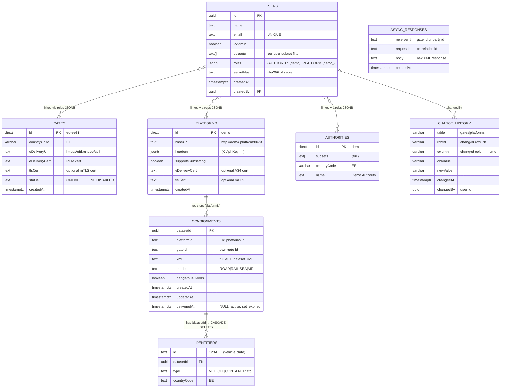

# eFTI Gate v2.0 Database Documentation

**Database**: PostgreSQL 14+ (tested on 14.10, 15.5, 16.1)
**Character Set**: UTF-8
**Timezone**: UTC (all `TIMESTAMPTZ` columns)
**Total Tables**: 8 core tables (gates, platforms, authorities, users, consignments, identifiers, async_responses, change_history)
**Schema source**: `gate/db/*.sql` (Liquibase changesets)

---

## Table of Contents

1. [Overview](#1-overview)
2. [Entity-Relationship Diagram](#2-entity-relationship-diagram)
3. [Tables](#3-tables)
   - [3.1 gates](#31-gates)
   - [3.2 platforms](#32-platforms)
   - [3.3 authorities](#33-authorities)
   - [3.4 users](#34-users)
   - [3.5 consignments](#35-consignments)
   - [3.6 identifiers](#36-identifiers)
   - [3.7 async_responses](#37-async_responses)
   - [3.8 change_history](#38-change_history)
4. [Indexing Strategy](#4-indexing-strategy)
5. [Data Retention Policies](#5-data-retention-policies)
6. [PostgreSQL Extensions](#6-postgresql-extensions)
7. [Triggers & Functions](#7-triggers--functions)
8. [Backup & Restore](#8-backup--restore)
9. [Performance Tuning](#9-performance-tuning)
10. [Troubleshooting](#10-troubleshooting)
11. [Development Setup](#11-development-setup)

---

## 1. Overview

The eFTI Gate database stores all state for an EU national eFTI gateway operating under
EU Regulation 2024/2024. Its core responsibilities:

- **Gate registry**: Known EU peer gates (eu-fi01, eu-de01, ...) with their eDelivery endpoints and status
- **Platform registry**: Freight companies that register consignment identifiers
- **Authority registry**: Competent authorities (police, customs) that query identifiers and datasets
- **User management**: All authenticated users with their roles (ADMIN, PLATFORM, AUTHORITY, GATE)
- **Consignment registry**: Consignment metadata and full dataset XML uploaded by platforms
- **Identifier index**: Searchable identifiers (vehicle plates, container IDs) linked to consignments
- **Async responses**: Temporary store for eDelivery AS4 async message responses
- **Audit trail**: Column-level change history for compliance and debugging

### Key Design Decisions

- **CITEXT primary keys** on `gates`, `platforms`, `authorities`: Case-insensitive matching (e.g., "DEMO" == "demo")
- **UUID primary key** on `users`, `consignments` (UUID v4 via `gen_random_uuid()`)
- **JSONB roles field** on `users`: Flexible role/entity mapping without join tables
- **Soft-delete pattern** on `consignments`: `deliveredAt IS NOT NULL` marks expired consignments; metadata retained for audit
- **In-memory registry pattern**: `gates`, `platforms`, `authorities` are loaded at startup into in-memory `ConcurrentHashMap`. DB changes propagate via `pg_notify` channel `registry_change`.
- **No separate `dataset_requests` table**: Dataset access is stateless (pass-through proxy). Authority queries are logged in `change_history` via triggers.

---

## 2. Entity-Relationship Diagram



---

## 3. Tables

### 3.1 `gates`

**Purpose**: Registry of all known EU eFTI peer gates. Used to:
- Route identifier broadcast searches (`gateRegistry.online()`)
- Route dataset requests to remote gates (`gateRegistry[gateId]`)
- Track ping health status of each gate

**Source**: `gate/db/gates.sql`

**Columns**:

| Column | Type | Constraints | Description |
|--------|------|-------------|-------------|
| `id` | CITEXT | PRIMARY KEY | Gate identifier (pattern: `eu-{country}{number}`, e.g. `eu-ee31`) |
| `countryCode` | VARCHAR(2) | NOT NULL | ISO 3166-1 alpha-2 country code |
| `eDeliveryUrl` | TEXT | NOT NULL | eDelivery AS4 endpoint URL |
| `eDeliveryCert` | TEXT | NOT NULL | X.509 certificate PEM for eDelivery (renamed from `certPem`) |
| `tlsCert` | TEXT | | Optional TLS client certificate for mTLS |
| `status` | TEXT | NOT NULL, DEFAULT 'ONLINE' | Health status: `ONLINE`, `OFFLINE`, `DISABLED` |
| `createdAt` | TIMESTAMPTZ | NOT NULL, DEFAULT NOW() | Registration timestamp |

**Status values** (from `efti.domain.Status`):
- `ONLINE` — included in broadcasts, pinged regularly
- `OFFLINE` — excluded from broadcasts, ping job continues trying
- `DISABLED` — excluded from broadcasts AND ping job (admin-disabled)

**Business Rules**:
- Own gate (configured via `GATE_ID` env var) is NOT stored in this table
- CITEXT allows case-insensitive ID comparison
- `isFast` computed property: `eDeliveryUrl.path.startsWith("/services/fast")` — uses HTTP instead of AS4

**Change history**: Tracked via `gates_history` trigger.

**Example**:
```sql
SELECT id, countryCode, status FROM gates WHERE status = 'ONLINE';
-- eu-fi01 | FI | ONLINE
-- eu-de01 | DE | ONLINE
-- eu-se01 | SE | ONLINE
```

---

### 3.2 `platforms`

**Purpose**: Configuration of eFTI platform companies that register consignment identifiers. Each platform has a `baseUrl` that the gate calls to retrieve dataset XML for authority requests.

**Source**: `gate/db/platforms.sql`

**Columns**:

| Column | Type | Constraints | Description |
|--------|------|-------------|-------------|
| `id` | CITEXT | PRIMARY KEY | Platform identifier (e.g. `demo`, `plt-abc-001`) |
| `baseUrl` | TEXT | NOT NULL | HTTP base URL for platform API calls |
| `headers` | JSONB | NOT NULL, DEFAULT '{}' | Additional HTTP headers (e.g. `{"X-Api-Key": "..."}`) |
| `supportsSubsetting` | BOOLEAN | NOT NULL, DEFAULT TRUE | If false, gate requests full XML and applies subset filtering locally |
| `eDeliveryCert` | TEXT | | X.509 certificate for eDelivery AS4 integration |
| `tlsCert` | TEXT | | Optional TLS client certificate for mTLS to platform |
| `createdAt` | TIMESTAMPTZ | NOT NULL, DEFAULT NOW() | Registration timestamp |

**Business Rules**:
- Platform is loaded into `platformRegistry` (in-memory) at startup
- `supportsSubsetting=false` (legacy): gate calls `/v1/dataset/{uil}` and applies subsetting internally via `subsetter` module
- `supportsSubsetting=true`: gate calls platform subset-specific endpoint
- Platform users must have exactly 1 platform in their roles to submit identifiers (multi-platform user restriction)

**Change history**: Tracked via `platforms_history` trigger.

**Example**:
```sql
INSERT INTO platforms (id, baseUrl, headers, supportsSubsetting)
VALUES ('plt-abc-001', 'https://efti.abc-logistics.ee', '{"X-Api-Key":"secret-key-abc"}', TRUE);
```

---

### 3.3 `authorities`

**Purpose**: Configuration of competent authorities (police, customs, transport inspectorate) that are allowed to search identifiers and request datasets.

**Source**: `gate/db/authorities.sql`

**Columns**:

| Column | Type | Constraints | Description |
|--------|------|-------------|-------------|
| `id` | CITEXT | PRIMARY KEY | Authority identifier (e.g. `demo`, `aut-politsei-001`) |
| `subsets` | TEXT[] | NOT NULL | Allowed eFTI dataset subsets (e.g. `{EU07, full}`) |
| `countryCode` | VARCHAR(2) | NOT NULL | ISO 3166-1 alpha-2 country code |
| `name` | TEXT | | Human-readable authority name |

**Business Rules**:
- Authority is loaded into `authorityRegistry` (in-memory) at startup
- User-level `subsets` must be a subset of `authority.subsets` (enforced in `UserAdminRoutes`)
- Separate `authority_users` table was dropped; users are linked via `roles` JSONB in `users`

**Change history**: Tracked via `authorities_history` trigger.

**Example**:
```sql
INSERT INTO authorities (id, subsets, countryCode, name)
VALUES ('aut-politsei-001', ARRAY['EU07', 'full'], 'EE', 'Police and Border Guard Board');
```

---

### 3.4 `users`

**Purpose**: All authenticated users of the gate system. A single table covers all user types (admin, platform operators, authority users, gate users), differentiated by the `roles` JSONB field and `isAdmin` flag.

**Source**: `gate/db/users.sql`

**Columns**:

| Column | Type | Constraints | Description |
|--------|------|-------------|-------------|
| `id` | UUID | PRIMARY KEY, DEFAULT gen_random_uuid() | User UUID |
| `name` | TEXT | NOT NULL | Display name |
| `email` | TEXT | UNIQUE | Email (used as login identifier for human users) |
| `isAdmin` | BOOLEAN | NOT NULL, DEFAULT FALSE | Legacy super-admin flag |
| `subsets` | TEXT[] | | User-specific subset restriction (must be ⊆ authority.subsets) |
| `roles` | JSONB | NOT NULL, DEFAULT '{}' | Role-to-entity mapping: `{"AUTHORITY":["aut-001"], "PLATFORM":["plt-abc"]}` |
| `secretHash` | TEXT | NOT NULL | SHA-256 hash of the user's secret/password |
| `createdAt` | TIMESTAMPTZ | NOT NULL, DEFAULT NOW() | Creation timestamp |
| `createdBy` | UUID | FK → users(id) | Admin who created this user |

**Roles structure**:
```json
{
  "ADMIN": null,
  "PLATFORM": ["demo"],
  "AUTHORITY": ["aut-politsei-001"],
  "GATE": ["eu-fi01", "eu-de01"]
}
```

**Authentication**:
- HTTP Basic Auth: `Authorization: Basic base64(email:secret)` or `base64(id:secret)`
- Gate verifies: `sha256(providedSecret) == user.secretHash`
- Route access controlled by `@Access(ROLE)` annotation checked against `user.roles`

**Business Rules**:
- Platform users with multiple platforms in `roles.PLATFORM` cannot submit identifier data
- `createdBy` links to the admin who created the user (audit trail)
- Historical `gateId`, `platformId`, `authorityId` columns migrated to `roles` JSONB in latest changeset

**Change history**: Tracked via `users_history` trigger.

**Example**:
```sql
INSERT INTO users (name, email, roles, secretHash)
VALUES (
  'Officer Jaan Tamm',
  'jaan.tamm@politsei.ee',
  '{"AUTHORITY": ["aut-politsei-001"]}',
  encode(sha256('generated-secret-uuid'::bytea), 'base64')
);
```

---

### 3.5 `consignments`

**Purpose**: The central consignment dataset registry. Each row stores the full eFTI XML dataset for one consignment, uploaded by a platform. This is the primary data store that authorities ultimately access when requesting datasets.

**Source**: `gate/db/identifiers.sql`

**Columns**:

| Column | Type | Constraints | Description |
|--------|------|-------------|-------------|
| `datasetId` | UUID | PRIMARY KEY | Consignment dataset UUID (provided by platform) |
| `platformId` | TEXT | NOT NULL | Platform that registered this consignment |
| `gateId` | TEXT | NOT NULL | Gate that received this registration (always own gate) |
| `xml` | TEXT | NOT NULL | Full eFTI dataset XML content |
| `mode` | TEXT | | Transport mode: `ROAD`, `RAIL`, `SEA`, `AIR`, `MULTIMODAL` |
| `dangerousGoods` | BOOLEAN | | Quick flag: does XML contain dangerous goods data? |
| `createdAt` | TIMESTAMPTZ | NOT NULL, DEFAULT NOW() | Registration timestamp |
| `updatedAt` | TIMESTAMPTZ | NOT NULL, DEFAULT NOW() | Last update timestamp |
| `deliveredAt` | TIMESTAMPTZ | | NULL = active; NOT NULL = expired/delivered |

**Expiry logic**:
- Background expiry job: sets `deliveredAt = NOW()` for old consignments (`createdAt < NOW() - 90 days`)
- Expiry runs at randomized time (03:45–05:45 local) to spread load across EU gates
- Expired consignments (`deliveredAt IS NOT NULL`) are excluded from identifier search results

**Dataset XML**:
- Schema: `http://efti.eu/v1/consignment/identifier` (XSD in `xsd/consignment-identifier.xsd`)
- Up to ~10MB per consignment XML
- Parsed by `EftiParser` on registration to extract identifiers

**Business Rules**:
- Platform can re-upload same `datasetId` to update the XML (upsert via `ConsignmentRepository.save`)
- `identifiers` rows are deleted and re-inserted on update (CASCADE DELETE on `datasetId`)
- `gateId` always equals the receiving gate's own ID (may be removed in future)

**Example**:
```sql
-- Find active consignments for a platform
SELECT datasetId, mode, dangerousGoods, createdAt
FROM consignments
WHERE platformId = 'demo'
  AND deliveredAt IS NULL
ORDER BY createdAt DESC;
```

---

### 3.6 `identifiers`

**Purpose**: Searchable index of identifiers extracted from consignment XML. One consignment can have multiple identifiers (e.g. vehicle plate + trailer plate + container ID).

**Source**: `gate/db/identifiers.sql`

**Columns**:

| Column | Type | Constraints | Description |
|--------|------|-------------|-------------|
| `id` | TEXT | PK (with datasetId) | Identifier value (e.g. vehicle plate `123ABC`, container `TCKU3953913`) |
| `datasetId` | UUID | PK, FK → consignments(datasetId) ON DELETE CASCADE | Parent consignment |
| `type` | TEXT | NOT NULL | Identifier type (e.g. `VEHICLE`, `CONTAINER`, `TRANSPORT_DOCUMENT`) |
| `countryCode` | TEXT | | Registration country (ISO 3166-1 alpha-2, e.g. `EE`) |

**Primary key**: Composite `(id, datasetId)` — same plate can appear in multiple consignments.

**Cascade delete**: When a consignment row is deleted, all its identifiers are automatically deleted.

**Search query**:
```sql
-- Main identifier search (called by EftiService.getLocalIdentifiers)
SELECT c.*
FROM consignments c
JOIN identifiers i ON i.datasetId = c.datasetId
WHERE i.id = '123ABC'
  AND i.countryCode = 'EE'  -- optional
  AND c.deliveredAt IS NULL;
```

**Example**:
```sql
INSERT INTO identifiers (id, datasetId, type, countryCode)
VALUES
  ('123ABC', '550e8400-e29b-41d4-a716-446655440000', 'VEHICLE', 'EE'),
  ('456DEF', '550e8400-e29b-41d4-a716-446655440000', 'TRAILER', 'EE');
```

---

### 3.7 `async_responses`

**Purpose**: Temporary storage for asynchronous eDelivery AS4 responses. When the gate sends a request to a remote gate via eDelivery (synchronous wait not possible), the response is stored here and polled/matched by the waiting coroutine.

**Source**: `gate/db/async_responses.sql`

**Columns**:

| Column | Type | Constraints | Description |
|--------|------|-------------|-------------|
| `receiverId` | TEXT | PK (with requestId) | Receiving party ID (gate ID or AS4 party ID) |
| `requestId` | TEXT | PK (with receiverId) | Correlation request ID (X-Request-ID) |
| `body` | TEXT | NOT NULL | Raw XML response body |
| `createdAt` | TIMESTAMPTZ | NOT NULL, DEFAULT NOW() | Arrival timestamp |

**Business Rules**:
- Row inserted when remote gate responds asynchronously via eDelivery
- Row consumed (deleted) after being picked up by the waiting HTTP request handler
- Old rows (no waiting handler) should be cleaned up periodically
- Column originally named `gateId`, then `partyId`, now `receiverId`

**Example**:
```sql
-- Insert async response (called by GateMessageHandler)
INSERT INTO async_responses (receiverId, requestId, body)
VALUES ('eu-ee31', 'req-a1b2c3d4', '<identifierResponse ...>...</identifierResponse>');

-- Consume async response (called by EDeliveryClient.sendAndReceive)
DELETE FROM async_responses
WHERE receiverId = 'eu-ee31' AND requestId = 'req-a1b2c3d4'
RETURNING body;
```

---

### 3.8 `change_history`

**Purpose**: Column-level audit trail of all changes to audited tables (gates, platforms, authorities, users). Records old and new values for each changed column.

**Source**: `gate/db/change_history.sql`

**Columns**:

| Column | Type | Description |
|--------|------|-------------|
| `table` | VARCHAR | Table where change occurred (e.g. `platforms`) |
| `rowId` | VARCHAR | Primary key value of the changed row |
| `column` | VARCHAR | Column name that changed |
| `oldValue` | VARCHAR | Previous value (TEXT cast) |
| `newValue` | VARCHAR | New value (TEXT cast) |
| `changedAt` | TIMESTAMPTZ | Change timestamp (`clock_timestamp()` for accuracy in transactions) |
| `changedBy` | UUID | User ID from session context (`app.user` setting) |

**Audited tables**: `gates`, `platforms`, `authorities`, `users` (all have `*_history` triggers).

**Setting audit user**:
```sql
-- Application calls this before making changes
CALL set_app_user('d2e3f4a5-...'::uuid);

-- Then trigger automatically records changedBy
UPDATE platforms SET baseUrl = 'https://new-url.ee' WHERE id = 'demo';
-- → change_history row: table=platforms, rowId=demo, column=baseUrl, oldValue=..., newValue=..., changedBy=d2e3f4a5-...
```

**Example query**:
```sql
-- Audit: who changed platform 'demo' in the last 7 days?
SELECT ch.*, u.email
FROM change_history ch
LEFT JOIN users u ON u.id = ch.changedBy
WHERE ch."table" = 'platforms' AND ch.rowId = 'demo'
  AND ch.changedAt > NOW() - INTERVAL '7 days'
ORDER BY ch.changedAt DESC;
```

---

## 4. Indexing Strategy

### 4.1 Identifier Search (Hot Path)

The primary read workload: authority calls `GET /identifiers/{plate}?registrationCountryCode=EE`.

```sql
-- EftiService.getLocalIdentifiers → ConsignmentRepository.find
SELECT c.* FROM consignments c
JOIN identifiers i ON i.datasetId = c.datasetId
WHERE i.id = '123ABC'
  AND i.countryCode = 'EE'       -- optional
  AND c.deliveredAt IS NULL;
```

**Indexes**:

| Index | Type | Columns | Reason |
|-------|------|---------|--------|
| `idx_identifiers_id` | B-tree | `id` | Exact plate lookup |
| `idx_identifiers_id_country` | B-tree | `(id, countryCode)` | Plate + country (most selective) |
| `idx_identifiers_id_trgm` | GIN (pg_trgm) | `id` | Fuzzy/partial plate search (ILIKE) |
| `identifiers_dataset_idx` | B-tree | `datasetId` | JOIN to consignments |
| `idx_consignments_delivered` | B-tree (partial) | `createdAt WHERE deliveredAt IS NULL` | Expiry job scan |

Expected performance (1M identifiers):
- Exact match: < 5ms (B-tree index scan)
- Fuzzy match: < 30ms (GIN trigram scan)

### 4.2 Broadcast Gate Selection

```sql
-- GateRegistry.online() on startup → in-memory cache
-- Updated via pg_notify when gates change
SELECT * FROM gates WHERE status = 'ONLINE' AND id != 'eu-ee31';
```

**Index**: `idx_gates_status` (partial, `WHERE status = 'ONLINE'`) — small table, fast.

### 4.3 Expiry Background Job

```sql
-- Expiry job
SELECT datasetId FROM consignments
WHERE deliveredAt IS NULL
  AND createdAt < NOW() - INTERVAL '90 days';
```

**Index**: `idx_consignments_delivered` (partial, `WHERE deliveredAt IS NULL`) — covers only active rows.

### 4.4 Authentication

```sql
-- Auth lookup (every request)
SELECT * FROM users WHERE email = 'jaan.tamm@politsei.ee';
```

**Index**: Implicit B-tree from `UNIQUE` constraint on `users.email`.

### 4.5 Role-Based Queries

```sql
-- Find all authority users
SELECT * FROM users WHERE roles ? 'AUTHORITY';
```

**Index**: `idx_users_roles` (GIN on JSONB `roles` column).

### 4.6 Full Index List

See `migrations/V3__create_indexes.sql` for complete definitions.

---

## 5. Data Retention Policies

### 5.1 Consignment Expiry

**Policy**: Consignments expire after ~90 days (background job sets `deliveredAt`).

```sql
-- Background expiry job (runs at randomized 03:45–05:45)
UPDATE consignments
SET deliveredAt = NOW()
WHERE deliveredAt IS NULL
  AND createdAt < NOW() - INTERVAL '90 days';
```

Expired consignments remain in the DB with `deliveredAt IS NOT NULL`. They are:
- **Excluded from search** (identifier queries filter `deliveredAt IS NULL`)
- **Still accessible** via direct UIL (dataset XML still present)

### 5.2 Change History Retention

**Policy**: `change_history` rows are retained indefinitely by default for audit/compliance.
For very high-volume deployments, archive rows older than 2 years:

```sql
-- Archive old change history (run as scheduled job)
CREATE TABLE IF NOT EXISTS change_history_archive (LIKE change_history);

INSERT INTO change_history_archive
SELECT * FROM change_history WHERE changedAt < NOW() - INTERVAL '2 years';

DELETE FROM change_history WHERE changedAt < NOW() - INTERVAL '2 years';
```

### 5.3 Async Responses Cleanup

**Policy**: Async responses are consumed immediately by the waiting handler. Orphaned rows
(no waiting handler, e.g. after restart) should be cleaned up.

```sql
-- Clean up stale async responses older than 1 hour
DELETE FROM async_responses WHERE createdAt < NOW() - INTERVAL '1 hour';
```

---

## 6. PostgreSQL Extensions

### Required

**`pgcrypto`** — UUID generation and hashing:
```sql
CREATE EXTENSION IF NOT EXISTS pgcrypto;

-- Generate UUID v4 (used as default for users.id)
SELECT gen_random_uuid();
-- 550e8400-e29b-41d4-a716-446655440000
```

**`citext`** — Case-insensitive text type (used for gates.id, platforms.id, authorities.id):
```sql
CREATE EXTENSION IF NOT EXISTS citext;

-- 'DEMO' == 'demo' with citext
SELECT * FROM platforms WHERE id = 'DEMO';  -- finds 'demo'
```

### Optional (Performance)

**`pg_trgm`** — Trigram matching for fuzzy plate search:
```sql
CREATE EXTENSION IF NOT EXISTS pg_trgm;

-- Enables GIN index for ILIKE queries
SELECT * FROM identifiers WHERE id ILIKE '%23AB%';
```

**`pg_stat_statements`** — Query performance monitoring:
```sql
CREATE EXTENSION IF NOT EXISTS pg_stat_statements;

-- Find slowest queries
SELECT query, mean_exec_time, calls
FROM pg_stat_statements
WHERE mean_exec_time > 100
ORDER BY mean_exec_time DESC
LIMIT 10;
```

---

## 7. Triggers & Functions

### 7.1 `set_app_user(userId uuid)` — Procedure

Sets the current user context in the session for audit logging.

```sql
-- Called by application before making DB changes
CALL set_app_user('d2e3f4a5-eb08-11f0-b506-3c9c0f2eb459'::uuid);
```

### 7.2 `get_app_user()` — Function

Retrieves the current user UUID from the session. Returns `NULL` if not set.

```sql
SELECT get_app_user();
-- d2e3f4a5-eb08-11f0-b506-3c9c0f2eb459
```

### 7.3 `add_change_history()` — Trigger Function

Records every changed column to `change_history`. Iterates all columns, compares old vs. new, inserts a row for each change.

**Attached to** (AFTER UPDATE triggers):
- `gates_history` on `gates`
- `platforms_history` on `platforms`
- `authorities_history` on `authorities`
- `users_history` on `users`

**Example trigger output** (platform baseUrl change):
```
table=platforms | rowId=demo | column=baseUrl | oldValue=http://demo-platform:8070 | newValue=http://localhost:8070 | changedBy=175791a3-...
```

### 7.4 CASCADE DELETE on `identifiers`

```sql
ALTER TABLE identifiers
ADD FOREIGN KEY (datasetId) REFERENCES consignments(datasetId) ON DELETE CASCADE;
```

When `DELETE FROM consignments WHERE datasetId = '...'` executes, all `identifiers` rows with that `datasetId` are automatically deleted.

---

## 8. Backup & Restore

### 8.1 Full Backup

```bash
# Daily backup (recommended: 02:00 UTC, before expiry job runs)
pg_dump -U efti_admin -d efti_gate -F c \
  -f /backups/efti_gate_$(date +%Y%m%d_%H%M).dump

# Verify backup
pg_restore --list /backups/efti_gate_20260422_0200.dump | head -20
```

### 8.2 Schema-Only Backup

```bash
# Useful for comparing with migration output
pg_dump -U efti_admin -d efti_gate -s -f /backups/schema_$(date +%Y%m%d).sql
```

### 8.3 WAL Archiving (Continuous)

```conf
# postgresql.conf
wal_level = replica
archive_mode = on
archive_command = 'cp %p /wal-archive/%f'
```

### 8.4 Full Restore

```bash
# Stop application
systemctl stop efti-gate

# Drop and recreate database
dropdb -U postgres efti_gate
createdb -U postgres efti_gate
psql -U postgres -c "GRANT ALL PRIVILEGES ON DATABASE efti_gate TO efti_admin;"

# Restore
pg_restore -U postgres -d efti_gate /backups/efti_gate_20260422_0200.dump

# Verify
psql -U efti_admin -d efti_gate -c "SELECT COUNT(*) FROM consignments;"

# Restart application
systemctl start efti-gate
```

### 8.5 Point-in-Time Recovery

```bash
# Restore base backup
pg_restore -U postgres -d efti_gate /backups/efti_gate_20260422_0200.dump

# Configure recovery target
cat > $PGDATA/recovery.conf <<EOF
restore_command = 'cp /wal-archive/%f %p'
recovery_target_time = '2026-04-22 14:30:00 UTC'
recovery_target_action = 'promote'
EOF

pg_ctl start
```

---

## 9. Performance Tuning

### 9.1 PostgreSQL Configuration

```conf
# postgresql.conf — recommended for production (16-core, 64GB RAM)
max_connections = 200
shared_buffers = 16GB           # 25% of RAM
effective_cache_size = 48GB     # 75% of RAM
maintenance_work_mem = 2GB
work_mem = 64MB

# SSD storage
random_page_cost = 1.1
effective_io_concurrency = 200

# Autovacuum (important for consignments and change_history)
autovacuum = on
autovacuum_max_workers = 4
autovacuum_naptime = 10s
autovacuum_vacuum_scale_factor = 0.01   # vacuum after 1% of rows change
```

### 9.2 Connection Pooling (PgBouncer)

```ini
# pgbouncer.ini
[databases]
efti_gate = host=localhost port=5432 dbname=efti_gate

[pgbouncer]
pool_mode = transaction
max_client_conn = 1000
default_pool_size = 25
reserve_pool_size = 5
```

### 9.3 Query Analysis

```sql
-- Analyze identifier search query
EXPLAIN (ANALYZE, BUFFERS, FORMAT TEXT)
SELECT c.datasetId, c.xml, c.mode, i.countryCode
FROM consignments c
JOIN identifiers i ON i.datasetId = c.datasetId
WHERE i.id = '123ABC'
  AND c.deliveredAt IS NULL;

-- Expected: Index Scan using idx_identifiers_id, time < 5ms
```

### 9.4 Monitoring Slow Queries

```sql
-- Enable pg_stat_statements and find slow queries
SELECT
  LEFT(query, 100) AS query_preview,
  ROUND(mean_exec_time::numeric, 2) AS avg_ms,
  calls,
  ROUND(total_exec_time::numeric, 0) AS total_ms
FROM pg_stat_statements
WHERE mean_exec_time > 50
ORDER BY mean_exec_time DESC
LIMIT 10;
```

### 9.5 Table Sizes

```sql
-- Monitor table growth
SELECT
  tablename,
  pg_size_pretty(pg_total_relation_size('public.' || tablename)) AS total_size,
  pg_size_pretty(pg_relation_size('public.' || tablename)) AS table_size,
  pg_size_pretty(pg_indexes_size('public.' || tablename)) AS index_size
FROM pg_tables
WHERE schemaname = 'public'
ORDER BY pg_total_relation_size('public.' || tablename) DESC;
```

---

## 10. Troubleshooting

### 10.1 Identifier Search Returns No Results

**Check 1**: Is the consignment active?
```sql
SELECT datasetId, deliveredAt FROM consignments c
JOIN identifiers i ON i.datasetId = c.datasetId
WHERE i.id = '123ABC';
-- deliveredAt IS NOT NULL → consignment expired
```

**Check 2**: Is the index being used?
```sql
EXPLAIN ANALYZE SELECT * FROM identifiers WHERE id = '123ABC';
-- Should show: Index Scan using idx_identifiers_id
-- If showing Seq Scan: run ANALYZE identifiers;
```

### 10.2 Gate Not Included in Broadcasts

```sql
-- Check gate status
SELECT id, status FROM gates WHERE id = 'eu-fi01';
-- OFFLINE or DISABLED → not included in gateRegistry.online()
```

Fix: Trigger a ping via admin API:
```
POST /gates/eu-fi01/ping
```

### 10.3 Authentication Failures (401)

```sql
-- Check user exists and has correct role
SELECT id, email, roles, isAdmin FROM users WHERE email = 'jaan.tamm@politsei.ee';

-- Verify secretHash format (should be base64-encoded sha256)
SELECT secretHash FROM users WHERE email = 'jaan.tamm@politsei.ee';
-- Correct format: 43 chars ending in =  e.g. 'SYKPH8XcG6HGxFVyZX6xLxDUViJldNbNbYtqtvM2pO4='
```

### 10.4 Platform Identifier Submission Fails (401 multi-platform)

```sql
-- Check if user has multiple platforms
SELECT roles FROM users WHERE email = 'operator@logistics.ee';
-- {"PLATFORM": ["plt-abc-001", "plt-xyz-002"]}  ← must have exactly 1 platform
```

Fix: Create a separate user per platform.

### 10.5 Change History Missing

```sql
-- Verify trigger exists
SELECT tgname, tgenabled FROM pg_trigger WHERE tgname LIKE '%_history%';
-- gates_history    | O (enabled)
-- platforms_history| O (enabled)

-- Check if app.user was set
SELECT current_setting('app.user', true);
-- Empty → changedBy will be NULL
```

### 10.6 High Disk Usage

```sql
-- Find largest tables
SELECT tablename,
       pg_size_pretty(pg_total_relation_size('public.' || tablename)) AS size
FROM pg_tables WHERE schemaname = 'public'
ORDER BY pg_total_relation_size('public.' || tablename) DESC;
```

If `consignments` is large: verify expiry job is running. If `change_history` is large: archive old rows (see section 5.2).

### 10.7 Connection Pool Exhaustion

```sql
-- Active connections by state
SELECT state, COUNT(*) FROM pg_stat_activity GROUP BY state;
-- idle: connection pool leak → check HikariCP maxPoolSize
```

---

## 11. Development Setup

### 11.1 Quick Start with Docker Compose

```bash
# From project root — starts PostgreSQL with all migrations applied
docker compose up db

# Apply migrations (Liquibase via Gradle, current gate approach)
./gradlew :gate:update

# Or apply Flyway migrations manually
psql -U efti_admin -d efti_gate -f docs/specs/db/migrations/V1__initial_schema.sql
psql -U efti_admin -d efti_gate -f docs/specs/db/migrations/V2__seed_data.sql
psql -U efti_admin -d efti_gate -f docs/specs/db/migrations/V3__create_indexes.sql
```

### 11.2 Standalone PostgreSQL

```bash
# Create database and user
psql -U postgres -c "CREATE DATABASE efti_gate;"
psql -U postgres -c "CREATE USER efti_admin WITH PASSWORD 'dev_password';"
psql -U postgres -c "GRANT ALL PRIVILEGES ON DATABASE efti_gate TO efti_admin;"
psql -U postgres -d efti_gate -c "GRANT ALL ON SCHEMA public TO efti_admin;"

# Install required extensions
psql -U efti_admin -d efti_gate -c "CREATE EXTENSION IF NOT EXISTS pgcrypto;"
psql -U efti_admin -d efti_gate -c "CREATE EXTENSION IF NOT EXISTS citext;"

# Apply migrations
psql -U efti_admin -d efti_gate -f docs/specs/db/migrations/V1__initial_schema.sql
psql -U efti_admin -d efti_gate -f docs/specs/db/migrations/V2__seed_data.sql
psql -U efti_admin -d efti_gate -f docs/specs/db/migrations/V3__create_indexes.sql

# Verify
psql -U efti_admin -d efti_gate -c "\dt"
psql -U efti_admin -d efti_gate -c "SELECT id, countryCode, status FROM gates;"
```

### 11.3 Environment Variables

The gate application reads database connection from `.env` file:

```bash
# gate/.env
DB_URL=jdbc:postgresql://localhost:5432/efti_gate
DB_USER=efti_admin
DB_PASSWORD=dev_password
GATE_ID=eu-ee31
COUNTRY_CODE=EE
```

### 11.4 Reset Database (Fresh Start)

```bash
# WARNING: Destroys all data
psql -U postgres -c "DROP DATABASE IF EXISTS efti_gate;"
psql -U postgres -c "CREATE DATABASE efti_gate;"
psql -U postgres -c "GRANT ALL PRIVILEGES ON DATABASE efti_gate TO efti_admin;"

# Re-apply all migrations
for f in docs/specs/db/migrations/V[123]*.sql; do
  echo "Applying $f..."
  psql -U efti_admin -d efti_gate -f "$f"
done
```

### 11.5 Demo Users and Credentials

After applying V2 seed:

| Role | Email | Notes |
|------|-------|-------|
| Admin | admin@efti.eu | Full admin access, `isAdmin=true` |
| Platform operator | demo-platform@efti.eu | Access to platform `demo` |
| Authority user | demo-authority@efti.eu | Access to authority `demo` (subsets: full) |

Actual secrets are not stored in migrations (only hashes). Retrieve credentials from `gate/.env` or request from gate admin.

---

**Database documentation complete.** A developer following this README can set up and operate the eFTI Gate database in under 30 minutes.
