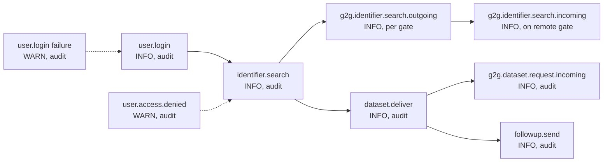

# eFTI Gate v2.0 Logging Specification

**Version**: 1.1 — Phase-2 compaction
**Date**: 2026-05-05
**Status**: Development-ready specification

---

## 1. Overview

The eFTI Gate produces structured logs to support:

- **Operational troubleshooting** — trace individual requests end-to-end across gate-to-gate and gate-to-platform hops.
- **GDPR Art. 30 compliance** — audit trail for all dataset access by authorities (7-year retention).
- **Performance monitoring** — detect slow queries, gate timeouts, broadcast degradation.
- **Security audit** — record authentication failures, authorisation denials, suspicious patterns.

**Compliance anchors**: eFTI Regulation 2024/1942 and 2025/2243; GDPR Art. 30; eDelivery AS4 message-ID preservation.

### 1.1 Pipeline

```
Application (Kotlin/JVM)
  └── Logback AsyncAppender (queueSize=512, discardingThreshold=0)
        └── RollingFileAppender → /var/log/efti-gate/application.log
              └── Filebeat / Fluentd
                    └── Elasticsearch / OpenSearch
                          └── Kibana dashboards + alerts
```

### 1.2 Canonical event chain (typical authority workflow)



All events on the chain share `http.request.id` (X-Request-ID propagated through SOAP/eDelivery correlation header).

---

## 2. JSON format and field taxonomy

All log entries **must** be valid JSON on a single line. Format follows [Elastic Common Schema 8.x](https://www.elastic.co/guide/en/ecs/current/index.html). Custom eFTI fields use the `efti.*` prefix to avoid ECS root collisions — never put custom fields at the ECS root.

### 2.1 Mandatory fields (every entry)

| Field | Type | Description | Example |
|---|---|---|---|
| `@timestamp` | ISO 8601 string (UTC) | Event time | `"2026-04-23T10:15:30.123Z"` |
| `log.level` | string (lowercase) | `error`/`warn`/`info`/`debug`/`trace` | `"info"` |
| `message` | string | Human-readable summary | `"Identifier registered successfully"` |
| `service.name` | string | Always `"efti-gate"` | `"efti-gate"` |
| `service.version` | string | Gate software version | `"2.0.0"` |
| `host.hostname` | string | Node hostname | `"gate-eu-ee31-node1"` |

### 2.2 Context fields (when applicable)

| Field | Type | Description |
|---|---|---|
| `event.action` | string | Dot-separated event name (e.g. `identifier.register`, `dataset.deliver`) |
| `event.outcome` | string | `success` or `failure` |
| `event.duration` | long (ns) | Nanoseconds elapsed |
| `http.request.id` | UUID string | X-Request-ID; propagated across G2G hops |
| `http.request.method` | string | HTTP verb |
| `http.request.path` | string | Exact request path (e.g. `/v1/identifiers/...`) |
| `http.request.body.bytes` | int | Request body size (bytes) — never log body content at INFO+ |
| `http.response.status_code` | int | HTTP response status |
| `user.id` | UUID string | `users.id` of the authenticated user |
| `user.roles` | string[] | Assigned gate roles, e.g. `["PLATFORM"]` |
| `error.type` | string | Exception class name |
| `error.message` | string | Exception message |
| `error.stack_trace` | string | First 10 stack frames (ERROR level only) |
| `db.table` | string | Primary table touched |
| `db.operation` | string | `SELECT` or `INSERT` (the gate is append-only — see `db/README.md`) |
| `db.duration_ms` | int | Query duration |
| `g2g.source_gate` | string | Originating gate ID for G2G inbound |
| `g2g.target_gate` | string | Target gate ID for G2G outbound |
| `g2g.response_time_ms` | long | Round-trip ms |
| `job.id` | string | Background job run identifier — format `job-{yyyyMMdd}-{uuid-prefix}` |
| `job.name` | string | Job class name (e.g. `IdentifierExpirationJob`) |

### 2.3 `efti.*` namespace (custom)

| Field | Type | Description | Example |
|---|---|---|---|
| `efti.dataset.id` | UUID | Dataset UUID | `"550e8400-e29b-41d4-a716-446655440000"` |
| `efti.platform.id` | string | Platform party ID | `"demo"` |
| `efti.gate.id` | string | Gate party ID | `"eu-ee31"` |
| `efti.authority.id` | string | Authority party ID | `"demo"` |
| `efti.identifier.value` | string | Identifier searched | `"123ABC"` |
| `efti.identifier.type` | string | `means` / `equipment` / `carried` | `"means"` |
| `efti.mode` | string | Transport mode code (1–5) — see `data-transformations.md` §2.4 | `"1"` |
| `efti.dangerous_goods` | boolean | Dangerous-goods flag | `true` |
| `efti.subsets` | string[] | Requested eFTI subsets (`EU01`..`EU07`) | `["EU01"]` |
| `efti.error.code` | string | Error catalog code from `errors.json` | `"INVALID_XML"` |
| `efti.search.local_results` | int | Local-search row count | `2` |
| `efti.search.broadcast` | boolean | Broadcast invoked? | `false` |
| `efti.search.gates_queried` | string[] | Gates targeted in broadcast | `["eu-fi01","eu-de01"]` |
| `efti.search.failed_gates` | string[] | Gates that timed out / errored | `["eu-de01"]` |
| `efti.search.total_results` | int | Aggregate result count | `3` |
| `efti.search.events_sent` | int | SSE events emitted on stream close | `6` |
| `efti.dataset.size_bytes` | int | Bytes streamed back to authority | `15234` |
| `efti.expired_count` | int | Rows deleted by `IdentifierExpirationJob` | `14` |
| `efti.cutoff_datetime` | ISO 8601 | Expiration cutoff used by job | `"2026-04-16T02:00:00.000Z"` |
| `efti.audit` | boolean | Marks an event as audit-meaningful (GDPR / admin trail) | `true` |
| `efti.required_role` | string | Role expected when `user.access.denied` fires | `"PLATFORM"` |
| `efti.authority.country` | string (ISO-3166 α-2) | Set on `authority.create` | `"EE"` |
| `efti.authority.subsets` | string[] | Set on `authority.create` | `["EU01","EU07"]` |
| `efti.db.pool.available` | int | Available JDBC connections (warning event) | `1` |
| `efti.db.pool.max` | int | Configured max pool size | `10` |
| `efti.db.pool.pending` | int | Pending connection requests | `8` |
| `efti.jvm.heap.used_mb` | int | Heap usage MB (warning event) | `830` |
| `efti.jvm.heap.max_mb` | int | `-Xmx` value MB | `1000` |
| `efti.jvm.heap.percent` | int | Heap % | `83` |
| `efti.log_level` | string | Active log level — startup event | `"INFO"` |
| `efti.platform_count` / `efti.authority_count` / `efti.gate_count` | int | Registry sizes — startup / `registry.sync` events | `2` |

---

## 3. Log levels

| Level | Criteria | Examples | Operator action |
|---|---|---|---|
| **ERROR** | Unhandled exceptions, DB failures, critical faults requiring immediate attention. | `PSQLException` during identifier save, JAXB misconfiguration, OOM. | Alert on-call within 5 min. |
| **WARN** | Client errors (4xx), recoverable failures, gate/platform unreachable, circuit-breaker state changes, auth failures. | `INVALID_XML`, gate marked OFFLINE, rate-limit exceeded, `ForbiddenException`. | Review during business hours. |
| **INFO** | Normal business events. | Identifier saved, broadcast completed, dataset delivered, admin action, login, job completion. | Retained for audit/analytics. |
| **DEBUG** | Detailed flow — bind parameters, XML transform steps, SOAP envelope details. | SQL INSERT statement, parsed `ConsignmentXml` fields. | **Disabled in production** (`LOG_LEVEL=INFO`). |
| **TRACE** | Full request/response bodies, raw XML payloads. | Full consignment XML, complete AS4 response body. | **Never enabled in production**. |

**Configuration**: `LOG_LEVEL` env var (default `INFO`).

---

## 4. Canonical log templates

Five templates cover every event shape in the gate. Per-event variations live in §5 (event×endpoint table) — do not duplicate full JSON examples for each.

### 4.1 Successful authenticated request

```json
{
  "@timestamp": "2026-04-23T10:15:30.123Z",
  "log.level": "info",
  "message": "Identifier registered successfully",
  "event.action": "identifier.register",
  "event.outcome": "success",
  "event.duration": 4500000,
  "http": {
    "request.id": "550e8400-e29b-41d4-a716-446655440000",
    "request.method": "POST",
    "request.path": "/v1/identifiers/550e8400-e29b-41d4-a716-446655440000",
    "request.body.bytes": 1842,
    "response.status_code": 200
  },
  "user": { "id": "502d74a0-eb03-11f0-b86c-3c9c0f2eb459", "roles": ["PLATFORM"] },
  "efti": {
    "dataset.id": "550e8400-e29b-41d4-a716-446655440000",
    "platform.id": "demo",
    "gate.id": "eu-ee31",
    "identifier.value": "123ABC",
    "identifier.type": "means",
    "mode": "1",
    "dangerous_goods": false
  },
  "db": { "table": "consignments", "operation": "INSERT", "duration_ms": 8 },
  "service.name": "efti-gate", "service.version": "2.0.0", "host.hostname": "gate-eu-ee31-node1"
}
```

| Placeholder | Meaning |
|---|---|
| `event.action` | `<entity>.<verb>` — see §5 table for the full list. |
| `event.duration` | Nanoseconds total handler time. |
| `http.request.id` | UUID v4 from inbound `X-Request-ID`; auto-generated if missing. |
| `efti.*` | Populate any subset of §2.3 fields relevant to the operation. |
| `db.*` | Present only if the handler executed at least one SQL statement. |

### 4.2 Validation error (RFC 7807 → WARN)

```json
{
  "@timestamp": "2026-04-23T10:16:45.789Z",
  "log.level": "warn",
  "message": "Identifier registration failed: XML parse error",
  "event.action": "identifier.register",
  "event.outcome": "failure",
  "event.duration": 1200000,
  "http": {
    "request.id": "660f9511-f39c-42e5-b827-557766551111",
    "request.method": "POST",
    "request.path": "/v1/identifiers/660f9511-f39c-42e5-b827-557766551111",
    "request.body.bytes": 542,
    "response.status_code": 400
  },
  "user": { "id": "502d74a0-eb03-11f0-b86c-3c9c0f2eb459", "roles": ["PLATFORM"] },
  "efti": { "dataset.id": "660f9511-f39c-42e5-b827-557766551111", "platform.id": "demo", "error.code": "INVALID_XML" },
  "error": { "type": "BadRequestException", "message": "Error parsing identifiers: XML parse error at line 4: element 'modeCode' is not closed" },
  "service.name": "efti-gate", "service.version": "2.0.0", "host.hostname": "gate-eu-ee31-node1"
}
```

| Placeholder | Meaning |
|---|---|
| `efti.error.code` | One of the codes catalogued in `errors.json` (e.g. `INVALID_XML`, `DUPLICATE_DATASET_ID`, `PLATFORM_TIMEOUT`, `GATE_TIMEOUT`, `GATEWAY_UNAVAILABLE`, `FOLLOW_UP_GATE_MISMATCH`). |
| `error.type` / `error.message` | Exception class and message. **Never** include full input XML. |
| `http.response.status_code` | The 4xx returned to the client. |

### 4.3 Authorization denied (WARN, audit-meaningful)

```json
{
  "@timestamp": "2026-04-23T09:02:45.234Z",
  "log.level": "warn",
  "message": "Authorisation denied: insufficient role",
  "event.action": "user.access.denied",
  "event.outcome": "failure",
  "http": {
    "request.method": "POST",
    "request.path": "/v1/identifiers/550e8400-e29b-41d4-a716-446655440000",
    "response.status_code": 403
  },
  "user": { "id": "04fa30eb-eb08-11f0-b506-3c9c0f2eb459", "roles": ["AUTHORITY"] },
  "efti": { "error.code": "FORBIDDEN", "required_role": "PLATFORM", "audit": true },
  "error": { "type": "ForbiddenException", "message": "Access denied: endpoint requires PLATFORM role" },
  "service.name": "efti-gate", "service.version": "2.0.0", "host.hostname": "gate-eu-ee31-node1"
}
```

| Placeholder | Meaning |
|---|---|
| `efti.error.code` | `FORBIDDEN`, `FORBIDDEN_NO_PLATFORM`, `FORBIDDEN_MULTI_PLATFORM`, `FORBIDDEN_SUBSET`, `FORBIDDEN_WRITE_ACCESS`, or `TOKEN_INVALID`. |
| `efti.audit` | `true` — this event is part of the GDPR / security audit trail. |
| `user.id` / `user.roles` | Omit when authentication failed (no user resolved). |

### 4.4 Server error (ERROR, includes stack)

```json
{
  "@timestamp": "2026-04-23T13:42:08.991Z",
  "log.level": "error",
  "message": "Unhandled exception during dataset delivery",
  "event.action": "dataset.deliver",
  "event.outcome": "failure",
  "http": {
    "request.id": "2a90e81e-17d3-48d9-b7a7-64c26e2df44b",
    "request.method": "GET",
    "request.path": "/v1/dataset/eu-ee31/demo/550e8400-e29b-41d4-a716-446655440000",
    "response.status_code": 500
  },
  "efti": { "dataset.id": "550e8400-e29b-41d4-a716-446655440000", "error.code": "DATABASE_ERROR" },
  "error": {
    "type": "PSQLException",
    "message": "connection refused",
    "stack_trace": "efti.EftiService.getDataset(...)\n  efti.PlatformClient.getDataset(...)\n  ..."
  },
  "service.name": "efti-gate", "service.version": "2.0.0", "host.hostname": "gate-eu-ee31-node1"
}
```

| Placeholder | Meaning |
|---|---|
| `error.stack_trace` | First 10 stack frames; required at ERROR level. |
| `efti.error.code` | Server-side category (`DATABASE_ERROR`, `TRANSFORMATION_ERROR`, `INTERNAL_ERROR`). |

### 4.5 Audit-meaningful event (admin / GDPR)

```json
{
  "@timestamp": "2026-04-23T14:30:00.000Z",
  "log.level": "info",
  "message": "Platform registered by admin",
  "event.action": "platform.create",
  "event.outcome": "success",
  "event.duration": 22000000,
  "http": {
    "request.method": "POST",
    "request.path": "/api/v1/platforms",
    "response.status_code": 200
  },
  "user": { "id": "175791a3-da82-11f0-b10c-3c9c0f2eb459", "roles": ["ADMIN"] },
  "efti": { "platform.id": "plt-new-001", "audit": true },
  "db": { "table": "platforms", "operation": "INSERT", "duration_ms": 11 },
  "service.name": "efti-gate", "service.version": "2.0.0", "host.hostname": "gate-eu-ee31-node1"
}
```

| Placeholder | Meaning |
|---|---|
| `efti.audit: true` | Marks the entry for the GDPR Art. 30 / admin audit retention class (7 years). |
| `event.action` | `<entity>.<verb>` — `platform.create`, `platform.delete`, `authority.create`, `gate.disable`, `user.create`, `user.delete`, `consignment.delete`, etc. |
| `db.*` | Always populated for admin write events so the audit trail records which row was touched. |

---

## 5. Event × endpoint catalogue

Every entry below uses the §4 templates — pick the matching shape, fill in `event.action`, `efti.*` fields, and the audit flag. *Audit?* = retain 7 years per GDPR / security policy.

| Surface | `event.action` | Endpoint / trigger | Default level | Audit? |
|---|---|---|---|---|
| Platform | `identifier.register` | POST `/v1/identifiers/{datasetId}` (success) | INFO | N (90d retention) |
| Platform | `identifier.register` | Same — XML parse / validation error → 400 | WARN | N |
| Platform | `identifier.register` | Same — duplicate datasetId → 409 | WARN | N |
| Job | `identifier.expire` | `IdentifierExpirationJob` INSERTs `status='inactive'` rows for expired datasets | INFO | **Y** (state transition) |
| Job | `archive.run` | `POST /api/v1/admin/archive` invoked by CronManager — start, per-table commit, finish; `details` JSON carries per-table archived counts, duration, partial flag (Epic 26) | INFO; WARN on `partial=true`; ERROR on storage failure | **Y** |
| Authority | `identifier.search` | GET `/v1/identifiers/{identifier}` — local hit | INFO | **Y** |
| Authority | `identifier.search.broadcast` | Same — broadcast invoked | INFO | **Y** |
| Authority | `identifier.search.broadcast` | Same — broadcast partial failure (gate timeout) | WARN | **Y** |
| Authority | `dataset.deliver` | GET `/v1/dataset/{gateId}/{platformId}/{datasetId}` (local platform) | INFO | **Y** |
| Authority | `dataset.deliver` | Same — platform timeout → 504 | WARN | **Y** |
| Authority | `dataset.proxy` | Same — UIL targets remote gate, served via G2G | INFO | **Y** |
| Authority | `followup.send` | POST `/v1/follow-up/{gateId}/{platformId}/{datasetId}/{datasetRequestId}` | INFO | **Y** |
| Admin | `user.login` | `AccessChecker.before()` resolves credentials | INFO | **Y** |
| Admin | `user.login` | Same — invalid credentials → 401 | WARN | **Y** |
| Admin | `user.access.denied` | Authenticated but role mismatch → 403 | WARN | **Y** |
| Admin | `platform.create` / `platform.update` / `platform.delete` | `/api/v1/platforms`, `/api/v1/platforms/{id}` | INFO | **Y** |
| Admin | `authority.create` / `authority.update` / `authority.delete` | `/api/v1/authorities`, `/api/v1/authorities/{id}` | INFO | **Y** |
| Admin | `gate.create` / `gate.update` / `gate.delete` | `/api/v1/gates`, `/api/v1/gates/{id}` | INFO | **Y** |
| Admin | `user.create` / `user.delete` | `/api/v1/users`, `/api/v1/users/{id}` | INFO | **Y** |
| Admin | `consignment.delete` | DELETE `/api/v1/consignments/{datasetId}` | INFO | **Y** |
| G2G | `gate.ping` | `GatePingJob` per gate (success) | INFO | N |
| G2G | `gate.ping` | Same — failure, gate marked OFFLINE | WARN | N |
| G2G | `g2g.identifier.search.incoming` | Remote gate AS4 identifier query in | INFO | N |
| G2G | `g2g.identifier.search.outgoing` | Outbound broadcast to one gate (per-gate entry) | INFO / DEBUG sampled | N |
| G2G | `g2g.dataset.request.incoming` | Remote gate AS4 UIL query in | INFO | **Y** |
| eDelivery | `edelivery.message.receive` | AS4 payload arrived | INFO; WARN on parse error | N |
| eDelivery | `edelivery.response.store` | Async response stored in `async_responses` | INFO | N |
| System | `application.start` | Gate fully initialised | INFO | N |
| System | `registry.sync` | `RegistrySyncJob` reload | INFO | N |
| System | `db.pool.warning` | < 2 connections free in JDBC pool | WARN | N |
| System | `db.query.slow` | Any SQL > 500 ms | WARN | N (30d) |
| System | `jvm.memory.warning` | Heap > 80 % of `-Xmx` | WARN | N (30d) |
| SSE | `sse.stream.open` / `sse.stream.close` | Authority `Accept: text/event-stream` lifecycle | INFO | N |

**HTTP path note**: Platform + Authority APIs (called by external systems) use `/v1/...`; Admin API (called by gate operators) uses `/api/v1/...`. There is no separate `/admin` namespace. Health probes are at `/health/...` (unauthenticated).

---

## 6. Sensitive data handling (redaction policy)

Logs cross trust boundaries — apply the redaction rules below at every log site. **Bias to redact**: when in doubt, omit the field.

| Field | Action | Notes |
|---|---|---|
| `users.secretHash` | **Never log** | Hash material — applies to all log levels including TRACE. |
| `Authorization` header value | **Never log** | Strip before any request-dump. Includes Bearer tokens and Basic Auth credentials. |
| `eDeliveryCert` / `tlsCert` (private parts) | **Never log** | Certificate material from `gates`/`platforms` tables. |
| Full XML dataset content (`consignments.xml`, AS4 payload bodies) | **Redact at INFO+** | TRACE-only, gated by `LOG_DATASET_CONTENT=true`. **Never** enable in production. |
| Full HTTP request/response bodies | **Redact at INFO+** | Log size only — `http.request.body.bytes`, `http.response.body.bytes`. |
| `users.email` | **Redact** | Log `user.id` (UUID) instead. |
| Vehicle plate (audit contexts) | **Partial: `"123***"`** | Show first 3 chars only when GDPR-sensitive. Full plate stays in operational INFO logs. |
| SQL bind parameter values | **Redact at INFO+** | Log query template / `query_hash` only at WARN/INFO. Bind values allowed at DEBUG. |

---

## 7. Correlation and tracing

| Mechanism | Format | Where |
|---|---|---|
| `http.request.id` | UUID v4 | Inbound `X-Request-ID` header → MDC → every log line in the request scope. Propagated as eDelivery / SOAP correlation ID into G2G hops. |
| Background job IDs | `job-{yyyyMMdd}-{uuid-prefix}` | E.g. `job-20260423-550e8400-e29b-41d4`. |
| Cross-gate tracing | Same `http.request.id` on every gate's logs | Search `http.request.id: "<uuid>"` across all gate Elasticsearch indices to reconstruct a broadcast. |

---

## 8. Retention and storage

### 8.1 Retention table

| Class | Retention | Legal basis | Examples |
|---|---|---|---|
| Audit (authority data access) | **7 years** | GDPR Art. 30, eFTI Reg. 2024/1942 | `dataset.deliver`, `dataset.proxy`, `identifier.search`, `identifier.search.broadcast`, `followup.send`, `g2g.dataset.request.incoming` |
| Admin audit | **7 years** | GDPR Art. 30 | `platform.*`, `authority.*`, `gate.*`, `user.create`, `user.delete`, `consignment.delete`, `identifier.expire` |
| Security | **7 years** | Security policy | `user.login` (success/failure), `user.access.denied` |
| Business | **90 days** | Operational | `identifier.register`, `gate.ping`, `edelivery.*`, `g2g.*` (non-audit) |
| Performance | **30 days** | Operational | `db.query.slow`, `jvm.memory.warning`, `db.pool.warning` |
| Error | **90 days** | Operational | All ERROR/WARN entries not already covered above |
| Debug | **7 days** | Development | DEBUG level |
| Trace | **1 day** | Development | TRACE level — disabled in production |

### 8.2 Aggregation

- Log shipper: Filebeat / Fluentd reading `/var/log/efti-gate/application.log`.
- Storage: Elasticsearch 8.x or OpenSearch 2.x; daily rolling indices `efti-gate-YYYY.MM.DD`.
- ILM: Hot (0–7d) → Warm (7–90d) → Cold (90d → 7y for audit) → Delete.
- Indexed fields (for query performance): `event.action`, `user.id`, `http.request.id`, `efti.dataset.id`, `efti.platform.id`, `efti.identifier.value`, `efti.error.code`, `log.level`.

---

## 9. Performance requirements

- **JSON serialisation overhead**: ≤ 2 ms per entry (use async appender).
- **Async buffer**: Logback `AsyncAppender` with `queueSize=512`, `discardingThreshold=0` (never discard ERROR/WARN).
- **Throughput**: ≥ 1000 entries/second per gate node without blocking request threads.
- **Sampling**: high-volume DEBUG events (e.g. `g2g.identifier.search.outgoing`) may be sampled at 10 % via `LOG_SAMPLING_RATE=0.1` in production.
- **JSON validity**: every entry is single-line valid JSON; required-fields check on `@timestamp`, `log.level`, `message`, `service.name`, `service.version`, `host.hostname`.

---

## 10. Configuration

| Environment variable | Default | Description |
|---|---|---|
| `LOG_LEVEL` | `INFO` | `ERROR`/`WARN`/`INFO`/`DEBUG`/`TRACE` |
| `LOG_FORMAT` | `JSON` | `JSON` (production) or `TEXT` (development) |
| `LOG_FILE_PATH` | `/var/log/efti-gate/application.log` | Log file path |
| `LOG_DATASET_CONTENT` | `false` | If `true`, log full XML dataset at TRACE — never use in production |
| `LOG_SAMPLING_RATE` | `1.0` | Sampling rate for high-volume events (0.0–1.0) |
| `LOG_ASYNC_QUEUE_SIZE` | `512` | Logback AsyncAppender queue size |

---

## 11. Migration from current Gate

| Aspect | Current Gate | v2.0 |
|---|---|---|
| Format | Unstructured `logger().info(...)` text | ECS-compliant JSON (single line) |
| Context | Message only | Full context: user, dataset, gate, timing, error code |
| Audit trail | None | 7-year GDPR-compliant audit for dataset access and admin writes |
| Performance | Synchronous | Async with bounded queue (≤ 2 ms overhead) |
| Correlation | `X-Request-ID` passed in code, not always logged | `http.request.id` mandatory in every request-scope entry; propagated G2G |

---

## Appendix A — Logback configuration

```xml
<configuration>
  <appender name="JSON_FILE" class="ch.qos.logback.core.rolling.RollingFileAppender">
    <file>${LOG_FILE_PATH:-/var/log/efti-gate/application.log}</file>
    <rollingPolicy class="ch.qos.logback.core.rolling.TimeBasedRollingPolicy">
      <fileNamePattern>/var/log/efti-gate/application.%d{yyyy-MM-dd}.log.gz</fileNamePattern>
      <maxHistory>90</maxHistory>
      <totalSizeCap>10GB</totalSizeCap>
    </rollingPolicy>
    <encoder class="net.logstash.logback.encoder.LogstashEncoder">
      <customFields>{"service.name":"efti-gate","service.version":"${SERVICE_VERSION:-2.0.0}"}</customFields>
      <fieldNames>
        <timestamp>@timestamp</timestamp>
        <version>[ignore]</version>
      </fieldNames>
    </encoder>
  </appender>

  <appender name="ASYNC" class="ch.qos.logback.classic.AsyncAppender">
    <queueSize>${LOG_ASYNC_QUEUE_SIZE:-512}</queueSize>
    <discardingThreshold>0</discardingThreshold>
    <includeCallerData>false</includeCallerData>
    <appender-ref ref="JSON_FILE"/>
  </appender>

  <root level="${LOG_LEVEL:-INFO}">
    <appender-ref ref="ASYNC"/>
  </root>
</configuration>
```

Required dependency (`build.gradle.kts`):

```kotlin
implementation("net.logstash.logback:logstash-logback-encoder:7.4")
```

---

## Appendix B — Example Kibana / OpenSearch queries

| Goal | Query |
|---|---|
| Failed identifier registrations (last 24 h) | `event.action: "identifier.register" AND event.outcome: "failure"` |
| Trace one request end-to-end | `http.request.id: "<uuid>"` |
| Slow queries today | `event.action: "db.query.slow" AND db.duration_ms: [500 TO *]` |
| GDPR audit — dataset access by authorities | `event.action: ("dataset.deliver" OR "dataset.proxy") AND user.roles: "AUTHORITY"` |
| All audit-meaningful events for a user | `user.id: "<uuid>" AND efti.audit: true` |
| Gates that timed out in last hour | `efti.error.code: "GATE_TIMEOUT" AND @timestamp: [now-1h TO now]` |
