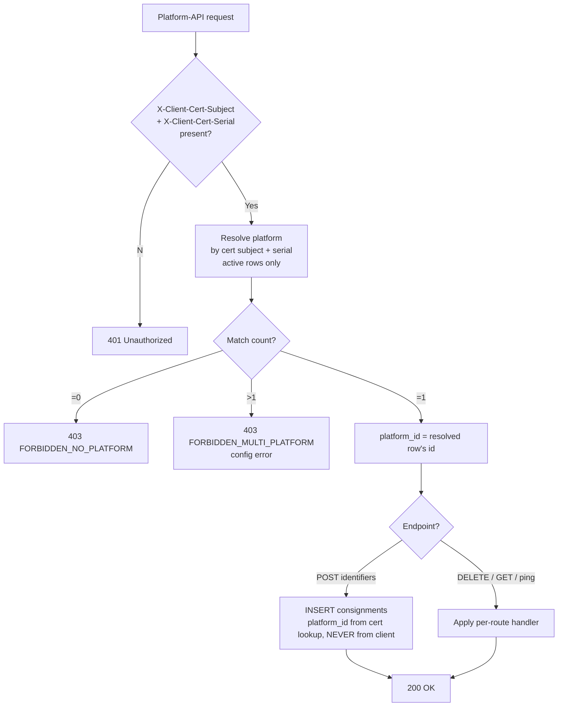
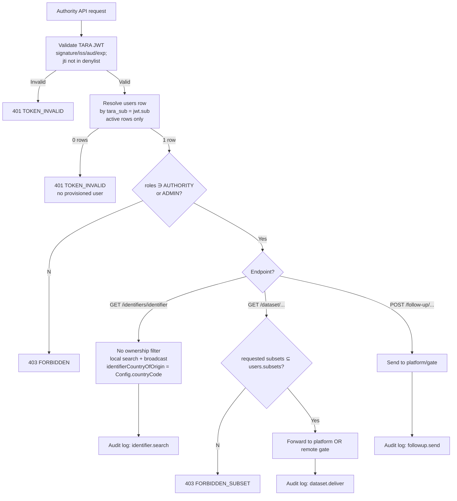

# eFTI Gate v2.0 Permissions Matrix

**Version**: 1.1 — Phase-2 compaction
**Date**: 2026-05-05
**Status**: Development-ready specification

---

## 1. Overview

The authorization model for eFTI Gate v2.0 — who can call which endpoint, what data each role sees (row-level security), and how the checks compose.

**Compliance anchors**:
- **eFTI Regulation 2024/1942** — competent authorities have unrestricted search across identifier data; platforms must respond to dataset requests from recognised authorities.
- **GDPR Art. 30** — every authority data access is logged with user identity and legal basis (7-year retention; see `logging-spec.md`).
- **EU gate-to-gate** — any EU eFTI gate may query any other gate.

### 1.1 Authorization flow

```mermaid
graph TD
    REQ[HTTP Request] --> AC[AccessChecker]
    AC --> CRED{Credential type?}
    CRED -->|None| PUB{Public route?<br/>/health, OpenAPI UI}
    PUB -->|Yes| ALLOW[Allow]
    PUB -->|No| UNAUTH[401 Unauthorized]
    CRED -->|Bearer JWT<br/>Authority / Admin| TARA[Validate TARA JWT:<br/>signature, iss, aud, exp;<br/>jti not in sessions denylist;<br/>iat ≥ users.token_revoked_at]
    CRED -->|mTLS X.509<br/>Platform| MTLS[Resolve platform<br/>by cert subject + serial<br/>against active platforms]
    CRED -->|Bearer ARCHIVE_OPS_TOKEN<br/>CronManager admin| OPS[Literal compare against<br/>ARCHIVE_OPS_TOKEN env var]
    CRED -->|HTTP Basic<br/>break-glass only| BG[Validate against bcrypt<br/>secret_hash on local-admin row;<br/>503 if fallback disabled]
    TARA -->|Invalid| ERR401[401 TOKEN_INVALID]
    TARA -->|Valid| TARASUB[Resolve users row<br/>by tara_sub = jwt.sub<br/>active row only]
    TARASUB -->|None| NOUSER[401 TOKEN_INVALID<br/>no provisioned user]
    TARASUB -->|Resolved| AUTHZ[Read roles, subsets<br/>from the resolved users row<br/>as the authorisation source]
    MTLS -->|None| NOPLAT[403 FORBIDDEN_NO_PLATFORM]
    MTLS -->|>1 active| MULTI[403 FORBIDDEN_MULTI_PLATFORM]
    MTLS -->|1 active| ALLOWPLAT[Allow Platform handler]
    OPS -->|Mismatch| OPSDENY[403 FORBIDDEN]
    OPS -->|Match| ALLOW
    BG -->|Invalid or disabled| BGFAIL[401 / 503]
    BG -->|Valid| BGTOKEN[Issue gate-signed JWT<br/>sub='local-admin'; iat=NOW;<br/>caller proceeds via TARA-JWT path]
    AUTHZ --> ROLECHECK{Required role on route<br/>matches caller's roles?}
    ROLECHECK -->|No| ERR403[403 FORBIDDEN]
    ROLECHECK -->|Yes| WRITE{Mutating endpoint<br/>with entityId param?}
    WRITE -->|Yes| SCOPE{entityId in caller's<br/>roles[ADMIN] scope?}
    SCOPE -->|No| ERR403WA[403 FORBIDDEN_WRITE_ACCESS]
    SCOPE -->|Yes| ALLOW
    WRITE -->|No| ALLOW
```

The diagram describes the rules; concrete query bodies belong to the implementation. Append-only semantics ("the latest row by `created_at` wins"; "soft-deleted entities — `is_active=FALSE` on the latest row — do not authenticate") apply to every "active row" check. See [`db/README.md`](db/README.md) for the canonical read pattern.

---

## 2. Identity model

Two kinds of caller identity, modelled in two different ways. The legacy "single Role enum" abstraction has been retired in favour of separate identity sources per surface.

| Surface | Identity source | Where the identity lives | Authorisation source |
|---|---|---|---|
| **Authority API** | TARA OIDC JWT `sub` (Estonian PIC) | A `users` row with matching `tara_sub` | **Resolved `users` row's** `roles` (must include `AUTHORITY`), `subsets` (∈ `EU01..EU07`), `roles.AUTHORITY` scope-IDs. JWT carries identity (`sub`) only; the gate's authorisation snapshot can change after a JWT is minted, so DB-side state wins. |
| **Admin API** | TARA OIDC JWT `sub` | A `users` row with matching `tara_sub` | **Resolved `users` row's** `roles` (must include `ADMIN`), `roles.ADMIN` scope-IDs (gate IDs). JWT carries identity only. |
| **Platform API** | mTLS X.509 client cert | A `platforms` row whose `cert_subject` + `cert_serial` match | None — cert subject = platform identity. |
| **CronManager admin endpoints** | Static `Authorization: Bearer <ARCHIVE_OPS_TOKEN>` | Env var; **no DB row** | None — token comparison is the whole authorisation. |
| **G2G (gate ↔ gate)** | mTLS at the AS4 access point (Member-State-issued cert) | A `gates` row whose `e_delivery_cert` matches | None — gate identity is the cert subject; trust is established by the cert chain rooted at the EU Trust Service. |
| **Break-glass local admin** | HTTP Basic + bcrypt | A single `users` row with `secret_hash != NULL` | The same resolved-`users`-row source as TARA path; the break-glass JWT issued by `/api/v1/auth/local-token` is a transport vehicle, not the source of truth. Default-disabled (`LOCAL_ADMIN_FALLBACK_ENABLED=false`). |

**`users.roles`** is a JSONB map carrying *only* `AUTHORITY` and `ADMIN` entries (e.g. `{"AUTHORITY":["auth-mta"]}` or `{"ADMIN":["eu-ee31"]}`). There is **no** `PLATFORM` or `GATE` entry — those identities don't have user records.

**Super Admin** = `is_admin=TRUE` AND `roles={}` — unrestricted.
**Regular Admin** = `is_admin=TRUE` AND `roles={"ADMIN":["<gate-id>"]}` — scoped to that gate's resources by `checkWriteAccess(entityId)`.

**`users.subsets`** carries the permitted eFTI subset list (`EU01..EU07`) for AUTHORITY users; must satisfy `users.subsets ⊆ authorities.subsets` of every authority listed in `roles.AUTHORITY`.

**`users.tara_sub`** carries the value the gate matches against the inbound JWT's `sub` claim. For TARA-issued JWTs this is the Estonian PIC. For the single break-glass local-admin row this is the reserved literal `local-admin` (lower-case; never collides with a PIC). Always non-null — the resolution path is uniform across TARA and break-glass JWTs.

**`users.token_revoked_at`** is the per-user broadcast revocation marker. `POST /api/v1/users/{userId}/revoke-token` writes a new `users` row with `token_revoked_at = NOW()`; on JWT validation the gate rejects any presented JWT whose `iat` claim predates the resolved user's latest `token_revoked_at`. Distinct from the per-jti `sessions` denylist (used by `POST /api/v1/auth/logout`): the denylist targets one specific JWT, this column targets every JWT a user currently holds.

---

## 3. Permissions matrix

**Path conventions:**
- Platform + Authority APIs (called by external systems) use `/v1/...`.
- Admin API (called by gate operators) uses `/api/v1/...`.
- Health probes use `/health/...` (no auth).

✅ = allowed; ❌ = denied; "All" = no row-level filter; "Own *" = filtered to user's party scope.

### 3.1 Platform API

Authenticated by **mTLS** with the platform's eDelivery AP X.509 certificate (Member-State-issued per Impl Reg 2024/1942 Art 11). The reverse proxy terminates mTLS and forwards `X-Client-Cert-Subject` / `X-Client-Cert-Serial`; the gate looks them up against `platforms` to resolve identity. **No JWT, no user record.** TARA-authenticated callers (Authority / Admin) cannot reach Platform endpoints.

| Endpoint | Method | mTLS-resolved Platform | TARA JWT (any role) | Unauth |
|---|---|---|---|---|
| `/v1/identifiers/{datasetId}` | POST | ✅ Bound to the resolved `platforms.id` | ❌ | ❌ |
| `/v1/identifiers/{datasetId}` | DELETE | ✅ Bound to the resolved `platforms.id` (writes `status='deleted'`) | ❌ | ❌ |
| `/v1/status/{datasetId}` | GET | ✅ Bound to the resolved `platforms.id` | ❌ | ❌ |
| `/v1/datasets/{datasetId}` | GET | ✅ Bound to the resolved `platforms.id` (self-fetch) | ❌ | ❌ |
| `/v1/follow-up/{datasetId}/{requestId}` | GET | ✅ Bound to the resolved `platforms.id` | ❌ | ❌ |
| `/v1/ping` | POST | ✅ | ❌ | ❌ |

> Re-uploads are POST against the same `dataset_id` (the gate INSERTs a new `consignments` row sharing the logical id). There is **no PUT** on Platform endpoints — append-only forbids mutate-in-place; "update" is "INSERT new row".



**Row-level rule for Platform writes**: the saved `consignments.platform_id` is always taken from the cert-subject lookup — clients cannot override it via path or body.

### 3.2 Authority API

Authenticated by **TARA OIDC JWT** carrying `resource_access.efti-gate.roles ∋ AUTHORITY` (or `ADMIN`). The gate validates the JWT, then resolves it to a `users` row via `tara_sub = jwt.sub`; permission claims (`roles`, `subsets`, scope) are read from the resolved row.

| Endpoint | Method | TARA JWT (AUTHORITY or ADMIN) | mTLS Platform | Unauth |
|---|---|---|---|---|
| `/v1/identifiers/{identifier}` | GET | ✅ All gates' identifiers (audit logged) | ❌ | ❌ |
| `/v1/dataset/{gateId}/{platformId}/{datasetId}` | GET | ✅ Subsets requested ⊆ `users.subsets` | ❌ | ❌ |
| `/v1/follow-up/{gateId}/{platformId}/{datasetId}/{datasetRequestId}` | POST | ✅ | ❌ | ❌ |



**Authority subset rule**: `subsetId[]` query params must each be a member of the authenticated user's `users.subsets` array. Subset values are `EU01`..`EU07`.
**`identifierCountryOfOrigin`** in search results is set to this gate's `Config.countryCode` so authorities can see which gate returned each row.

### 3.3 Admin API

Admin endpoints require a valid TARA-issued JWT whose resolved `users.roles` includes `ADMIN`. Path prefix `/api/v1/`. The CronManager endpoints (`/api/v1/admin/*`) are the exception: they accept only the static `opsToken` Bearer (literal `ARCHIVE_OPS_TOKEN` env-var compare); JWTs are rejected on those routes. See §6 for the credential matrix.

| Endpoint | Method | ADMIN | Other roles | Unauth |
|---|---|---|---|---|
| `/api/v1/auth/local-token` | POST | ✅ (via Basic Auth, default-disabled) | ❌ | ✅ (Basic challenge) |
| `/api/v1/auth/logout` | POST | ✅ | ✅ (any authenticated user) | ❌ |
| `/api/v1/user` | GET | ✅ Own user | ❌ | ❌ |
| `/api/v1/platforms` | GET / POST | ✅ (POST needs `checkWriteAccess`; returns 201 on create, 409 on existing id) | ❌ | ❌ |
| `/api/v1/platforms/{platformId}` | PUT / DELETE | ✅ (write needs `checkWriteAccess`; PUT 404 on unknown id) | ❌ | ❌ |
| `/api/v1/platforms/{platformId}/ping` | POST | ✅ (Super Admin or matching scope) | ❌ | ❌ |
| `/api/v1/authorities` | GET / POST | ✅ (write needs `checkWriteAccess`) | ❌ | ❌ |
| `/api/v1/authorities/{authorityId}` | GET / PUT / DELETE | ✅ (write needs `checkWriteAccess`) | ❌ | ❌ |
| `/api/v1/gates` | GET / POST | ✅ (write needs `checkWriteAccess`) | ❌ | ❌ |
| `/api/v1/gates/{gateId}` | PUT / DELETE | ✅ (write needs `checkWriteAccess`) | ❌ | ❌ |
| `/api/v1/gates/own` | GET | ✅ | ❌ | ❌ |
| `/api/v1/gates/{gateId}/ping` | POST | ✅ (Super Admin or matching scope) | ❌ | ❌ |
| `/api/v1/users` | GET / POST | ✅ (POST returns 201 on create, 409 on duplicate `taraSub`) | ❌ | ❌ |
| `/api/v1/users/{userId}` | GET / PUT / DELETE | ✅ (PUT 404 on unknown id; cannot delete self → 400 `BAD_REQUEST_GENERAL`) | ❌ | ❌ |
| `/api/v1/users/{userId}/revoke-token` | POST | ✅ (Super Admin or matching scope) | ❌ | ❌ |
| `/api/v1/consignments`, `/api/v1/consignments/{datasetId}` | GET / DELETE | ✅ (DELETE = soft, INSERTs row with `status='deleted'`) | ❌ | ❌ |
| `/api/v1/audit` | GET | ✅ Super Admin only | ❌ | ❌ |
| `/api/v1/admin/archive` | POST | ❌ (rejected — opsToken-only) | ✅ OPS (`opsToken` Bearer) | ❌ |
| `/api/v1/admin/expire-identifiers` | POST | ❌ (rejected — opsToken-only) | ✅ OPS (`opsToken` Bearer) | ❌ |
| `/api/v1/admin/ping-gates` | POST | ❌ (rejected — opsToken-only) | ✅ OPS (`opsToken` Bearer) | ❌ |

```mermaid
flowchart TD
    REQ[Admin API request] --> A{Auth valid?}
    A --No--> R401[401 Unauthorized]
    A --Yes--> SA{isAdmin?}
    SA --No--> R403[403 FORBIDDEN]
    SA --Yes--> SUPER{Super Admin?<br/>roles == {}}
    SUPER --Yes--> ALL[All records visible/writable]
    SUPER --No--> SCOPE[Regular Admin:<br/>scoped to roles ADMIN gateIds]
    SCOPE --> OP{Operation?}
    OP -->|Read| FILTER[List filtered to gate scope]
    OP -->|Write| WC{checkWriteAccess<br/>entityId in roles values?}
    WC --No--> R403W[403 FORBIDDEN_WRITE_ACCESS]
    WC --Yes--> SELFD{DELETE user where<br/>userId == current?}
    SELFD --Yes--> R400[400 BAD_REQUEST_GENERAL<br/>Admin cannot delete self]
    SELFD --No--> APPLY[Apply change<br/>+ audit log]
    ALL --> APPLY
    FILTER --> RESP[Response]
    APPLY --> RESP
```

### 3.4 Health & system

| Endpoint | Method | Access |
|---|---|---|
| `/health/live` | GET | Public — anyone (Kubernetes liveness probe) |
| `/health/ready` | GET | Public — anyone (Kubernetes readiness probe; returns 503 when DB unreachable) |
| OpenAPI/Swagger UI | GET | Public — anyone |

---

## 4. Append-only & audit (callout)

> **Append-only design rule.** Every operational table is INSERT-only. The runtime `app` role has `SELECT, INSERT` only on every table — `UPDATE` and `DELETE` are not granted, period. "Edit" operations on registry rows (admin updates a gate, password reset, status flip, token revocation, async-response consumption) all INSERT a new row sharing the logical identifier. Reads return the latest row per logical id (`created_at DESC`) — see [`db/README.md`](db/README.md) for the canonical read-pattern guidance. Non-latest rows are moved to archival storage by CronManager (Epic 26).

> **GDPR Art. 30 callout.** Every authority data access (`identifier.search`, `dataset.deliver`, `followup.send`) and every admin write must produce an audit log entry. Retention: **7 years**. Field schema and example payloads are in `logging-spec.md` §2 and §4. Authentication failures and authorisation denials are also retained 7 years.

---

## 5. Multi-platform certificate misconfiguration

Platform identity is mTLS, not user roles. There is no "multi-platform user" — every X.509 certificate represents exactly one platform. The error to guard against is **a single certificate (subject DN + serial) registered against more than one active `platforms` row**, typically because an old platform was renamed and the obsolete row was not soft-deleted.

The fix is for the operator to soft-delete the obsolete row (under append-only semantics, that means writing a new `platforms` row whose `is_active=FALSE` so the latest row for that logical id is inactive). The cert lookup considers only the latest row per logical id and skips entries whose latest is `is_active=FALSE`, so the next inbound request resolves to the single remaining active platform. See `seq-13-multi-platform-user.mmd` for the full sequence.

---

## 6. Authentication

Three mechanisms, one per surface, mirroring the EFTI4EU reference implementation. The EC does not mandate a single protocol at REST surfaces (Reg 2020/1056 Recital 21 + Art 9; Impl Reg 2024/1942 Art 4 — "Member States may set up the AAPs … integrated in their respective eFTI Gate"). The choices below follow the reference impl pattern and the Estonian e-Government precedent.

| Surface | Mechanism | Detail |
|---|---|---|
| **Authority API** (`/v1/identifiers/{identifier}`, `/v1/dataset/...`, `/v1/follow-up/...`) | **OIDC JWT issued by TARA** (Estonian state authentication broker, RIA) | RS256, JWKS fetched from `https://tara.ria.ee/.well-known/openid-configuration` and cached. Validated as an OAuth 2.0 Resource Server. Required claims: `iss`, `aud`, `exp`, `iat`, `sub` (Estonian PIC), `jti`. The gate reads the canonical permission set from the resolved `users` row, not the JWT — so the JWT carries identity (`sub`) and freshness (`iat`, `jti`); roles / subsets / scope come from the DB. |
| **Admin API** (`/api/v1/...`, except the three CronManager endpoints) | **OIDC JWT issued by TARA**, same validator as Authority API; differentiated by the resolved `users.roles` having `ADMIN`. | Same JWKS, same RS256 chain. |
| **Platform API** (`/v1/identifiers/{datasetId}`, `/v1/datasets/...`, `/v1/status/...`, `/v1/follow-up/{datasetId}/...`, `/v1/ping`) | **mTLS with the platform's eDelivery AP certificate** (the same Member-State-issued X.509 cert mandated by Impl Reg 2024/1942 Art 11). | Reverse proxy terminates mTLS; forwards `X-Client-Cert-Subject` and `X-Client-Cert-Serial` headers; gate looks them up in `platforms.cert_subject` / `platforms.cert_serial`. No second credential — the cert is already mandatory. |
| **CronManager admin endpoints** (`POST /api/v1/admin/archive`, `…/expire-identifiers`, `…/ping-gates`) | **Static Bearer token** | `Authorization: Bearer <ARCHIVE_OPS_TOKEN>`. Operator provisions a 256-bit random secret into a Kubernetes Secret; CronManager injects it as `BEARER_OPS_TOKEN`. Gate compares the literal value against the `ARCHIVE_OPS_TOKEN` env var. No DB lookup, no JWT verification, no user record. Mismatch → 403 `FORBIDDEN`. Intentionally a non-human credential — TARA models people, not scheduled jobs. |
| **Health** (`/health/...`) | None | Public (Kubernetes probes). |
| **Break-glass** (`/api/v1/auth/local-token`) | HTTP Basic Auth + bcrypt | Default-disabled; enabled only via `LOCAL_ADMIN_FALLBACK_ENABLED=true`. Issues a short-lived (600 s) gate-signed JWT with `sub='local-admin'` and a fresh `iat`. The break-glass JWT carries the same claim shape as TARA-issued JWTs and is resolved by the same `users.tara_sub = jwt.sub` lookup — the seed `users` row for the break-glass account carries `tara_sub='local-admin'`. |

**JWT revocation — two complementary mechanisms:**

- **Per-token (`sessions` denylist).** `POST /api/v1/auth/logout` writes a `sessions` row with the JWT's `jti`, the original `exp`, and a reason; on JWT validation the gate rejects any presented JWT whose `jti` is in the denylist. Bounded by JWT lifetime — entries past `exp` are archived.
- **Per-user broadcast (`users.token_revoked_at`).** `POST /api/v1/users/{userId}/revoke-token` writes a new `users` row with `token_revoked_at = NOW()` (append-only); on JWT validation the gate rejects any presented JWT whose `iat` predates the resolved user's latest `token_revoked_at`. Use when the user is suspect (compromised credential, offboarding) and every JWT they hold should fail.

**`AccessChecker` on the JWT path** validates the JWT signature against the cached TARA JWKS, then resolves the caller against the database: it locates the active `users` row whose `tara_sub` matches the JWT `sub`; rejects the request if the JWT's `jti` is in the `sessions` denylist or the JWT's `iat` predates the resolved user's `token_revoked_at`; reads `roles`, `subsets`, and scope-IDs from the resolved row. Permission claims come from the database, not the JWT — the gate's authorisation snapshot can change after the JWT was minted, so DB-side state wins. The mTLS path resolves the platform against `platforms` by cert subject + serial (active rows only). The `opsToken` path does no DB lookup at all (literal env-var compare).

**Password hashing.** Bcrypt only, used for the single break-glass local-admin row in `users.secret_hash`. Every other row has `secret_hash = NULL`. Cost factor pinned at 12 (`$2a$12$…`) per `non-functional.md` §4.

**Break-glass JWT signing-key rotation.** A single asymmetric key pair is held by the gate (`BREAK_GLASS_JWT_SIGNING_KEY` env var; PEM-encoded RSA private key). Issued JWTs do not carry a `kid` header — the gate is the only verifier and uses the single in-memory key. Rotation procedure: (1) generate a new key pair offline; (2) restart the gate process with the new private key; (3) every break-glass JWT signed with the old key becomes invalid immediately because the new key cannot verify it. The 600 s TTL means worst-case-stranded sessions are 10 minutes. There is no support for overlapping signing keys — operator accepts the brief gap on rotation.

---

## 7. Error responses (RFC 7807)

All errors share the schema `{type, code, title, status, detail, instance}` per RFC 7807 (`code` required, bound to the catalog enum). Type host is `https://api.efti.ee/errors/...`. Full catalog with payloads is in `errors.json` — only the auth/authz codes are summarised here.

| HTTP | `errorCode` | `type` slug | Triggered when |
|---|---|---|---|
| 401 | (no code) | `unauthorized` | No `Authorization` header on a protected route, or JWT signature/exp/iss/aud invalid, or platform mTLS cert not present / not in `platforms.cert_subject` registry. |
| 401 | `TOKEN_INVALID` | `unauthorized` | JWT presented but malformed, or `jti` is in the revocation denylist (`sessions` table). |
| 403 | `FORBIDDEN` | `forbidden` | Authenticated, but `roles` claim does not include any role permitted on this surface (e.g. AUTHORITY-only JWT calling Admin endpoint), **or** `Authorization: Bearer …` value does not match `ARCHIVE_OPS_TOKEN` on a CronManager admin endpoint. |
| 403 | `FORBIDDEN_NO_PLATFORM` | `forbidden-no-platform` | mTLS cert presented but `platforms.cert_subject` lookup yields no active platform, or matched a `is_active=FALSE` row. |
| 403 | `FORBIDDEN_MULTI_PLATFORM` | `forbidden-multi-platform` | mTLS cert subject resolves to more than one active `platforms` row (configuration error). Always 403 — never 401, 400. |
| 403 | `FORBIDDEN_WRITE_ACCESS` | `forbidden-write-access` | `User.checkWriteAccess(entityId)` — JWT's `efti.scope` does not include the target entity id. |
| 403 | `FORBIDDEN_SUBSET` | `forbidden-subset` | Authority requested a subset not in JWT's `subsets` claim. |
| 400 | `BAD_REQUEST_GENERAL` | `bad-request` | Admin tried to delete themselves (`userId == currentUser.id`). |

---

## 8. Implementation pointers

This spec is the contract — the implementation lives elsewhere. Do **not** redefine the schema or copy SQL/Kotlin into this document.

- **Database schema** for `users`, `platforms`, `authorities`, `gates` (including `roles JSONB`, `subsets text[]`, `secretHash`, `isAdmin`, `gates.status`): `docs/specs/db/schema.sql` — every column carries `COMMENT ON …`. Append-only enforcement is by GRANT (the runtime `app` role has `SELECT, INSERT` only; no UPDATE, no DELETE on any table); state transitions are INSERTs of new rows sharing the same logical id, and the latest row by `created_at` is the current state. There are no `_history` companion tables — the operational table itself is its own change log.
- **Endpoint definitions** with `@Access` annotations and request/response schemas: `docs/specs/openapi.yaml`.
- **Error catalog** (full payloads, all 36 codes): `docs/specs/errors.json`.
- **AccessChecker / Routes / repositories** runtime code: `gate/src/efti/...` — `AccessChecker.before()`, `PlatformAuthChecker.resolvePlatform()`, `JwtValidator.validate()`, `User.checkWriteAccess()`, `UserRepository.byTaraSub()`, `SessionDenylistRepository.isRevoked(jti)`. The pseudocode below is the canonical pattern; production code may diverge in error wrapping and logging detail.

### 8.1 Canonical AccessChecker pattern

The authorization gate routes a request to exactly one of the four credential types from §1.1, then applies the role / scope / subset rules of §3. The credential-routing rules:

- **Path prefix decides the credential type.** `/v1/identifiers/{datasetId}`, `/v1/datasets/...`, `/v1/status/...`, `/v1/follow-up/{datasetId}/...`, `/v1/ping` are **Platform API** (mTLS). `/v1/identifiers/{identifier}`, `/v1/dataset/...`, `/v1/follow-up/{gateId}/...` are **Authority API** (TARA JWT). `/api/v1/admin/archive`, `/api/v1/admin/expire-identifiers`, `/api/v1/admin/ping-gates` are **CronManager** (opsToken). `/api/v1/auth/local-token` is **break-glass** (HTTP Basic). Everything else under `/api/v1/` is **Admin API** (TARA JWT). `/health/...` is public.
- **OPTIONS** preflight requests bypass authentication (CORS).
- **No DB lookup** on the opsToken path — the env-var compare is the entire authorisation. **Two DB lookups** on the JWT path — the `sessions` denylist plus the `users.tara_sub` resolution. **One DB lookup** on the mTLS path — the active `platforms` row whose cert subject + serial match. **One DB lookup** on the break-glass path — the local-admin `users` row.
- **Append-only** semantics throughout: every "active row" check considers only the latest row per logical id, ignoring soft-deleted (`is_active=FALSE` on the latest row) entries.

Per-route handlers add row-level checks once authentication has resolved the caller: Authority dataset routes intersect requested subsets against the resolved user's `subsets`; Admin write routes verify the target entity is in the resolved user's `roles[ADMIN]` scope-IDs (`checkWriteAccess`); Platform-API write routes bind `consignments.platform_id` to the cert-resolved id and reject any client-supplied override. The mechanics of the JWT validator, the JWKS cache, and the cert-subject lookup are implementation choices for the build phase (the spec only commits to the outcomes above and the schema columns referenced in §2).

---

## 9. Audit logging summary

Every authorization-relevant event must be logged with `event.action`, `user.id`, request context, and `efti.error.code` (on failure). Field reference and full payload examples in `logging-spec.md` §2 (efti.* fields) and §3 (canonical templates).

| Event | `event.action` | Level | Retention |
|---|---|---|---|
| Authentication success | `user.login` (success) | INFO | 7y |
| Authentication failure | `user.login` (failure) | WARN | 7y |
| Authorization denied | `user.access.denied` | WARN | 7y |
| Authority identifier search | `identifier.search` | INFO | 7y |
| Authority dataset access | `dataset.deliver` | INFO | 7y |
| Authority follow-up sent | `followup.send` | INFO | 7y |
| Admin write (platform/authority/gate/user create/update/delete) | `<entity>.<verb>` | INFO | 7y |
