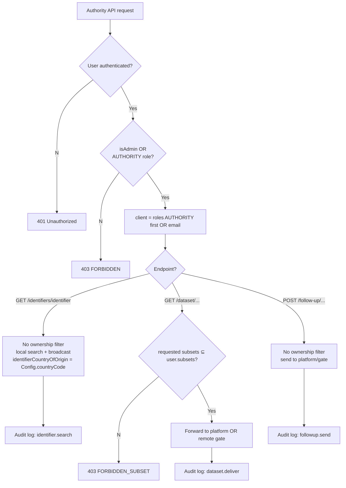

# eFTI Gate v2.0 Permissions Matrix

**Version**: 1.1 — Phase-2 compaction
**Date**: 2026-05-05
**Status**: Development-ready specification

---

## 1. Overview

The authorization model for eFTI Gate v2.0 — who can call which endpoint, what data each role sees (row-level security), and how the checks compose.

**Compliance anchors**:
- **eFTI Regulation 2024/1942** — competent authorities have unrestricted search across identifier data; platforms must respond to dataset requests from recognised authorities.
- **GDPR Art. 30** — every authority data access is logged with user identity and legal basis (7-year retention; see `logging-spec.md`).
- **EU gate-to-gate** — any EU eFTI gate may query any other gate.

### 1.1 Authorization flow

```mermaid
graph TD
    REQ[HTTP Request] --> AC[AccessChecker.before]
    AC --> AUTH{Authorization header?}
    AUTH --No--> PUB{Public endpoint?}
    PUB --Yes--> ALLOW[Allow]
    PUB --No--> UNAUTH[401 Unauthorized<br/>WWW-Authenticate: Basic]
    AUTH --Yes--> CRED[Validate credentials<br/>UserRepository.byCredentials]
    CRED --Invalid--> FORBIDDEN[403 → 401 challenge]
    CRED --Valid--> ROLE{isAdmin?}
    ROLE --Yes--> ALLOW
    ROLE --No--> ANNOTATION{@Access annotation?}
    ANNOTATION --Missing--> ERROR[500 Internal Error<br/>@Access required]
    ANNOTATION --Present--> MATCH{User role in<br/>allowed roles?}
    MATCH --No--> FORBIDDEN2[403 Forbidden]
    MATCH --Yes--> RLS[Row-Level Security<br/>per-route handler]
    RLS --Fail--> FORBIDDEN3[403 Forbidden]
    RLS --Pass--> ALLOW
```

---

## 2. User roles

Roles are defined in `users.Role`:

```kotlin
enum class Role { ADMIN, GATE, PLATFORM, AUTHORITY }
```

Each `User` has `roles: Map<Role, Set<PartyId<*>>>` — a role mapped to one or more party IDs (platform IDs, authority IDs, or gate IDs). `users.subsets` carries the permitted eFTI subset list (`EU01`..`EU07`) for AUTHORITY users.

| Role | Description | Auth | `roles` JSONB example | Restrictions |
|------|-------------|------|------------------------|--------------|
| **ADMIN** | Gate operator. Manages platforms, authorities, users, gates. Bypasses `@Access` role checks. | Basic Auth (email:password) or Bearer (UUID:secret) | `{}` (Super Admin) or `{"ADMIN":["eu-ee31"]}` (gate-scoped) | `checkWriteAccess(entityId)` enforces party scope unless Super Admin. |
| **PLATFORM** | Platform operator. Registers identifier metadata. | Bearer (UUID:secret) | `{"PLATFORM":["demo"]}` | `roles[PLATFORM].size > 1` ⇒ 403 `FORBIDDEN_MULTI_PLATFORM` (single-platform M2M users only). |
| **AUTHORITY** | Competent authority inspector. Searches identifiers, requests datasets, posts follow-ups. | Bearer (UUID:secret) | `{"AUTHORITY":["demo"]}` + `subsets=ARRAY['EU01','EU07']` | Subset filter on `/dataset/...` — `users.subsets` ⊆ `authorities.subsets`. |
| **GATE** | Gate-to-gate system user (fast HTTP G2G fallback when AS4 not used). | Bearer or mTLS (AS4 cert) | `{"GATE":["eu-fi01"]}` | Cannot write to PLATFORM resources (`User.checkWriteAccess()` validates party-ID type). |

**Super Admin** = `isAdmin=true` AND `roles={}` — unrestricted.
**Regular Admin** = `isAdmin=true` AND `roles={ADMIN: {gateId}}` — scoped to that gate's resources.

---

## 3. Permissions matrix

**Path conventions:**
- Platform + Authority APIs (called by external systems) use `/v1/...`.
- Admin API (called by gate operators) uses `/api/v1/...`.
- Health probes use `/health/...` (no auth).

✅ = allowed; ❌ = denied; "All" = no row-level filter; "Own *" = filtered to user's party scope.

### 3.1 Platform API

| Endpoint | Method | ADMIN | PLATFORM | AUTHORITY | GATE | Unauth |
|---|---|---|---|---|---|---|
| `/v1/identifiers/{datasetId}` | POST | ✅ All | ✅ Own platform only | ❌ | ❌ | ❌ |

```mermaid
flowchart TD
    REQ[POST /v1/identifiers/datasetId] --> A{User authenticated?}
    A --No--> R401[401 Unauthorized]
    A --Yes--> B{isAdmin?}
    B --Yes--> SET[platformId = body or first role]
    B --No--> C{@Access PLATFORM?}
    C --Mismatch--> R403[403 FORBIDDEN]
    C --Yes--> D{roles PLATFORM size}
    D --=0--> R403N[403 FORBIDDEN_NO_PLATFORM]
    D -->|>1| R403M[403 FORBIDDEN_MULTI_PLATFORM]
    D -->|=1| SET
    SET --> SAVE[INSERT consignments<br/>platformId from auth token, NEVER from client]
    SAVE --> OK[200 OK]
```

**Row-level rule for PLATFORM**: the saved `consignments.platformId` is always taken from the authenticated user's token — clients cannot override it.

### 3.2 Authority API

| Endpoint | Method | ADMIN | PLATFORM | AUTHORITY | GATE | Unauth |
|---|---|---|---|---|---|---|
| `/v1/identifiers/{identifier}` | GET | ✅ All | ❌ | ✅ All (audit logged) | ❌ | ❌ |
| `/v1/dataset/{gateId}/{platformId}/{datasetId}` | GET | ✅ All | ❌ | ✅ Own subsets only | ❌ | ❌ |
| `/v1/follow-up/{gateId}/{platformId}/{datasetId}/{datasetRequestId}` | POST | ✅ | ❌ | ✅ | ❌ | ❌ |



**Authority subset rule**: `subsetId[]` query params must each be a member of the authenticated user's `users.subsets` array. Subset values are `EU01`..`EU07`.
**`identifierCountryOfOrigin`** in search results is set to this gate's `Config.countryCode` so authorities can see which gate returned each row.

### 3.3 Admin API

All admin endpoints require `@Access(ADMIN)`. Path prefix `/api/v1/`.

| Endpoint | Method | ADMIN | Other roles | Unauth |
|---|---|---|---|---|
| `/api/v1/user` | GET | ✅ Own user | ❌ | ❌ |
| `/api/v1/switch` | GET | ✅ | ❌ | ❌ |
| `/api/v1/platforms`, `/api/v1/platforms/{id}` | GET/POST/PUT/DELETE | ✅ (write needs `checkWriteAccess`) | ❌ | ❌ |
| `/api/v1/authorities`, `/api/v1/authorities/{id}` | GET/POST/PUT/DELETE | ✅ (write needs `checkWriteAccess`) | ❌ | ❌ |
| `/api/v1/gates`, `/api/v1/gates/{id}` | GET/POST/PUT/DELETE | ✅ (write needs `checkWriteAccess`) | ❌ | ❌ |
| `/api/v1/users`, `/api/v1/users/{id}` | GET/POST/DELETE | ✅ (cannot delete self) | ❌ | ❌ |
| `/api/v1/consignments`, `/api/v1/consignments/{datasetId}` | GET/DELETE | ✅ | ❌ | ❌ |

```mermaid
flowchart TD
    REQ[Admin API request] --> A{Auth valid?}
    A --No--> R401[401 Unauthorized]
    A --Yes--> SA{isAdmin?}
    SA --No--> R403[403 FORBIDDEN]
    SA --Yes--> SUPER{Super Admin?<br/>roles == {}}
    SUPER --Yes--> ALL[All records visible/writable]
    SUPER --No--> SCOPE[Regular Admin:<br/>scoped to roles ADMIN gateIds]
    SCOPE --> OP{Operation?}
    OP -->|Read| FILTER[List filtered to gate scope]
    OP -->|Write| WC{checkWriteAccess<br/>entityId in roles values?}
    WC --No--> R403W[403 FORBIDDEN_WRITE_ACCESS]
    WC --Yes--> SELFD{DELETE user where<br/>userId == current?}
    SELFD --Yes--> R400[400 BAD_REQUEST_GENERAL<br/>Admin cannot delete self]
    SELFD --No--> APPLY[Apply change<br/>+ audit log]
    ALL --> APPLY
    FILTER --> RESP[Response]
    APPLY --> RESP
```

### 3.4 Health & system

| Endpoint | Method | Access |
|---|---|---|
| `/health` (or equivalent) | GET | Public — anyone |
| OpenAPI/Swagger UI | GET | Public — anyone |

---

## 4. Append-only & audit (callout)

> **Append-only design rule.** Per the repo `README.md` non-negotiables, `change_history`, `audit_log` and `follow_up_log` are ledger tables — INSERT-only, enforced at the DB level. Registry tables (`users`, `platforms`, `authorities`, `gates`, `consignments`, `identifiers`) allow UPDATE for status/credential transitions; every UPDATE is captured into `change_history` by an `AFTER UPDATE` trigger. The runtime `app` role has no `DELETE` privilege on any table. Logical deletion uses status enums (`gates.status='DISABLED'`, `consignments.status='deleted'`).

> **GDPR Art. 30 callout.** Every authority data access (`identifier.search`, `dataset.deliver`, `followup.send`) and every admin write must produce an audit log entry. Retention: **7 years**. Field schema and example payloads are in `logging-spec.md` §2 and §4. Authentication failures and authorisation denials are also retained 7 years.

---

## 5. Multi-platform users

`users.roles JSONB` already supports multiple platforms (`{"PLATFORM": ["demo","plt-456"]}`), but `PlatformRoutes.before()` blocks any user with `roles[PLATFORM].size > 1` from sending identifier data — the gate cannot determine which platform owns the submission. **Mandate**: one M2M system user per platform.

```sql
-- Recommended: dedicated single-platform sender
INSERT INTO users (name, isAdmin, roles, secretHash) VALUES
  ('Demo Platform M2M', false, '{"PLATFORM":["demo"]}',     :hash1),
  ('Plt-456 M2M',       false, '{"PLATFORM":["plt-456"]}', :hash2);
```

---

## 6. Authentication

| Aspect | Detail |
|---|---|
| **Bearer format** | `Authorization: Bearer {userId}:{secret}` (base64-encoded `userId:secret`). `userId` is UUID v4; `secret` is plaintext (hashed in DB as `secretHash`). |
| **Basic Auth** | `Authorization: Basic {base64(email:password)}`. Admin only. **Disabled in production** — replaced by TARA in EE extension module. |
| **Password hashing** | `secretHash = SHA-256(password + userId-as-salt)`. Stored in `users.secretHash`. |
| **PG row-level context** | After auth, `userRepository.setAppUser(user)` runs `SET LOCAL app.user_id = ':userId'` so PostgreSQL RLS policies (if configured) can apply. |
| **Public endpoints** | `/health` and OpenAPI/Swagger UI (annotated `@Public`). 401 challenge sets `WWW-Authenticate: Basic realm="eFTI Gate Admin"`. |
| **CORS preflight** | `OPTIONS` requests bypass `AccessChecker`. |

---

## 7. Error responses (RFC 7807)

All errors share the schema `{type, title, status, detail, instance, errorCode?}`. Type host is `https://api.efti.ee/errors/...`. Full catalog with payloads is in `errors.json` — only the auth/authz codes are summarised here.

| HTTP | `errorCode` | `type` slug | Triggered when |
|---|---|---|---|
| 401 | (no code) | `unauthorized` | No `Authorization` header on a protected route. Response also sets `WWW-Authenticate: Basic`. |
| 401 | `TOKEN_INVALID` | `unauthorized` | Credentials provided but cannot be decoded or do not match any user. |
| 403 | `FORBIDDEN` | `forbidden` | Authenticated, but `checkAccess()` finds no matching role. |
| 403 | `FORBIDDEN_NO_PLATFORM` | `forbidden-no-platform` | `@Access(PLATFORM)` matched but `roles[PLATFORM]` is empty. |
| 403 | `FORBIDDEN_MULTI_PLATFORM` | `forbidden-multi-platform` | `roles[PLATFORM].size > 1` on POST identifiers. |
| 403 | `FORBIDDEN_WRITE_ACCESS` | `forbidden-write-access` | `User.checkWriteAccess(entityId)` — admin's roles do not include the target party ID. |
| 403 | `FORBIDDEN_SUBSET` | `forbidden-subset` | Authority requested a subset not in `users.subsets`. |
| 400 | `BAD_REQUEST_GENERAL` | `bad-request` | Admin tried to delete themselves (`userId == currentUser.id`). |

---

## 8. Implementation pointers

This spec is the contract — the implementation lives elsewhere. Do **not** redefine the schema or copy SQL/Kotlin into this document.

- **Database schema** for `users`, `platforms`, `authorities`, `gates` (including `roles JSONB`, `subsets text[]`, `secretHash`, `isAdmin`, `gates.status`): `docs/specs/db/schema.sql` — every column carries `COMMENT ON …`. Append-only enforcement and `change_history` triggers also live there.
- **Endpoint definitions** with `@Access` annotations and request/response schemas: `docs/specs/openapi.yaml`.
- **Error catalog** (full payloads, all 35 codes): `docs/specs/errors.json`.
- **AccessChecker / Routes / repositories** runtime code: `gate/src/efti/...` — `AccessChecker.before()`, `PlatformRoutes.before()`, `AuthorityRoutes.before()`, `User.checkWriteAccess()`, `UserRepository.byCredentials()`, `UserRepository.setAppUser()`. The pseudocode below is the canonical pattern; production code may diverge in error wrapping and logging detail.

### 8.1 Canonical AccessChecker pattern

```kotlin
// AccessChecker.before(exchange) — single global authorization gate.
fun before(exchange: HttpExchange) {
    if (exchange.method == OPTIONS) return                     // CORS preflight passes
    val auth = exchange.header("Authorization")
    val user = auth?.let { resolveUser(it) }                   // Basic→email, Bearer→UUID
    val access = exchange.route.findAnnotation<Access>()       // e.g. @Access(PLATFORM)
    val isPublic = access == null && exchange.route.hasAnnotation<Public>()

    if (user == null) {
        if (isPublic) return
        exchange.header("WWW-Authenticate", "Basic realm=\"eFTI Gate Admin\"")
        throw UnauthorizedException()
    }
    if (!isPublic && !user.isAdmin && access!!.roles.none { user.roles.containsKey(it) })
        throw ForbiddenException()                             // wrong role for endpoint

    exchange.attr("user", user)
    userRepository.setAppUser(user)                            // SET LOCAL app.user_id
}
```

Per-route handlers add the row-level checks: `PlatformRoutes.before()` rejects multi-platform users; `AuthorityRoutes.before()` resolves `client = roles[AUTHORITY].firstOrNull() ?: email`; dataset routes intersect `subsetId[]` against `user.subsets`; admin write routes call `user.checkWriteAccess(entityId)`. See `gate/src/efti/` for the live versions.

---

## 9. Audit logging summary

Every authorization-relevant event must be logged with `event.action`, `user.id`, request context, and `efti.error.code` (on failure). Field reference and full payload examples in `logging-spec.md` §2 (efti.* fields) and §3 (canonical templates).

| Event | `event.action` | Level | Retention |
|---|---|---|---|
| Authentication success | `user.login` (success) | INFO | 7y |
| Authentication failure | `user.login` (failure) | WARN | 7y |
| Authorization denied | `user.access.denied` | WARN | 7y |
| Authority identifier search | `identifier.search` | INFO | 7y |
| Authority dataset access | `dataset.deliver` | INFO | 7y |
| Authority follow-up sent | `followup.send` | INFO | 7y |
| Admin write (platform/authority/gate/user create/update/delete) | `<entity>.<verb>` | INFO | 7y |
