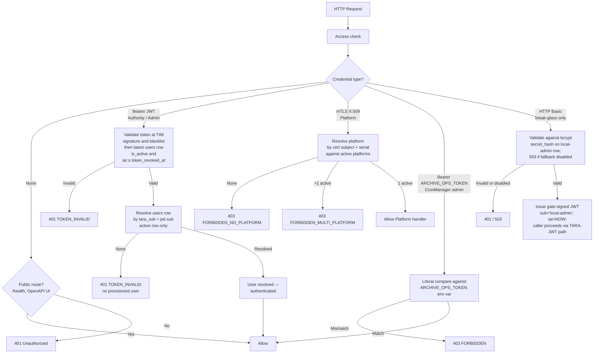
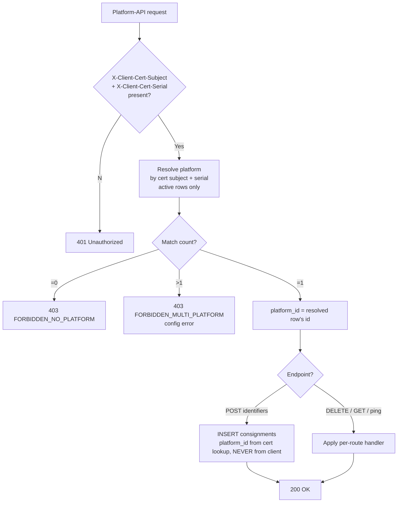
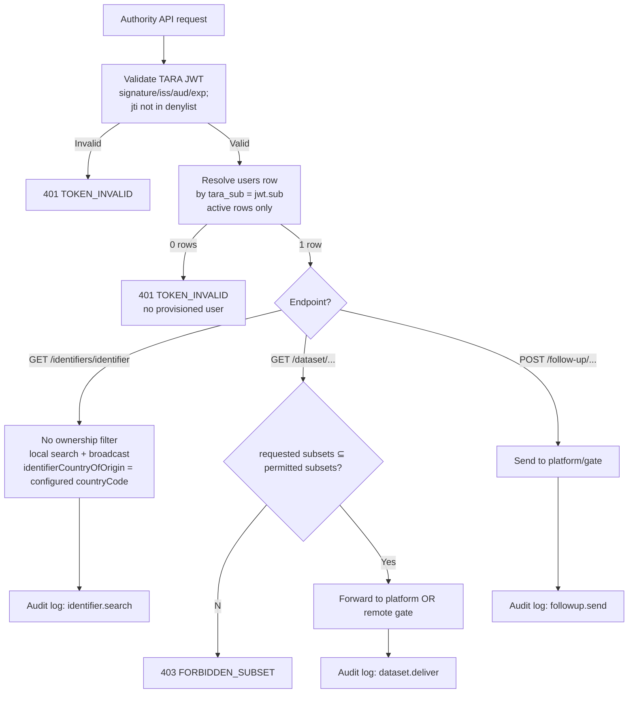
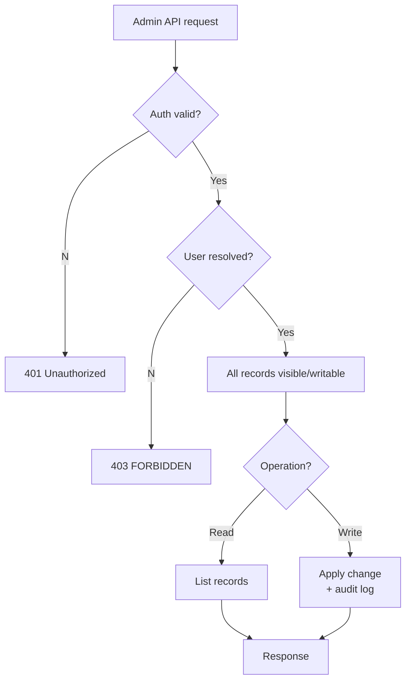

# eFTI Gate v2.0 Permissions Matrix

**Version**: 1.5 — `users.is_admin` dropped; every authenticated user has full access
**Date**: 2026-09-03
**Status**: Development-ready specification

**Changed in 1.5** (§1.1, §2, §3.2, §6, §7): `users.is_admin` is removed. Every authenticated
user has full access to all Admin and Authority API routes.

**Changed in 1.4** (§1.1, §2, §3.2, §6, §7): `users.is_authority` is removed. A competent
authority proper is an organisation authenticated over X-Road (`authorities.registry_code`,
[ADR-006](../architecture/decisions/006-xroad-identity-and-subsets.md)), never a `users` row.

**Changed in 1.3** (§2, §3.2, §7): the X-Road channel is added to the §2 identity table. Subset
permissions are **not** on `users` — there is no `users.subsets` column in the migrations or in
`docs/specs/db/schema.sql`, and `users` carries no link to an authority. The only subset register is
`authorities.subsets`, keyed by `registry_code`, which is what the `X-Road-Client` member code
resolves to. `FORBIDDEN_SUBSET` is therefore enforceable on the X-Road path and blocked on the JWT
path until that gap is closed. See
[ADR-006](../architecture/decisions/006-xroad-identity-and-subsets.md).

**Changed in 1.2** (§1.1, §2, §3.2, §6, §7, §8.1): the session token is issued by **TIM**
after TARA OIDC login, not by TARA directly, and is validated by calling TIM rather than
against a cached TARA JWKS. Revocation is immediate on both paths. The JWT-path cost is one
TIM call plus **one** DB lookup, not two. `FORBIDDEN_WRITE_ACCESS` is
decided from the resolved `users` row, which is what §2 and §6 always said — the §7 wording
that sourced it from JWT claims was inconsistent and has been corrected. (`FORBIDDEN_SUBSET` was
listed here too; corrected in 1.3 — subsets are not on `users`.) The
`resource_access.efti-gate.roles` claim reference is removed: TARA does not issue it.

---

## 1. Overview

The authorization model for eFTI Gate v2.0 — who can call which endpoint, what data each role sees (row-level security), and how the checks compose.

**Compliance anchors**:
- **eFTI Regulation 2024/1942** — competent authorities have unrestricted search across identifier data; platforms must respond to dataset requests from recognised authorities.
- **GDPR Art. 30** — every authority data access is logged with user identity and legal basis (7-year retention; see `logging-spec.md`).
- **EU gate-to-gate** — any EU eFTI gate may query any other gate.

### 1.1 Authorization flow

The diagram describes the rules; concrete query bodies belong to the implementation. Append-only semantics ("the latest row by `created_at` wins"; "soft-deleted entities — `is_active=FALSE` on the latest row — do not authenticate") apply to every "active row" check. See [`db/README.md`](db/README.md) for the canonical read pattern.

---

## 2. Identity model

Two kinds of caller identity, modelled in two different ways. The legacy "single Role enum" abstraction has been retired in favour of separate identity sources per surface.

| Surface | Identity source | Where the identity lives | Authorisation source |
|---|---|---|---|
| **Authority API** | TIM-issued JWT `sub` / `personalCode` (Estonian PIC), originating from TARA OIDC | A `users` row with matching `tara_sub` | **Resolved `users` row's** `tara_sub` match. The token carries identity only; the gate's authorisation snapshot can change after a token is minted, so DB-side state wins. |
| **Admin API** | TIM-issued JWT `sub` / `personalCode` | A `users` row with matching `tara_sub` | **Resolved `users` row's** `tara_sub` match. The token carries identity only. |
| **Platform API** | mTLS X.509 client cert | A `platforms` row whose `e_delivery_cert` matches | None — cert subject = platform identity. |
| **CronManager admin endpoints** | Static `Authorization: Bearer <ARCHIVE_OPS_TOKEN>` | Env var; **no DB row** | None — token comparison is the whole authorisation. |
| **G2G (gate ↔ gate)** | mTLS at the AS4 access point (Member-State-issued cert) | A `gates` row whose `e_delivery_cert` matches | None — gate identity is the cert subject; trust is established by the cert chain rooted at the EU Trust Service. |
| **Gate-internal service calls** | Static shared secret in the `X-Internal-Service-Token` header | Env/constant only; **no DB row** | None — the token comparison is the whole authorisation, and the *calling component* is responsible for authorising its own end user first. Accepted only by `efti/POST/api/v1/authority/*`. Used today by the X-Road adapter; earmarked for G2G inbound. Deliberately generic so `core` carries no X-Road awareness. Same posture as `opsToken` (§6). See [ADR-006](../architecture/decisions/006-xroad-identity-and-subsets.md). |
| **X-Road (EE national)** | mTLS at the RIA-operated Security Server, forwarded as the `X-Road-Client` header | The single `ACTIVE` `authorities` row whose `registry_code` matches the header's `memberCode` (a code matching more than one active row is a registry misconfiguration and is denied, not resolved) | The resolved `authorities` row — `authorities.subsets` is the permitted-subset set. Identity is the **organisation**, not a person; `X-Road-UserId` never grants access (intended for audit, but no audit writer exists yet). See [ADR-006](../architecture/decisions/006-xroad-identity-and-subsets.md). |
| **Break-glass local admin** | HTTP Basic + bcrypt | A single `users` row with `secret_hash != NULL` | The same resolved-`users`-row source as TARA path; the break-glass JWT issued by `/api/v1/auth/local-token` is a transport vehicle, not the source of truth. Default-disabled (`LOCAL_ADMIN_FALLBACK_ENABLED=false`). |

**`users.tara_sub`** carries the value the gate matches against the inbound JWT's `sub` claim. For TARA-issued JWTs this is the Estonian PIC. For the single break-glass local-admin row this is the reserved literal `local-admin` (lower-case; never collides with a PIC). Always non-null — the resolution path is uniform across TARA and break-glass JWTs.

**`users.token_revoked_at`** is the per-user broadcast revocation marker. `POST /api/v1/users/{userId}/revoke-token` writes a new `users` row with `token_revoked_at = NOW()`; on JWT validation the gate rejects any presented JWT whose `iat` claim predates the resolved user's latest `token_revoked_at`. Distinct from the per-jti `sessions` denylist (used by `POST /api/v1/auth/logout`): the denylist targets one specific JWT, this column targets every JWT a user currently holds.

---

## 3. Permissions matrix

**Path conventions:**
- Platform + Authority APIs (called by external systems) use `/v1/...`.
- Admin API (called by gate operators) uses `/api/v1/...`.
- Health probes use `/health/...` (no auth).

✅ = allowed; ❌ = denied; "All" = no row-level filter; "Own *" = filtered to user's party scope.

### 3.1 Platform API

Authenticated by **mTLS** with the platform's eDelivery AP X.509 certificate (Member-State-issued per Impl Reg 2024/1942 Art 11). The reverse proxy terminates mTLS and forwards `X-Client-Cert-Subject` / `X-Client-Cert-Serial`; the gate looks them up against `platforms` to resolve identity. **No JWT, no user record.** TARA-authenticated callers (Authority / Admin) cannot reach Platform endpoints.

| Endpoint | Method | mTLS-resolved Platform | TARA JWT (any role) | Unauth |
|---|---|---|---|---|
| `/v1/identifiers/{datasetId}` | POST | ✅ Bound to the resolved `platforms.id` | ❌ | ❌ |
| `/v1/identifiers/{datasetId}` | DELETE | ✅ Bound to the resolved `platforms.id` (writes `status='deleted'`) | ❌ | ❌ |
| `/v1/status/{datasetId}` | GET | ✅ Bound to the resolved `platforms.id` | ❌ | ❌ |
| `/v1/datasets/{datasetId}` | GET | ✅ Bound to the resolved `platforms.id` (self-fetch) | ❌ | ❌ |
| `/v1/follow-up/{datasetId}/{requestId}` | GET | ✅ Bound to the resolved `platforms.id` | ❌ | ❌ |
| `/v1/ping` | POST | ✅ | ❌ | ❌ |

> Re-uploads are POST against the same `dataset_id` (the gate INSERTs a new `consignments` row sharing the logical id). There is **no PUT** on Platform endpoints — append-only forbids mutate-in-place; "update" is "INSERT new row".

**Row-level rule for Platform writes**: the saved `consignments.platform_id` is always taken from the cert-subject lookup — clients cannot override it via path or body.

### 3.2 Authority API

Authenticated by the **TIM-issued JWT** obtained through TARA OIDC login. The gate validates the token at TIM, then resolves it to a `users` row via `tara_sub = jwt.sub`. The token itself carries **no** role claim — an earlier draft referenced `resource_access.efti-gate.roles`, a Keycloak-shaped claim that TARA does not issue and the gate does not read.

| Endpoint | Method | TARA JWT (authenticated) | mTLS Platform | Unauth |
|---|---|---|---|---|
| `/v1/identifiers/{identifier}` | GET | ✅ All gates' identifiers (audit logged) | ❌ | ❌ |
| `/v1/dataset/{gateId}/{platformId}/{datasetId}` | GET | ✅ Subset restriction **not yet enforced on this path** — see the §7 `FORBIDDEN_SUBSET` note | ❌ | ❌ |
| `/v1/follow-up/{gateId}/{platformId}/{datasetId}/{datasetRequestId}` | POST | ✅ | ❌ | ❌ |

**`identifierCountryOfOrigin`** in search results is set to this gate's configured `countryCode` so authorities can see which gate returned each row.

### 3.3 Admin API

Admin endpoints require a valid TARA-issued JWT whose resolved `users` row matches. Path prefix `/api/v1/`. The CronManager endpoints (`/api/v1/admin/*`) are the exception: they accept only the static `opsToken` Bearer (literal `ARCHIVE_OPS_TOKEN` env-var compare); JWTs are rejected on those routes. See §6 for the credential matrix.

| Endpoint | Method | Authenticated | Non-authenticated | Unauth |
|---|---|---|---|---|
| `/api/v1/auth/local-token` | POST | ✅ (via Basic Auth, default-disabled) | ❌ | ✅ (Basic challenge) |
| `/api/v1/auth/logout` | POST | ✅ | ✅ (any authenticated user) | ❌ |
| `/api/v1/user` | GET | ✅ Own user | ✅ Own user | ❌ |
| `/api/v1/platforms` | GET / POST | ✅ (POST needs `checkWriteAccess`; returns 201 on create, 409 on existing id) | ❌ | ❌ |
| `/api/v1/platforms/{platformId}` | PUT / DELETE | ✅ (write needs `checkWriteAccess`; PUT 404 on unknown id) | ❌ | ❌ |
| `/api/v1/platforms/{platformId}/ping` | POST | ✅ (Super Admin or matching scope) | ❌ | ❌ |
| `/api/v1/authorities` | GET / POST | ✅ (write needs `checkWriteAccess`) | ❌ | ❌ |
| `/api/v1/authorities/{authorityId}` | GET / PUT / DELETE | ✅ (write needs `checkWriteAccess`) | ❌ | ❌ |
| `/api/v1/gates` | GET / POST | ✅ (write needs `checkWriteAccess`) | ❌ | ❌ |
| `/api/v1/gates/{gateId}` | PUT / DELETE | ✅ (write needs `checkWriteAccess`) | ❌ | ❌ |
| `/api/v1/gates/own` | GET | ✅ | ❌ | ❌ |
| `/api/v1/gates/{gateId}/ping` | POST | ✅ (Super Admin or matching scope) | ❌ | ❌ |
| `/api/v1/users` | GET / POST | ✅ (POST returns 201 on create, 409 on duplicate `taraSub`) | ❌ | ❌ |
| `/api/v1/users/{userId}` | GET / PUT / DELETE | ✅ (PUT 404 on unknown id; cannot delete self → 400 `BAD_REQUEST_GENERAL`) | ❌ | ❌ |
| `/api/v1/users/{userId}/revoke-token` | POST | ✅ (Super Admin or matching scope) | ❌ | ❌ |
| `/api/v1/consignments`, `/api/v1/consignments/{datasetId}` | GET / DELETE | ✅ (DELETE = soft, INSERTs row with `status='deleted'`) | ❌ | ❌ |
| `/api/v1/audit` | GET | ✅ Super Admin only | ❌ | ❌ |
| `/api/v1/admin/archive` | POST | ❌ (rejected — opsToken-only) | ✅ OPS (`opsToken` Bearer) | ❌ |
| `/api/v1/admin/expire-identifiers` | POST | ❌ (rejected — opsToken-only) | ✅ OPS (`opsToken` Bearer) | ❌ |
| `/api/v1/admin/ping-gates` | POST | ❌ (rejected — opsToken-only) | ✅ OPS (`opsToken` Bearer) | ❌ |

### 3.4 Health & system

| Endpoint | Method | Access |
|---|---|---|
| `/health/live` | GET | Public — anyone (Kubernetes liveness probe) |
| `/health/ready` | GET | Public — anyone (Kubernetes readiness probe; returns 503 when DB unreachable) |
| OpenAPI/Swagger UI | GET | Public — anyone |

---

## 4. Append-only & audit (callout)

> **Append-only design rule.** Every operational table is INSERT-only. The runtime `app` role has `SELECT, INSERT` only on every table — `UPDATE` and `DELETE` are not granted, period. "Edit" operations on registry rows (admin updates a gate, password reset, status flip, token revocation, async-response consumption) all INSERT a new row sharing the logical identifier. Reads return the latest row per logical id (`created_at DESC`) — see [`db/README.md`](db/README.md) for the canonical read-pattern guidance. Non-latest rows are moved to archival storage by CronManager (Epic 26).

> **GDPR Art. 30 callout.** Every authority data access (`identifier.search`, `dataset.deliver`, `followup.send`) and every admin write must produce an audit log entry. Retention: **7 years**. Field schema and example payloads are in `logging-spec.md` §2 and §4. Authentication failures and authorisation denials are also retained 7 years.

---

## 5. Multi-platform certificate misconfiguration

Platform identity is mTLS, not user roles. There is no "multi-platform user" — every X.509 certificate represents exactly one platform. The error to guard against is **a single certificate (subject DN + serial) registered against more than one active `platforms` row**, typically because an old platform was renamed and the obsolete row was not soft-deleted.

The fix is for the operator to soft-delete the obsolete row (under append-only semantics, that means writing a new `platforms` row whose `is_active=FALSE` so the latest row for that logical id is inactive). The cert lookup considers only the latest row per logical id and skips entries whose latest is `is_active=FALSE`, so the next inbound request resolves to the single remaining active platform. See `seq-13-multi-platform-user.mmd` for the full sequence.

---

## 6. Authentication

Three mechanisms, one per surface, mirroring the EFTI4EU reference implementation. The EC does not mandate a single protocol at REST surfaces (Reg 2020/1056 Recital 21 + Art 9; Impl Reg 2024/1942 Art 4 — "Member States may set up the AAPs … integrated in their respective eFTI Gate"). The choices below follow the reference impl pattern and the Estonian e-Government precedent.

| Surface | Mechanism | Detail |
|---|---|---|
| **Authority API** (`/v1/identifiers/{identifier}`, `/v1/dataset/...`, `/v1/follow-up/...`) | **RS256 JWT issued by TIM** after TARA OIDC login | Presented as `Authorization: Bearer`. TIM (Bürokratt Token & Identity Manager) runs the TARA code exchange and mints the session token; the gate validates it by calling TIM `GET /jwt/userinfo`, which also enforces TIM's blacklist. Token claims: `sub` / `personalCode` (Estonian PIC), `iat`, `exp`, `jti`. The gate reads the canonical permission set from the resolved `users` row, **not** the token — the token carries identity and freshness only. |
| **Admin API** (`/api/v1/...`, except the three CronManager endpoints) | **Same TIM-issued JWT**, same validator as Authority API; differentiated by the resolved `users` row match. | Same validation path. |
| **Login** (`/oauth2/authorization/tara`, `/authenticate`) | **TARA OIDC**, brokered by TIM | Not part of the versioned eFTI contract and not routed through Ruuter — the browser talks to TIM directly, and auth paths carry no `/v1` prefix (`docs/planning/rest-api-disainijuhend.md` §5). TIM holds `TARA_CLIENT_ID` / `TARA_CLIENT_SECRET` and performs the back-channel code exchange, so the gate's REST surface never handles OIDC codes or the client secret. |
| **Platform API** (`/v1/identifiers/{datasetId}`, `/v1/datasets/...`, `/v1/status/...`, `/v1/follow-up/{datasetId}/...`, `/v1/ping`) | **mTLS with the platform's eDelivery AP certificate** (the same Member-State-issued X.509 cert mandated by Impl Reg 2024/1942 Art 11). | Reverse proxy terminates mTLS; forwards the client cert; gate looks it up in `platforms.e_delivery_cert`. No second credential — the cert is already mandatory. |
| **CronManager admin endpoints** (`POST /api/v1/admin/archive`, `…/expire-identifiers`, `…/ping-gates`) | **Static Bearer token** | `Authorization: Bearer <ARCHIVE_OPS_TOKEN>`. Operator provisions a 256-bit random secret into a Kubernetes Secret; CronManager injects it as `BEARER_OPS_TOKEN`. Gate compares the literal value against the `ARCHIVE_OPS_TOKEN` env var. No DB lookup, no JWT verification, no user record. Mismatch → 403 `FORBIDDEN`. Intentionally a non-human credential — TARA models people, not scheduled jobs. |
| **Gate-internal service calls** (`/efti/api/v1/authority/...`, POST only) | **Static shared secret** in `X-Internal-Service-Token` | Accepted as an alternative to the TIM JWT on the POST authority guard. No DB lookup — the literal comparison against the `INTERNAL_SERVICE_TOKEN` constant is the entire authorisation, so the calling component must have authorised its own end user first (the X-Road adapter resolves the organisation from `X-Road-Client` and enforces `authorities.subsets` before forwarding). Deny is the fall-through: an absent or empty header can never match, even if the constant were unset. **The token grants full Authority-API access to whoever holds it and is baked into the image at build time**, so the surface needs the same network isolation as the adapter itself. |
| **Health** (`/health/...`) | None | Public (Kubernetes probes). |
| **Break-glass** (`/api/v1/auth/local-token`) | HTTP Basic Auth + bcrypt | Default-disabled; enabled only via `LOCAL_ADMIN_FALLBACK_ENABLED=true`. Issues a short-lived (600 s) gate-signed JWT with `sub='local-admin'` and a fresh `iat`. The break-glass JWT carries the same claim shape as TARA-issued JWTs and is resolved by the same `users.tara_sub = jwt.sub` lookup — the seed `users` row for the break-glass account carries `tara_sub='local-admin'`. |

**JWT revocation — two complementary mechanisms, both effective on the next request:**

- **Per-token.** `POST /api/v1/auth/logout` blacklists the token at TIM, which makes TIM's `/jwt/userinfo` reject it from that moment on, and then appends a `sessions` row carrying the token's `jti`, its `exp` and a reason as the durable audit record. Enforcement precedes the audit write, so a failed INSERT can never block a revocation. Entries past `exp` are archived.
- **Per-user broadcast (`users.token_revoked_at`).** `POST /api/v1/users/{userId}/revoke-token` writes a new `users` row with `token_revoked_at = NOW()` (append-only); the identity query then rejects any token issued before that moment. Use when the user is suspect (compromised credential, offboarding) and every token they hold should fail.

**The access-check layer on the JWT path** calls TIM `GET /jwt/userinfo` to validate the token's signature and blacklist status, then resolves the caller against the database in a single query. That query takes the **latest** `users` row per logical id and only then applies its filters — the row must be `is_active`, must still carry the presented `tara_sub`, and must not have a `token_revoked_at` later than the token's issuance time. Filtering by `tara_sub` before resolving the latest row would let a superseded identifier keep authenticating, so the order is load-bearing. Permission state comes from the database, not the token — the gate's authorisation snapshot can change after the token was minted, so DB-side state wins. The mTLS path resolves the platform against `platforms` by `e_delivery_cert` (active rows only). The `opsToken` path does no DB lookup at all (literal env-var compare).

> **`jti` provenance.** TIM's `/jwt/userinfo` exposes neither `jti` nor `exp` — it returns `loggedInDate` / `loginExpireDate` and no token id. The `sessions` row's `jti` is therefore decoded from the token's own payload segment. Only that segment is passed to the database, never the signature, so the DB layer never receives a replayable credential.

**Password hashing.** Bcrypt only, used for the single break-glass local-admin row in `users.secret_hash`. Every other row has `secret_hash = NULL`. Cost factor pinned at 12 (`$2a$12$…`) per `non-functional.md` §4.

**Break-glass JWT signing-key rotation.** A single asymmetric key pair is held by the gate (`BREAK_GLASS_JWT_SIGNING_KEY` env var; PEM-encoded RSA private key). Issued JWTs do not carry a `kid` header — the gate is the only verifier and uses the single in-memory key. Rotation procedure: (1) generate a new key pair offline; (2) restart the gate process with the new private key; (3) every break-glass JWT signed with the old key becomes invalid immediately because the new key cannot verify it. The 600 s TTL means worst-case-stranded sessions are 10 minutes. There is no support for overlapping signing keys — operator accepts the brief gap on rotation.

---

## 7. Error responses (RFC 7807)

All errors share the schema `{type, code, title, status, detail, instance}` per RFC 7807 (`code` required, bound to the catalog enum). Type host is `https://api.efti.ee/errors/...`. Full catalog with payloads is in `errors.json` — only the auth/authz codes are summarised here.

| HTTP | `errorCode` | `type` slug | Triggered when |
|---|---|---|---|
| 401 | (no code) | `unauthorized` | No `Authorization` header on a protected route, or JWT signature/exp/iss/aud invalid, or platform mTLS cert not present / not in `platforms.e_delivery_cert` registry. |
| 401 | `TOKEN_INVALID` | `unauthorized` | JWT presented but malformed, or `jti` is in the revocation denylist (`sessions` table). |
| 403 | `FORBIDDEN` | `forbidden` | `Authorization: Bearer …` value does not match `ARCHIVE_OPS_TOKEN` on a CronManager admin endpoint. |
| 403 | `FORBIDDEN_NO_PLATFORM` | `forbidden-no-platform` | mTLS cert presented but `platforms.e_delivery_cert` lookup yields no active platform, or matched a `is_active=FALSE` row. |
| 403 | `FORBIDDEN_MULTI_PLATFORM` | `forbidden-multi-platform` | mTLS cert subject resolves to more than one active `platforms` row (configuration error). Always 403 — never 401, 400. |
| 403 | `FORBIDDEN_WRITE_ACCESS` | `forbidden-write-access` | `checkWriteAccess(entityId)` — the target entity id is not in the **resolved `users` row's** scope. |
| 403 | `FORBIDDEN_SUBSET` | `forbidden-subset` | Authority requested a subset not in its permitted subsets. **Enforced on the X-Road path** by `POST /xroad/v1/dataset` (the subsets named in the request) and `POST /xroad/v1/transport-means` (EU02, the class of data it returns) against `authorities.subsets`, resolved from the `X-Road-Client` member code (see §2 and [ADR-006](../architecture/decisions/006-xroad-identity-and-subsets.md)); a partially permitted request is denied whole, not narrowed. On the JWT path this is **still not enforceable** — `users` has no `subsets` column and no link to an authority. |
| 400 | `BAD_REQUEST_GENERAL` | `bad-request` | Admin tried to delete themselves (`userId == currentUser.id`). |

---

## 8. Implementation pointers

This spec is the contract — the implementation lives elsewhere. Do **not** redefine the schema or copy SQL / implementation code into this document.

- **Database schema** for `users`, `platforms`, `authorities`, `gates` (including `secretHash`, `gates.status`): `docs/specs/db/schema.sql` — every column carries `COMMENT ON …`. Append-only enforcement is by GRANT (the runtime `app` role has `SELECT, INSERT` only; no UPDATE, no DELETE on any table); state transitions are INSERTs of new rows sharing the same logical id, and the latest row by `created_at` is the current state. There are no `_history` companion tables — the operational table itself is its own change log.
- **Endpoint definitions** with `@Access` annotations and request/response schemas: `docs/specs/openapi.yaml`.
- **Error catalog** (full payloads, all 36 codes): `docs/specs/errors.json`.
- **Access-check, route, and repository code** lives in the implementation, not this document. The pseudocode below in §8.1 names the *behavioural* steps — request-time access-check entry point, platform resolution from mTLS, JWT validation, write-access scope check, user lookup by `tara_sub`, session-denylist check — and the spec captures the **what / when / fail-mode** of each. Module layout, class names, and error-wrapping idioms are the implementer's call.

### 8.1 Canonical access-check pattern

The authorization gate routes a request to exactly one of the four credential types from §1.1, then applies the role / scope / subset rules of §3. The credential-routing rules:

- **Path prefix decides the credential type.** `/v1/identifiers/{datasetId}`, `/v1/datasets/...`, `/v1/status/...`, `/v1/follow-up/{datasetId}/...`, `/v1/ping` are **Platform API** (mTLS). `/v1/identifiers/{identifier}`, `/v1/dataset/...`, `/v1/follow-up/{gateId}/...` are **Authority API** (TARA JWT). `/api/v1/admin/archive`, `/api/v1/admin/expire-identifiers`, `/api/v1/admin/ping-gates` are **CronManager** (opsToken). `/api/v1/auth/local-token` is **break-glass** (HTTP Basic). Everything else under `/api/v1/` is **Admin API** (TARA JWT). `/health/...` is public.
- **OPTIONS** preflight requests bypass authentication (CORS).
- **No DB lookup** on the opsToken path — the env-var compare is the entire authorisation. **One call to TIM plus one DB lookup** on the JWT path — `GET /jwt/userinfo` covers signature and blacklist, and a single query resolves the `users` row and enforces `is_active`, the current `tara_sub` and `token_revoked_at` together. **One DB lookup** on the mTLS path — the active `platforms` row whose cert subject + serial match. **One DB lookup** on the break-glass path — the local-admin `users` row.
- **Append-only** semantics throughout: every "active row" check considers only the latest row per logical id, ignoring soft-deleted (`is_active=FALSE` on the latest row) entries.

Per-route handlers add row-level checks once authentication has resolved the caller: Platform-API write routes bind `consignments.platform_id` to the cert-resolved id and reject any client-supplied override. The mechanics of the JWT validator, the JWKS cache, and the cert-subject lookup are implementation choices for the build phase (the spec only commits to the outcomes above and the schema columns referenced in §2).

---

## 9. Audit logging summary

Every authorization-relevant event must be logged with `event.action`, `user.id`, request context, and `efti.error.code` (on failure). Field reference and full payload examples in `logging-spec.md` §2 (efti.* fields) and §3 (canonical templates).

| Event | `event.action` | Level | Retention |
|---|---|---|---|
| Authentication success | `user.login` (success) | INFO | 7y |
| Authentication failure | `user.login` (failure) | WARN | 7y |
| Authorization denied | `user.access.denied` | WARN | 7y |
| Authority identifier search | `identifier.search` | INFO | 7y |
| Authority dataset access | `dataset.deliver` | INFO | 7y |
| Authority follow-up sent | `followup.send` | INFO | 7y |
| Admin write (platform/authority/gate/user create/update/delete) | `<entity>.<verb>` | INFO | 7y |
