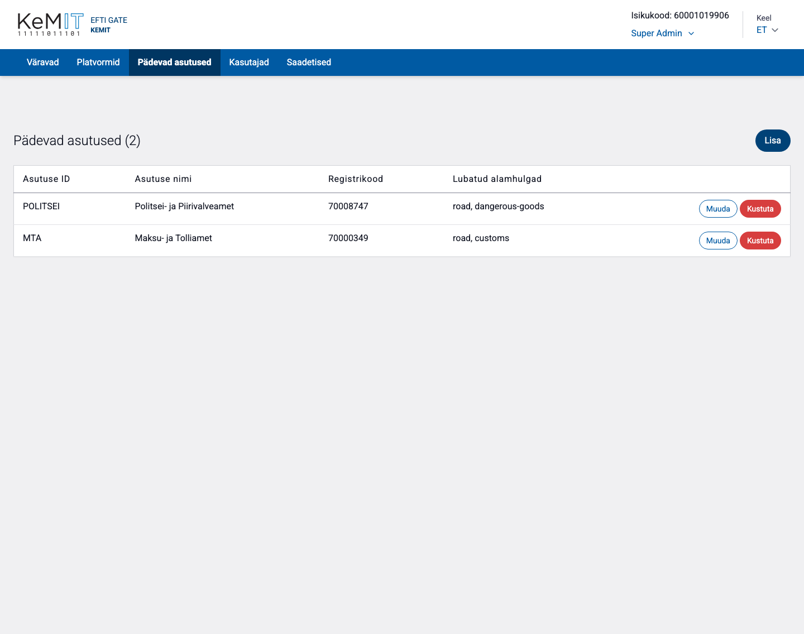
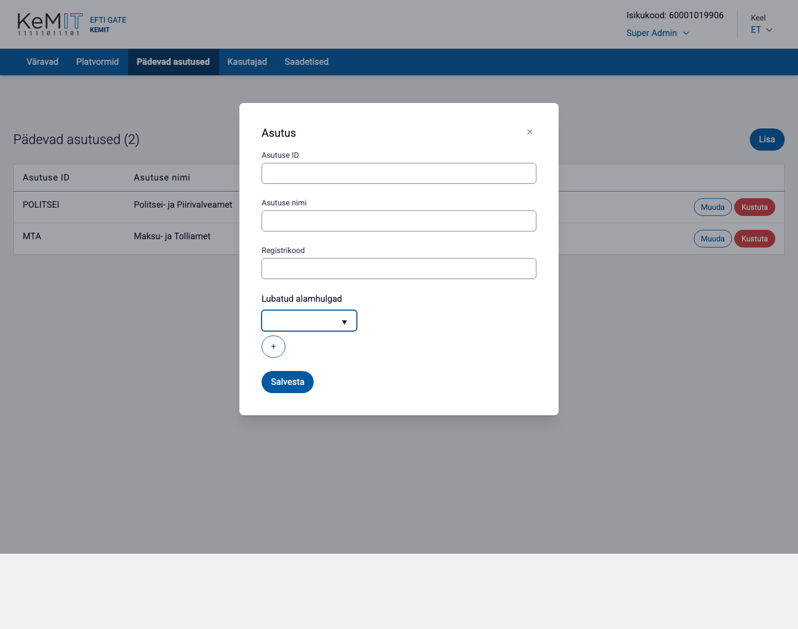

# Pädevad asutused

Vaates **Pädevad asutused** määratakse, millised asutused võivad värava kaudu andmeid küsida ning millistele eFTI andmete alamhulkadele neil on ligipääs.

## Pädeva asutuse lisamine

1. Vajuta **Lisa**.
2. Sisesta asutuse ID, nimi ja registrikood.
3. Lisa üks või mitu lubatud alamhulka.
4. Vajuta **Salvesta**.

Alamhulkade valik määrab, milliseid andmeosi asutusele väljastatakse. Anna asutusele ainult tööülesannete täitmiseks vajalikud alamhulgad.

## Muutmine ja kustutamine

- **Muuda** võimaldab nime, registrikoodi ja alamhulki uuendada. Asutuse ID jääb samaks.
- **Kustuta** küsib kinnituse ja eemaldab asutuse aktiivsest vaatest.

Pärast õiguste muutmist kontrolli üle kogu alamhulkade loend, mitte ainult lisatud või eemaldatud väärtus.

