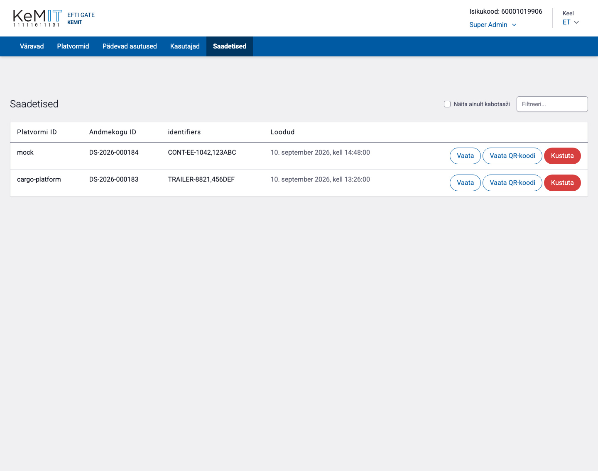
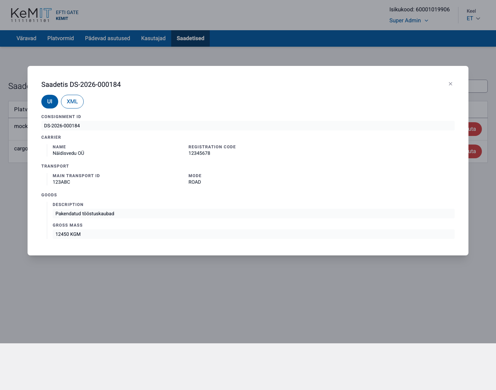
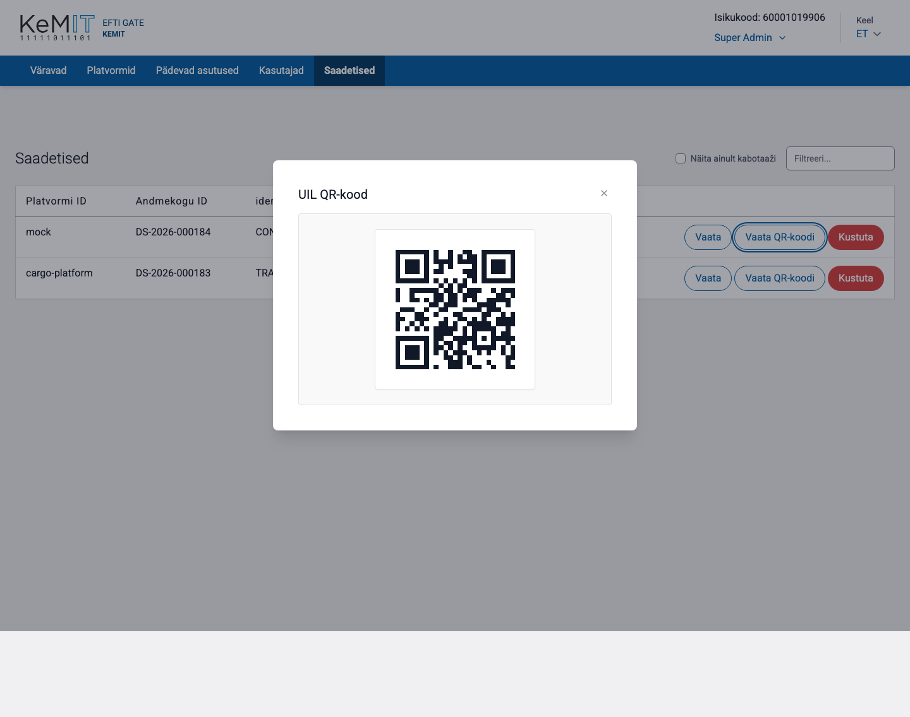

# Saadetised

Vaates **Saadetised** saab sirvida platvormidelt saabunud eFTI saadetiste kirjeid, vaadata nende sisu ning luua UIL-i QR-koodi.

Nimekirjas kuvatakse platvormi ID, andmekogu ID, transpordi identifikaatorid ja kirje loomise aeg.

## Saadetise leidmine

- Sisesta otsinguväljale **Filtreeri…** andmekogu või identifikaatori osa.
- Märgi **Näita ainult kabotaaži**, kui soovid piirata nimekirja kabotaažiga seotud kirjetele.
- Tabeli veerupäisel vajutamine muudab sortimist.

## Saadetise sisu vaatamine

1. Vajuta saadetise real **Vaata**.
2. Vaikimisi kuvatakse andmed struktureeritud **UI** vaates.
3. Algse XML-i vaatamiseks vali **XML**.
4. Sulgemiseks vajuta dialoogi sulgemisnuppu.

UI-vaade muudab XML-andmed hõlpsamini loetavaks. Tehnilise tõrke uurimisel või algandmete kopeerimisel kasuta XML-vaadet.

## QR-koodi vaatamine

Vajuta **Vaata QR-koodi**. QR-kood sisaldab saadetise UIL-i, mis moodustatakse värava, platvormi ja andmekogu identifikaatoritest.

## Saadetise kustutamine

Vajuta **Kustuta** ja kinnita tegevus. Süsteemi andmemudel on append-only: kasutajaliideses kustutamine loob kustutatud olekut tähistava uue versiooni, mitte ei kirjuta varasemat ajalugu üle.

