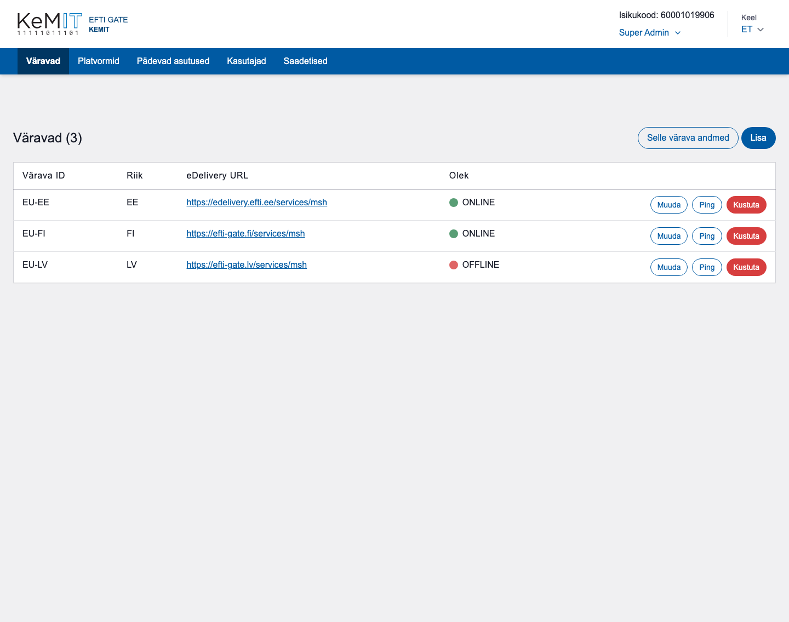
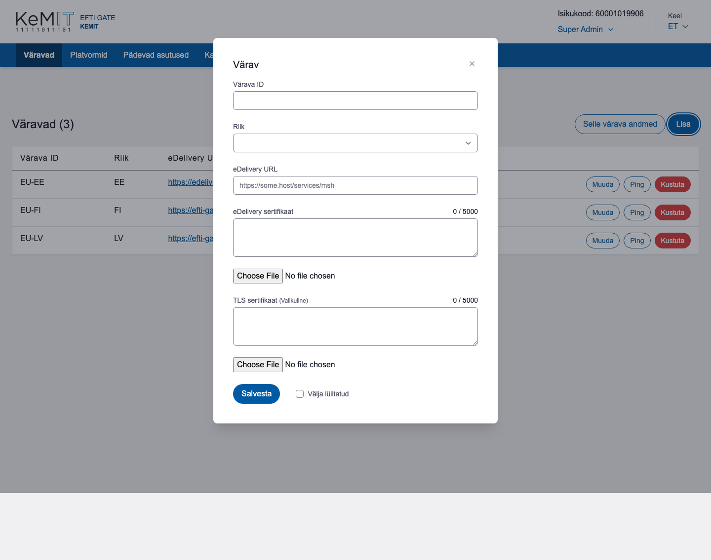

# Väravad

Vaates **Väravad** hallatakse teiste liikmesriikide väravaid ja vaadatakse nende ühenduse olekut.

## Oleku tähendus

| Olek | Tähendus |
|---|---|
| ONLINE | Viimane ühenduse kontroll õnnestus. |
| OFFLINE | Ühenduse kontroll ei õnnestunud või väravat ei ole veel edukalt kontrollitud. |
| KEELATUD | Värav on käsitsi välja lülitatud ja seda ei kasutata. |

Oleku värvilise tähise kohal hoides näeb viimase kontrolli aega.

## Värava lisamine

1. Vajuta **Lisa**.
2. Sisesta värava ID ja vali riik.
3. Sisesta eDelivery URL.
4. Lisa eDelivery ja TLS sertifikaadid PEM-vormingus.
5. Vajuta **Salvesta**.

Pärast salvestamist proovib süsteem väravat pingida. Ebaõnnestunud ping ei kustuta kirjet; värav kuvatakse olekuga **OFFLINE**.

## Värava muutmine ja kontrollimine

- **Muuda** avab värava andmed. Värava ID-d muuta ei saa.
- **Ping** käivitab kohe ühenduse kontrolli ja uuendab olekut.
- Märkeruut **Välja lülitatud** peatab värava kasutamise.
- **Kustuta** küsib kinnituse ja eemaldab värava aktiivsest vaatest.

Nupp **Selle värava andmed** näitab Eesti värava andmeid, mida on vaja partneri eDelivery pääsupunkti seadistamisel.

