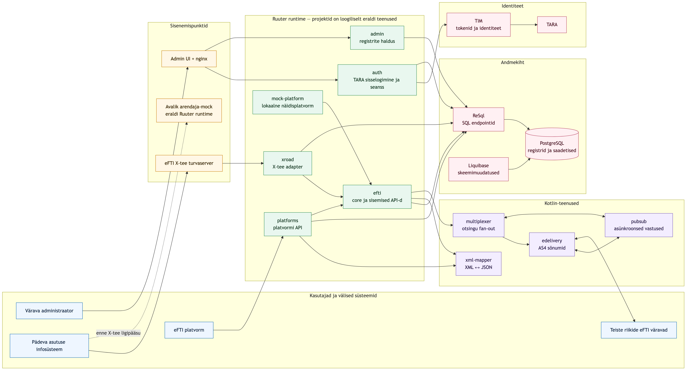

# eFTI värava kasutusjuhend

See juhend kirjeldab eFTI värava haldusliidese igapäevast kasutamist. Haldusliideses saab hallata teiste riikide väravaid, eFTI platvorme, pädevaid asutusi ja kasutajaid ning vaadata väravasse saabunud saadetiste andmeid.

Juhend vastab GitHubi `dev` haru kasutajaliidesele. Tehniline dokumentatsioon ja lähtekood on [eFTI Gate’i GitHubi repositooriumis](https://github.com/kemit-ee/efti-gate-ee).

## Süsteemi ülesehitus

Ruuter töötab ühe runtime’ina, kuid iga Ruuteri projekt on eraldi URL-ruumi, sisendlepingu ja autentimisreeglitega loogiline teenus. Kotlin-teenused tegelevad XML-i teisendamise, väravatevahelise sõnumivahetuse, otsingu hargnemise ja asünkroonsete vastustega. ReSql eraldab API-kihi SQL-ist ning PostgreSQL hoiab registri- ja saadetiste andmeid.

## Kellele juhend on mõeldud?

Juhend on mõeldud eFTI värava administraatorile. Kõigil süsteemi lisatud ja edukalt autenditud kasutajatel on sama haldusõigus; kasutajatele eraldi rolle ei määrata.

## Põhimõisted

| Mõiste | Tähendus |
|---|---|
| Värav | Euroopa Liidu liikmesriigi eFTI värav, millega Eesti värav eDelivery kaudu suhtleb. |
| Platvorm | Sertifitseeritud eFTI platvorm, mis saadab väravale saadetiste identifikaatoreid ja väljastab andmekogumeid. |
| Pädev asutus | Asutus, kelle töötajad võivad eFTI andmeid pärida. Asutusele määratakse lubatud andmete alamhulgad. |
| Kasutaja | TARA kaudu autentiv administraator, kes on väravas isikukoodi alusel registreeritud. |
| Saadetis | Platvormilt väravasse üles laaditud eFTI saadetise kirje koos identifikaatorite ja XML-andmetega. |

## Haldusliidese jaotised

Ülamenüüs on viis põhivaadet: **Väravad**, **Platvormid**, **Pädevad asutused**, **Kasutajad** ja **Saadetised**. Paremas ülanurgas saab vahetada keelt ning kasutajamenüüst välja logida.
