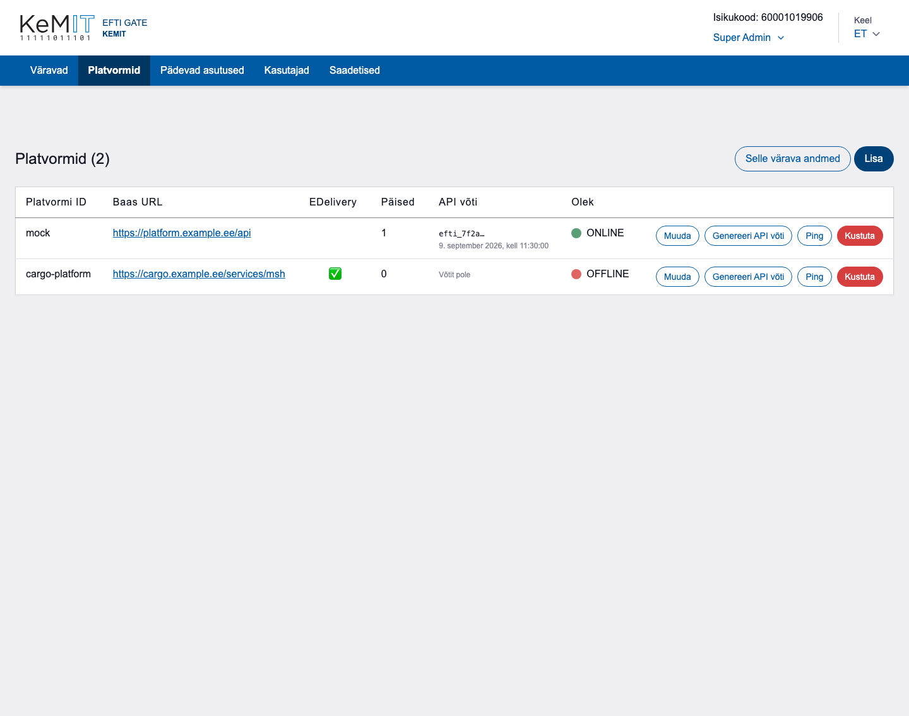
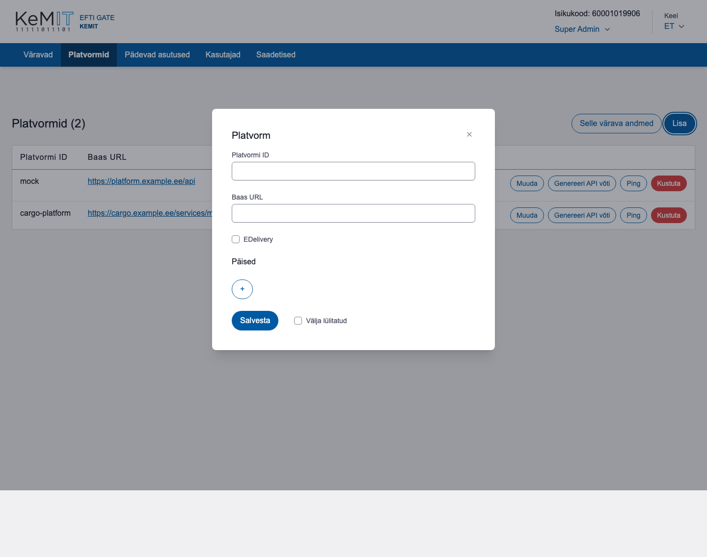

# Platvormid

Vaates **Platvormid** registreeritakse eFTI platvormid, nende ühendusandmed ja API võtmed.

## Platvormi lisamine

1. Vajuta **Lisa**.
2. Sisesta unikaalne platvormi ID ja baas-URL.
3. Kui platvorm kasutab eDelivery ühendust, märgi **EDelivery** ning lisa sertifikaadid.
4. Vajaduse korral lisa HTTP päised võtme ja väärtuse paaridena.
5. Vajuta **Salvesta**.

Kui baas-URL lõpeb `/msh`, käsitleb vorm ühendust eDelivery ühendusena.

## API võtme loomine

1. Leia platvormi rida.
2. Vajuta **Genereeri API võti**.
3. Kopeeri kuvatud võti kohe turvalisse saladuste haldussüsteemi.
4. Sulge aken alles pärast võtme talletamist.

Täielikku võtit kuvatakse ainult üks kord. Uue võtme genereerimine muudab eelmise võtme kohe kehtetuks.

## Muud tegevused

- **Muuda** uuendab ühendusandmeid ja päiseid.
- **Ping** kontrollib platvormi kättesaadavust.
- **Kustuta** küsib kinnituse ja eemaldab platvormi aktiivsest vaatest.
- Märkeruut **Välja lülitatud** takistab platvormi kasutamist.

