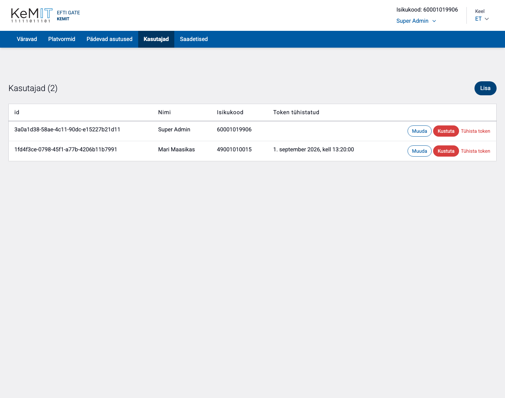
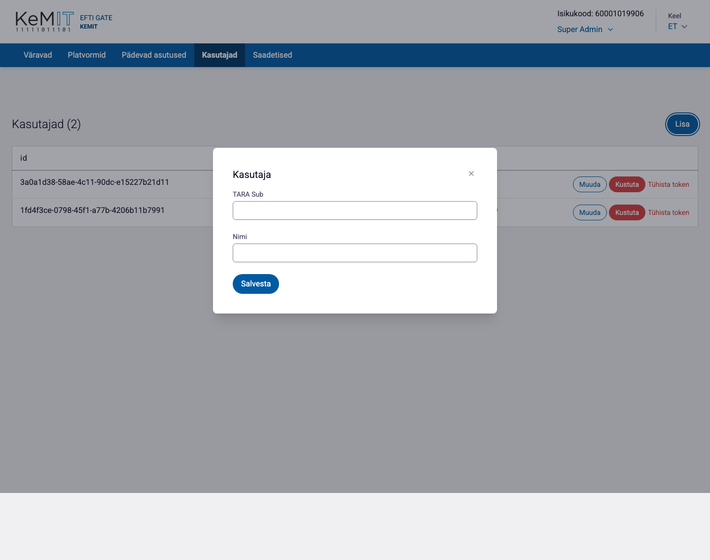

# Kasutajad

Vaates **Kasutajad** hallatakse inimesi, kellel on õigus TARA kaudu eFTI värava haldusliidesse sisse logida.

## Kasutaja lisamine

1. Vajuta **Lisa**.
2. Sisesta kasutaja isikukood väljale **TARA Sub**.
3. Sisesta kasutaja nimi.
4. Vajuta **Salvesta**.

Isikukood peab vastama TARA autentimisel tagastatavale identifikaatorile. Süsteemis ei ole eraldi administraatorirolle: iga olemasolev ja autenditud kasutaja saab kasutada kogu haldusliidest.

## Kasutaja muutmine

Nupuga **Muuda** saab muuta kasutaja nime. Olemasoleva kasutaja isikukoodi muuta ei saa; vale isikukoodi korral kustuta kirje ja lisa õige kasutaja.

## Tokeni tühistamine

1. Leia kasutaja.
2. Vajuta **Tühista token**.
3. Kinnita tegevus.

Tühistamine lõpetab kasutaja aktiivsete tokenite kehtivuse. Kasutaja peab uue seansi alustamiseks uuesti autentima.

## Kasutaja eemaldamine

Vajuta **Kustuta** ja kinnita tegevus. Pärast kustutamist ei saa inimene uue autentimisega haldusliidesse siseneda.

